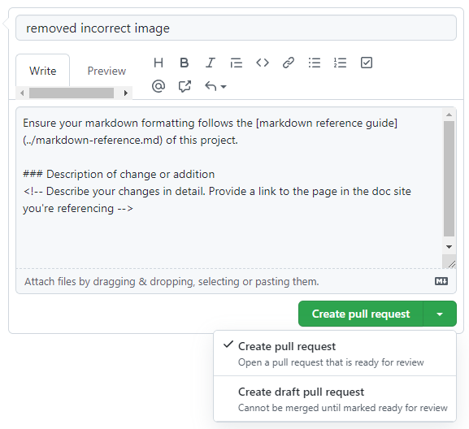
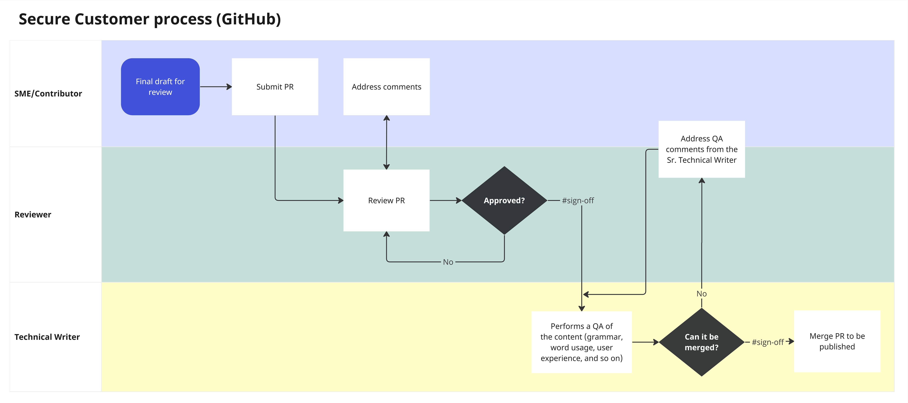

<!-- Reference links -->
[style-guide]: ./style-guide.md
[markdown]: ./markdown-reference.md
[contributor]: ./contributor-guide.md
[site]: https://developer.beyondidentity.com/
[issues]: https://github.com/gobeyondidentity/developer-docs/issues/new?assignees=&labels=triage&projects=&template=content-issue.yml&title=%5BContent+issue%5D%3A+
[repo]: https://github.com/gobeyondidentity/developer-docs
[pr]: https://github.com/gobeyondidentity/developer-docs/pulls
[enhancements]: https://github.com/gobeyondidentity/developer-docs/issues/new?assignees=&labels=%F0%9F%8C%9F+enhancement&projects=&template=enhancement.yml

- [Contributor's guide](#contributors-guide)
  - [When to provide feedback vs. contribute](#when-to-provide-feedback-vs-contribute)
    - [Provide us feedback](#provide-us-feedback)
    - [Contribute](#contribute)
  - [Site organization and files](#site-organization-and-files)
    - [Content files](#content-files)
    - [Site config files](#site-config-files)
  - [Doc site branches](#doc-site-branches)
  - [Best practices](#best-practices)
    - [Content development](#content-development)
    - [GitHub](#github)
    - [Commit messages](#commit-messages)
    - [Pull Requests](#pull-requests)
  - [Edit content](#edit-content)
    - [Mminor changes](#mminor-changes)
    - [Significant changes](#significant-changes)
  - [Add new content](#add-new-content)
  - [Create a pull request](#create-a-pull-request)
  - [Pull request guidelines](#pull-request-guidelines)
  - [Content development process](#content-development-process)
  - [Pull request template](#pull-request-template)
  - [PR descriptions](#pr-descriptions)
  - [Rejected PRs](#rejected-prs)


---

# Contributor's guide

Thank you for taking an interest in contributing to the Beyond Identity Developer Documentation. 

We've built the documentation with [Docusaurus](https://docusaurus.io) and you can find the source code our [developer-docs GitHub repo][repo].

You're welcome to contribute to the documentation to help make it better and we want to make it possible for you to become a contributor. Additionally, anyone can open an issue about documentation or suggest a change with a [pull request (PR)][pr] to the [GitHub repository][repo]. 

This guide outlines the different ways that you can get involved. In addition, it provides some of the resources that are available to help you get started. 

If you plan to contribute, make sure to [set up your environment](../README.md#get-started).

## When to provide feedback vs. contribute

Our docs are a continuous work in progress. You're welcome to contribute to the documentation to help improve it, and we want to make it possible for you to become a contributor. 

### Provide us feedback 

If you're not ready to contribute, you can provide us feedback. Your feedback is essential in shaping the customer content experience. The team will track these ideas and issues to address your feedback. There are several ways to provide feedback:

- **[Submit an enhancement idea][enhancements]** to make the docs better

- **[Open a GitHub issue][issues]** to report an issue with the content (something is incorrect or confusing)


### Contribute

As a contributor, you’ll need to understand the different ways to contribute and which is best based on your changes.

**Does the topic or document exist?**

- If YES, update the doc! Contribute to your heart's content. But first, determine which use case best fits your update:

  - **Minor changes: (use case #1)** If you only need to fix a typo or clarify a sentence or section, this option is your ideal choice. However, in this use case, you cannot upload files, such as an image, and you can update only one file.

  - **Significant changes: (use case #2)** Suppose you must make substantial changes, such as adding an image or editing multiple topics. In that case, this method is your best friend, as you'll have one pull request to manage. Consult with the Sr. Technical Writer first before making changes.

- If NO, should it? If so, consider **adding it (use case #3)**, but don't add a topic or doc just because you can. Consult with the Sr. Technical Writer first before adding. For example, your new topic could be added to an existing one, consolidating and clarifying the information. It's also possible that someone else is working on a similar topic. 

- If you're **not comfortable using GitHub or VS Code or don't have access to GitHub (use case #4)**, you can provide the Sr. Technical Writer a document (Google Docs, Microsoft Word, text file, or Confluence page). The document can be converted to markdown. So don't fret! We'll get your content published.


## Site organization and files

### Content files

- `/docs/` - Contains the Markdown files for the docs. Customize the order of the docs sidebar in `sidebars.js`.

  - `/docs/images` - Images used in the documentation.

  - `/docs/includes` - Reusable content such as feature descriptions, notes, common steps, and so on.

- `versioned_docs` - Contains the markdown files for the previous supported versions (v0 and v1).

- `versioned_sidebars` - Contains the sidebar files for the previous versions.

- `/sidebar.js` - Specify the order of documents in the sidebar. If you have a new file to add to the site, modify this file.

- `static/api` - Contains the API documentation for v0 and v1.

### Site config files

- `/docusaurus.config.js` - A config file containing the site configuration.

- `/src/` - Non-documentation files like pages, custom React components, or
Docaurus native components.

   - `/src/components` - Custom react components used for the website or included in the documentation, such as the Try It Out!

   - `/src/pages` - Any files within this directory will be converted into a website page. Currently, we don't use this directory.

   - `/src/theme` - Docusausus native components such as the sidebar, content page, and content page footer designs.

- `/static/` - Static directory. Any contents inside here will be copied into the root of the final `build` directory.

   - `/static/img` - Website images such as Beyond Identity logos and other assets.

- `/package.json` - A Docusaurus website is a React app. You can install and use any npm packages you like in them.


## Doc site branches

Before starting the authoring work, you must understand the different branches to work on. You'll use your branch to work on content for a certain issue or feature, but you'll submit your Pull Request against one of the branches listed below: 

- **`main`** - protected branch
    
    Docs for https://deverloper.beyondidentity.com/. This branch contains the most recent stable release content.
    
- **`docs-staging`** - protected branch
    
   Docs for a forward-version that includes features not yet included in the Beyond Identity stable version. When Secure Customer has a release, its `docs-staging` branch will be merged into `main`. Its content is published on https://developer-docs-git-docs-staging-beyondidentity.vercel.app/ for early validation purpose.  Think of this branch as **rolling**. 

- **`active-development`** - protected branch (used for front-end and back-end development). 

  Its content is published on https://developer-docs-git-active-development-beyondidentity.vercel.app/ for early validation purpose.

- You can have your own personal branch to work on content for a certain issue or feature. However, be sure to check and remove unused personal branches periodically for easy maintenance. Usually when your branch is merged, you can safely delete it.


## Best practices

To promote consistency, follow the guidelines below and mentioned throughout to keep the process productive and beneficial for all involved.

### Content development

- Verify your content for technical accuracy before submitting your Pull Request.

- Consult with the Sr. Technical Writer when adding topics or want to propose changes to the content structure. The Sr. Technical Writer maintains the content's quality, reduces duplication, and provides a consistent user experience. They can also strategize how to deliver complex information—for example, adding an explainer video (<90 secs) can help with complex scenarios or issues.

### GitHub

- Create a *working branch* when introducing logically related changes. This helps you manage your changes through the workflow. We refer to it here as a working branch because it's a workspace to iterate or refine your changes until they can be integrated into the default branch.

- Keep your branch up-to-date.

- Check and remove unused personal branches periodically for easy maintenance. Usually, when your branch is merged, you can safely delete it.


### Commit messages

Ensure that your commit message is a proper sentence. Refer to this [guide on writing good commit messages](https://cbea.ms/git-commit/).

A properly formed git commit subject line should always be able to complete the following sentence:

***If applied, this commit will ....***


### Pull Requests

- Try to make the review cycle short.

- Make sure the markdown follows the style guidelines of this project.

- Perform a self-review of your markdown, especially spelling errors.

- Verify that the PR does not generate new warnings before pushing your changes. The best way is to run the clear command.
  
  ```nodejs
  npm run clear
  yarn build
  ```


## Edit content 

### Mminor changes

If you only need to fix a typo or clarify a sentence or section, this option is your best choice. It streamlines the process of reporting and correcting minor errors and omissions in the documentation.  

Despite all efforts, small grammar and spelling errors _do_ make their way into our published documents. While you can create GitHub issues to report mistakes, creating a PR to fix the issue is faster and easier when the option is available.

1. In the [repo][repo], navigate to the /docs folder and locate the file you want to edit. Then, select the pencil icon to edit the article. <br />

   <br />

2. Edit the file in the web editor. Choose the **Preview** tab to check the formatting of your changes.<br />

   <br />

3. When you're finished editing, scroll to the bottom of the page and propose your changes. <br />

   1. In the **Commit changes** area, enter a title and an optional description for your changes. The title will be the first line of the commit message. <br />

   2. Select the option to create a branch and then  **Propose changes** to commit your changes.<br />
   
     <br />

4. Now that you've proposed and committed your changes, you need to ask the owners to review your changes. This is done using a pull request (PR).<br />

   Enter a title and a description for the PR, and then select **Create pull request**. You can select **Create a draft pull request** instead. The difference is that the reviewers are notified only when the PR is *Open* rather than *Draft*.<br />

   


That's it! Team members will review your PR and merge it when approved. You may get feedback requesting changes.

<div style="position: relative; padding-bottom: calc(68.66666666666666% + 44px); height: 0;"><iframe src="https://app.supademo.com/embed/clk7fd03gua59zgx6kvjhjj84" frameborder="0" webkitallowfullscreen="true" mozallowfullscreen="true" allowfullscreen style="position: absolute; top: 0; left: 0; width: 100%; height: 100%;"></iframe></div>


### Significant changes

If you need to make substantial changes, add an image or add a section to a topic. On the other hand, if your change is minor that doesn't involve uploading a file or making changes to multiple files, follow the [Edit content - minor change](#edit-content-minor-changes) instructions instead.

1. Make sure to [set up your environment](../README.md#get-started).

1. Make sure you're back on the main (default) branch so you can sync your local working branch.

   ```bash
   git checkout main
   git pull origin main
   ```

2. Create a working branch for your proposed changes. For example, **content-dev-faqs** or **update-visual-guidelines**.

   ```bash
   git checkout -b {your-branch-name}
   ```

3. Navigate to `/docs` and locate the topic you want to change. 

4. Change the date in the metadata and ensure the title, description, and author are correct. Add any additional keywords if they are missing.

   ```markdown
   ---
   title: Getting Started with React
   sidebar_label: React
   id: get-started-react
   description: 'Create a free Beyond Identity developer account and connect it to our sample application. This application demonstrates common workflows, like creating realms, applications, and passkeys (public-private key pairs) for user authentication.'
   slug: /get-started-react
   keywords: 
    - get started
    - react
   pagination_next: null
   pagination_prev: null
   last_update: 
      date: 06/01/2023
      author: Patricia McPhee
   draft: false
   doc_type: how-to
   displayed_sidebar: mainSidebar
   ---
   ```

4. Make your changes to the content and run the following command to build and review your changes.

   ```bash
   yarn start
   ```

   This command starts a local development server and opens a browser window. Most changes are reflected live without having to restart the server. If a browser window doesn\'t open, go to **http://localhost:3000/** to view your local changes. 

1. Perform a self-review of your markdown and make sure your changes or additions follow the [style guidelines](./style-guide.md).

1. Verify that the PR won't generate warnings or errors, such as broken links. If so, address them and ensure it builds without issues.
  
   ```bash
   npm run clear
   yarn build
   ```

7. When you're ready to submit a pull request, add your changes.

   ```bash
   git add --all
   ```

8. Commit your changes with a descriptive summary, for example, *Add clarity to the data table component usage examples*.

   ```bash
   git commit -m "short description of the change"
   ```

   Ensure that your commit message is a proper sentence. Refer to this [guide on writing good commit messages](https://cbea.ms/git-commit/).

   A properly formed git commit subject line should always be able to complete the following sentence:

   ***If applied, this commit will ....***

9. Publish, or push, your changes to the main repo for merging. 

   ```bash
   git push origin {your-branch-name}
   ```

1. [Create a pull request](#create-a-pull-request).


## Add new content

1. Make sure to [set up your environment](../README.md#get-started).

2. Make sure you're back on the main (default) branch so you can sync your local working branch.

   ```bash
   git checkout main
   git pull origin main
   ```

3. Create a working branch for your proposed changes. For example, **content-dev-faqs** or **update-visual-guidelines**.

   ```bash
   git checkout -b {your-branch-name}
   ```

4. Navigate to `/docs` and locate the subdirectory for your new topic.

5. Add the metadata (frontmatter).

   Keywords are optional but helpful. All other metadata is required.

   ```markdown
   ---
   title: Getting Started with React
   sidebar_label: React
   id: get-started-react
   description: 'Create a free Beyond Identity developer account and connect it to our sample application. This application demonstrates common workflows, like creating realms, applications, and passkeys (public-private key pairs) for user authentication.'
   slug: /get-started-react
   keywords: 
    - get started
    - react
   pagination_next: null
   pagination_prev: null
   last_update: 
      date: 06/01/2023
      author: Patricia McPhee
   draft: false
   doc_type: how-to
   displayed_sidebar: mainSidebar
   ---
   ```

6. Add the new markdown file in the sidebar.js file.

    ```javascript
    {
      type: 'category',
      label: 'Foundations',  
      collapsed: false, 
      collapsible: false,     
      link: {
        type: 'doc',
        id: 'foundations/foundations',
      },  
      items: [ 
        'foundations/overview', 
        'foundations/architecture',
        'foundations/universal-passkeys',
        'foundations/authenticator-config',
        'foundations/api-endpoints',
        'foundations/passwordless-connections',
      ],
    },
    ```
   
    It's a best practice to add the markdown file early in the content development phase. Otherwise, you\'ll get an error when you run the command to build and review your content.

7. Create your content and run the following command to build and review your changes.

    ```bash
    yarn start
    ```

    This command starts a local development server and opens a browser window. Most changes are reflected live without having to restart the server. If a browser window doesn't open, go to **http://localhost:3000/** to view your local changes. 

8. Perform a self-review of your markdown and make sure your changes or additions follow the [style guidelines](./style-guide.md).

9. Verify that the PR does not generate warnings or errors, such as broken links. If so, address them and ensure it builds without issues.
  
    ```bash
    npm run clear
    yarn build
    ```

10. When you're ready to submit a pull request, add your changes.
 
    ```bash
    git add --all
    ```

11. Commit your changes with a descriptive summary, for example, *Add clarity to the data table component usage examples*.

    ```bash
    git commit -m "short description of the change"
    ```

    Ensure that your commit message is a proper sentence. Refer to this [guide on writing good commit messages](https://cbea.ms/git-commit/).

    A properly formed git commit subject line should always be able to complete the following sentence:

    ***If applied, this commit will ....***

12. Publish, or push, your changes to the main repo for merging. 

    ```bash
    git push origin {your-branch-name}
    ```

13. [Create a pull request](#create-a-pull-request).

## Create a pull request

👉 Make sure to follow the [Pull request guidelines](#pull-request-guidelines).

1. Go to the [main page of the repo][repo].

2. Above the list of files, in the yellow banner, click **Compare & pull request** to create a pull request for the associated branch.  <br />

   

3. In the Open a pull request window, do the following:

   1. Select the branch.  

      :::note important  
      All pull requests should be opened against the `main` branch unless the it's for the upcoming next release. In that case, the PR should be opened against the `docs-staging` branch. 
      :::

   1. Ensure that the summary title is short but descriptive. If it is associated with a JIRA ticket, append it to the beginning in brackets, for example, **[MD-111] mac desktop login**. 

   1. Provide a description of your changes. For more details, see [PR descriptions](#pr-descriptions).

   1. In the **Reviewers** section, in the right panel, click the cog icon and select designated reviewers. For example, another PM, a developer, and the tehcnical writer. 

   1. Assign the PR to a specific reviewer if they are the main reviewer.  

   1. Select **Create pull request**.  If the pull request is a **work in progress** and not ready to be reviewed, select the **[Create draft pull request](https://github.blog/2019-02-14-introducing-draft-pull-requests/#tag-your-work-in-progress)**.

   

After the assigned reviewer reviews the content for technically accurate, they hand it off (add `#sign-off` in the comments of the PR) to the Technical Writer. This is where the content review takes place. If the Sr. Technical Writer has question regarding clarity of something, this is where the collaboration begins. After the review, the Technical Writer will `#sign-off` on the PR and merge it. For more details, see [Content development process](#content-development-process).

## Pull request guidelines

We ask that contributors submit a pull request with your changes. Here are our expectations for pull requests. Following them will expedite the process of merging and publishing your content.

A few things to keep in mind when creating your pull request:

| If | Then |
| --- | --- |
| PR relates to issues you found in the docs  | add **inaccurate**, **typo** or **missing information** keywords in the description and use the default base branch, **main**  |
| PR relates to GitHub issues you've addressed for `customer-docs`  | provide links to related GitHub issues and use the default base branch, **main**  |
|  PR is part of the current release | use the default base branch, **main**  |
| PR is part of the next future release  | make it against the **docs-staging** branch  |
|  PR is part of front-end or back-end development | make it against the **active-development** branch  |


## Content development process

The ownership of the PR is on the person who creates the PR. The author's responsibility is to get it reviewed and approved for technical accuracy before submitting the PR. It is the Technical Writer's responsibility to copyedit and ensure consistency across the customer-facing documentation.

What's common in tech companies (software companies in particular), is the SME/author of the content will consult with the Sr. Technical Writer to get a better understanding of where the content fits in the sidebar (left nav). During the conversation, they'll determine where the content fits. They'll also want to know: 

- What's the topic type?  Reference, concept, how-to? In some cases, it can be a combination.

- Can it be added to an existing topic to consolidate topics for clarity?  

- Or does the content stand alone, like a how-to, overview, or reference topic?  

It doesn't mean you don't need the Sr. Technical Writer's help between the consult and the Pull Request.  You absolutely can and should if guidance is needed. Often, engineers will continue collaborating with them even before they submit their Pull Request.

Once they get their content to the point where it's technically accurate, then they hand it off (`#sign-off`) to the Technical Writer via a Pull Request. This is where the content review takes place.  If the Sr. Technical Writer has question regarding clarity of something, this is where the collaboration begins. After the review, the Technical Writer will `#sign-off` on the PR and merge it. 

Some developers and product managers are comfortable with this process, but some are not.  In that case, you can provide the Sr. Technical Writer with the document (Google Docs or text file) and they can convert it to markdown. 



## Pull request template

When you create a pull request, a default pull request template is automatically applied for all new pull requests in the repository. It's useful to ensure that every pull request follows a standard process and to have a to-do list for the author to check before requesting a review. 


## PR descriptions

The PR descriptions matter because it's an opportunity to set the reviewer up for a review they will know how to review. Here you'll get to explain what you've done, why're you've done it, and how to prove it is ready to be merged into the main branch.

| The What | The Why |
| --- | --- |
|  Explain the changes you've made.  It doesn't need to be fancy and you don't have to get too technical. At a high level, this is where you let the reviewer know the overall effect of the PR.  It's important to explain what the change is and then reference the ticket. It's a much better experience for the reviewer if they're able to spend more time reviewing and less time studying speciications that may not even be applicable. <br /><br />**Example**<br /><br />"Added support for authentication. #JIRA-123"   | The "why" is sometimes more important than the "what." The "why" tells us what business or engineering goal this change achieves. It's a chance to explain the engineering goal and the business.<br /><br />**Example** <br /><br />"These changes complete the user login and account creation experience."    |

## Rejected PRs

--WIP---