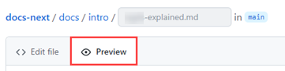
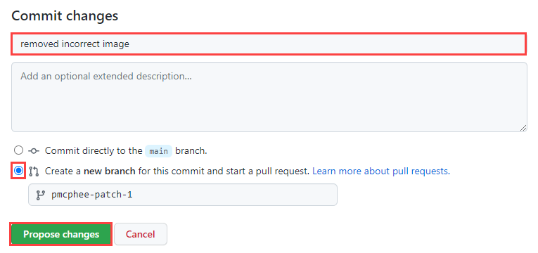

<!-- Reference links -->
[style-guide]: ./style-guide.md
[markdown]: ./markdown-reference.md
[contributor]: ./contributor-guide.md
[site]: https://next-dev-docs.vercel.app/
[issues]: https://github.com/gobeyondidentity/next-dev-docs/issues/new?assignees=&labels=triage&projects=&template=content-issue.yml&title=%5BContent+issue%5D%3A+
[repo]: https://github.com/gobeyondidentity/next-dev-docs
[pr]: https://github.com/gobeyondidentity/next-dev-docs/pulls
[enhancements]: https://github.com/gobeyondidentity/next-dev-docs/issues/new?assignees=&labels=%F0%9F%8C%9F+enhancement&projects=&template=enhancement.yml

- [Contributor's guide](#contributors-guide)
  - [Provide feedback](#provide-feedback)
  - [Before you start](#before-you-start)
  - [Local Git repo](#local-git-repo)
    - [Prerequisites](#prerequisites)
    - [Optional editing tools](#optional-editing-tools)
    - [Clone the repo](#clone-the-repo)
    - [Start the development server](#start-the-development-server)
  - [Doc branches](#doc-branches)
  - [Site organization and files](#site-organization-and-files)
  - [When to contribute](#when-to-contribute)
    - [Best practices](#best-practices)
  - [Edit content (minor changes)](#edit-content-minor-changes)
  - [Edit content (significant changes)](#edit-content-significant-changes)
  - [Add new content](#add-new-content)
  - [Create a pull request](#create-a-pull-request)
  - [Pull request guidelines](#pull-request-guidelines)
    - [Ownership](#ownership)
    - [Pull request template](#pull-request-template)
    - [PR descriptions](#pr-descriptions)
    - [Commit messages](#commit-messages)


---

# Contributor's guide

Thank you for taking an interest in contributing to the Beyond Identity Developer Documentation. 

We've built the documentation with [Docusaurus](https://docusaurus.io) and you can find the source code our [next-dev-docs GitHub repo][repo].

You're welcome to contribute to the documentation to help make it better and we want to make it possible for you to become a contributor. Additionally, anyone can open an issue about documentation or suggest a change with a [pull request (PR)][pr] to the [GitHub repository][repo]. 

This guide outlines the different ways that you can get involved. In addition, it provides some of the resources that are available to help you get started. 

## Provide feedback

If you're not ready to contribute, you can provide us feedback.  Your feedback is essential in shaping the customer content experience. There are several ways to provide feedback:

- [Submit an enhancement idea][enhancements] to make the docs better
- [open a GitHub issue][issues] to report an issue with the content (something is incorrect or confusing)

The team will track these ideas and issues to address your feedback. 

All feedback is welcome. :100:

## Before you start

- Make sure you're familiar with Git and GitHub, and [markdown][markdown]. We use basic markdown, extended markdown, and Docusaurus-specific markdown.
- Review the [documentation repo's][repo] organization and structure. You'll want to understand this so you know where files are and where to add new ones.
- Verify that you can open a [pull request][pr] and review changes.
- Ensure an [issue][issues] exists because someone might have reported or started work on it. 
- If the solution you are proposing is complex, prose it anyway and wait for one of the core contributors to approve it before implementing it. This helps in shorter turnaround times in merging PRs.
  
## Local Git repo

### Prerequisites

- Code editor, [VS Code](https://code.visualstudio.com) is recommended
- [Git](https://git-scm.com)
- [Node.js](https://nodejs.org)
- [Yarn](https://yarnpkg.com) 


### Optional editing tools

If you want the WYSIWYG experience, you can install one of the VS Code extensions:

- [Rich Markdown Editor](https://marketplace.visualstudio.com/items?itemName=patmood.rich-markdown-editor)
- [Markdown Editor](https://marketplace.visualstudio.com/items?itemName=zaaack.markdown-editor)
- [UNOTES](https://marketplace.visualstudio.com/items?itemName=ryanmcalister.Unotes)

Other helpful VS Code extensions:

- [Code Spell Checker](https://marketplace.visualstudio.com/items?itemName=streetsidesoftware.code-spell-checker)
- [Markdown All in One](https://marketplace.visualstudio.com/items?itemName=yzhang.markdown-all-in-one)

Non VS Code markdown editors:

- [StackEdit](https://stackedit.io/)
- [Dillinger](https://dillinger.io/)
- [Pandeo MEditor.md](https://pandao.github.io/editor.md/en.html)


### Clone the repo

1. Go to the [main page of the repository][repo]. 

1. Clone the repo.  This creates a directory named `next-dev-docs` in your current working directory.

   ```bash
   git clone https://github.com/gobeyondidentity/next-dev-docs.git
   cd next-dev-docs
   ```

2. Next, create a new [branch](https://git-scm.com/book/en/v2/Git-Branching-Branches-in-a-Nutshell) from `main` (always give your branch a meaningful, descriptive name). 

   ```bash
   git checkout -b <branch_name>
   ```

Refer to the [contributor's guide][contributor] for details on how to submit edits or additions to the documentation.

### Start the development server

We're finally able to get to the fun stuff! Install the dependencies and start a local development server:

```bash
yarn
yarn start
```

The `http://localhost:3000` opens in your browser so you can see your changes reflected live.

## Doc branches

Before you get started with the authoring work, it's necessary that you understand the different branches to work on.
* **`main`** -  protected branch

  Docs for [https://next-dev-docs.vercel.app/][site]. This branch contains the most recent stable release content.

* **`docs-staging`** - protected branch

  Docs for the upcoming `vNext` release. When Secure Customer has a release, its `docs-staging` branch will be merged into `main`.

* **`active-development`** - protected branch (currently used for front-end development)

  Docs for a forward-version that includes features not yet included in the Beyond Identity stable version. Its content is published on [https://next-dev-docs-git-active-development-beyondidentity.vercel.app/](https://next-dev-docs-git-active-development-beyondidentity.vercel.app/) for early validation purpose.

* Branches that start with `release-` contain archived release documentation for historical tracking, for example, `release-xx`.
  
* You can have your own personal branch to work on content for a certain issue or feature. However, be sure to check and remove unused personal branches periodically for easy maintenance. Usually when your branch is merged, you can safely delete it.

## Site organization and files

- `/docs/` - Contains the Markdown files for the docs. Customize the order of the docs sidebar in `sidebars.js`. 
  - `/docs/images` - Images used in the documentation.
- `/docusaurus.config.js` - A config file containing the site configuration.
- `/sidebar.js` - Specify the order of documents in the sidebar. If you have a new file to add to the site, modify this file.
- `/src/` - Non-documentation files like pages or custom React components.
  - `/src/components` - Custom react components used for the website or included in the documentation, such as the Try It Out!
  - `/src/pages` - Any files within this directory will be converted into a website page.
- `/static/` - Static directory. Any contents inside here will be copied into the root of the final `build` directory.
  - `/static/includes` - Reusable content such as feature descriptions, notes, common steps, and so on.
  - `/static/img` - Website images such as logos.
- `/package.json` - A Docusaurus website is a React app. You can install and use any npm packages you like in them.

## When to contribute

When relying on others to draft and review documentation, it makes sense to have a process to make it more productive and encouraging for everyone. 

The acceptance criteria for contributing to Beyond Identity developer documentation is:

**Does the topic or doc exist?**

- If yes, update the doc! Contribute until your heart's content. But first, determine which use case best fits your update:

  - **[Minor changes:](#edit-content-minor-changes)** If you only need to fix a typo or make a clarification to a sentence or section, this option is your best choice. In this use case, you will not be able to upload files, such as an image, and you can update only one file.
    
  - **[Significant changes:](#edit-content-significant-changes)** Suppose you need to make substantial changes, such as adding an image or editing multiple topics. In that case, this method is your best friend, as you'll have one pull request to manage. 

- If not, should it? If so, consider [adding it](#add-new-content), but don't add a topic or doc just because you can. Consult with the Sr. Technical Writer first before adding. 
  
  The reason for consulting with the Sr. Technical Writer is to maintain the highest quality of the content and reduce duplication. For example, your new topic could be added to an existing one, consolidating and clarifying the information. It's also possible that someone else is working on a similar topic. 

- (Internal only) If you're not comfortable using GitHub or VS Code, the methods mentioned above, you can provide the Sr. Technical Writer a document (Google Docs, Microsoft Word, or text file). The document can be converted to markdown. So don't fret! We'll get your content published. 


### Best practices

To promote consistency, follow the guidelines below and mentioned throughout to keep the process productive and beneficial for all involved.

- [ ] Always create a *working branch* whenever you introduce a set of logically related changes. This helps you manage your changes through the workflow. We refer to it here as a working branch because it's a workspace to iterate or refine your changes until they can be integrated into the default `main` branch. 

- [ ] The in-browser editing experience is best for minor or infrequent changes. 

- [ ] Always consult with the Sr. Technical Writer when adding topics or want to propose changes to the content structure.  

- [ ] Always keep your branch up-to-date. 


## Edit content (minor changes)

If you only need to fix a typo or clarify a sentence or section, this option is your best choice. It streamlines the process of reporting and correcting minor errors and omissions in the documentation.  

Despite all efforts, small grammar and spelling errors _do_ make their way into our published documents. While you can create GitHub issues to report mistakes, creating a PR to fix the issue is faster and easier when the option is available.

1. In the [repo][repo], navigate to the /docs folder and locate the file you want to edit. Then, select the pencil icon to edit the article. <br />

   <br />

2. Edit the file in the web editor. Choose the **Preview** tab to check the formatting of your changes.<br />

   <br />

3. When you're finished editing, scroll to the bottom of the page and propose your changes. <br />

   1. In the **Commit changes** area, enter a title and an optional description for your changes. The title will be the first line of the commit message. <br />

   2. Select the option to create a branch and then  **Propose changes** to commit your changes.<br />
   
     <br />

4. Now that you've proposed and committed your changes, you need to ask the owners to review your changes. This is done using a pull request (PR).<br />

   Enter a title and a description for the PR, and then select **Create pull request**. You can select **Create a draft pull request** instead. The difference is that the reviewers are notified only when the PR is *Open* rather than *Draft*.<br />

   


That's it! Team members will review your PR and merge it when approved. You may get feedback requesting changes.


## Edit content (significant changes)

If you need to make substantial changes, add an image or add a section to a topic. On the other hand, if your change is minor that doesn't involve uploading a file or making changes to multiple files, follow the [Edit content - minor change](#edit-content-minor-changes) instructions instead.

1. Make sure you're back on the main (default) branch so you can sync your local working branch.

   ```bash
   git checkout main
   git pull origin main
   ```

2. Create a working branch for your proposed changes. For example, **content-dev-faqs** or **update-visual-guidelines**.

   ```bash
   git checkout -b {branch-name}
   ```

3. Navigate to /docs and locate the topic you want to change. 

4. Change the date in the metadata and ensure the title, description, and author are correct. Add any additional keywords if they are missing.

   ```markdown
   ---
   title: Getting Started with React
   sidebar_label: React
   id: get-started-react
   description: 'Create a free Beyond Identity developer account and connect it to our sample application. This application demonstrates common workflows, like creating realms, applications, and passkeys (public-private key pairs) for user authentication.'
   slug: /get-started-react
   keywords: 
    - get started
    - react
   pagination_next: null
   pagination_prev: null
   last_update: 
      date: 06/01/2023
      author: Patricia McPhee
   draft: false
   doc_type: how-to
   displayed_sidebar: mainSidebar
   ---
   ```

4. Make your changes to the content and run the following command to build and review your changes.

   ```bash
   yarn start
   ```

   This command starts a local development server and opens a browser window. Most changes are reflected live without having to restart the server. If a browser window doesn\'t open, go to **http://localhost:3000/** to view your local changes. 

1. Perform a self-review of your markdown and make sure your changes or additions follow the [style guidelines](./style-guide.md).

1. Verify that the PR does not generate warnings or errors, such as broken links. If so, address them and ensure it builds without issues.
  
   ```bash
   yarn build
   ```

7. When you're ready to submit a pull request, add your changes.

   ```bash
   git add --all
   ```

8. Commit your changes with a descriptive summary, for example, *Add clarity to the data table component usage examples*.

   ```bash
   git commit -m "short description of the change"
   ```

   Ensure that your commit message is a proper sentence. Refer to this [guide on writing good commit messages](https://cbea.ms/git-commit/).

   A properly formed git commit subject line should always be able to complete the following sentence:

   ***If applied, this commit will ....***

9. Publish, or push, your changes to the main repo for merging. 

   ```bash
   git push origin {branch name}
   ```

1. [Create a pull request](#create-a-pull-request).


## Add new content

1. Make sure you're back on the main (default) branch so you can sync your local working branch.

   ```bash
   git checkout main
   git pull origin main
   ```

2. Create a working branch for your proposed changes. For example, **content-dev-faqs** or **update-visual-guidelines**.

   ```bash
   git checkout -b {branch-name}
   ```

3. Navigate to `/docs` and locate the subdirectory for your new topic.

4. Add the metadata (frontmatter).

   Keywords are optional but helpful. All other metadata is required.

   ```markdown
   ---
   title: Getting Started with React
   sidebar_label: React
   id: get-started-react
   description: 'Create a free Beyond Identity developer account and connect it to our sample application. This application demonstrates common workflows, like creating realms, applications, and passkeys (public-private key pairs) for user authentication.'
   slug: /get-started-react
   keywords: 
    - get started
    - react
   pagination_next: null
   pagination_prev: null
   last_update: 
      date: 06/01/2023
      author: Patricia McPhee
   draft: false
   doc_type: how-to
   displayed_sidebar: mainSidebar
   ---
   ```

5. Add the new markdown file in the sidebar.js file.

   ```javascript
   {
     type: 'category',
     label: 'Foundations',  
     collapsed: false, 
     collapsible: false,     
     link: {
       type: 'doc',
       id: 'foundations/foundations',
     },  
     items: [ 
       'foundations/overview', 
       'foundations/architecture',
       'foundations/universal-passkeys',
       'foundations/authenticator-config',
       'foundations/api-endpoints',
       'foundations/passwordless-connections',
     ],
   },
   ```
   
   It's a best practice to add the markdown file early in the content development phase. Otherwise, you\'ll get an error when you run the command to build and review your content.

6. Create your content and run the following command to build and review your changes.

   ```bash
   yarn start
   ```

   This command starts a local development server and opens a browser window. Most changes are reflected live without having to restart the server. If a browser window doesn't open, go to **http://localhost:3000/** to view your local changes. 

1. Perform a self-review of your markdown and make sure your changes or additions follow the [style guidelines](./style-guide.md).

1. Verify that the PR does not generate warnings or errors, such as broken links. If so, address them and ensure it builds without issues.
  
   ```bash
   yarn build
   ```

7. When you're ready to submit a pull request, add your changes.

   ```bash
   git add --all
   ```

8. Commit your changes with a descriptive summary, for example, *Add clarity to the data table component usage examples*.

   ```bash
   git commit -m "short description of the change"
   ```

   Ensure that your commit message is a proper sentence. Refer to this [guide on writing good commit messages](https://cbea.ms/git-commit/).

   A properly formed git commit subject line should always be able to complete the following sentence:

   ***If applied, this commit will ....***

9. Publish, or push, your changes to the main repo for merging. 

   ```bash
   git push origin {branch name}
   ```

1. [Create a pull request](#create-a-pull-request).

## Create a pull request

Now you're ready to create and submit a pull request to have your changes or additions reviewed. Make sure to follow the [Pull request guidelines](#pull-request-guidelines).

1. Go to the [main page of the repository][repo].

2. Above the list of files, in the yellow banner, click **Compare & pull request** to create a pull request for the associated branch.  <br /><br />

   > NOTE  
   > All pull requests should be opened against the `main` branch unless the it's for the upcoming next release. In that case, the PR should be opened against the `docs-staging` branch. 

   

1. Provide additional information and add reviewers. 

   A pull request must be related to a JIRA issue, unless the changes are minor, for example, correcting a typo. If it is related to a JIRA issue, reference the JIRA issue in the title.

   A description that includes:
   - Links to the design files that you used
   - Relevant links to documentation outlining your work
   - A screenshot of a feature or fix you delivered
   - The following are extra but highly recommended:
     - A summary of changes and reasoning behind them
     - A TODO list of missing details on large pull requests
     - A list of open questions if there are any
     - (Optional) A video demonstration of the feature

   For more details, see [PR descriptions](#pr-descriptions).

2. Select **Create pull request**.

   If the pull request is a **work in progress** and not ready to be reviewed, select the **[Create draft pull request](https://github.blog/2019-02-14-introducing-draft-pull-requests/#tag-your-work-in-progress)**.

3. After going through the review process for technical accuracy and a copy edit from a Sr. Technical Writer, they will enter `#sign-off` and merge the pull request. Your changes get merged into the `main` branch. 


## Pull request guidelines

We ask that contributors submit a pull request with your changes. Here are our expectations for pull requests. Following them will expedite the process of merging and publishing your content.

A few things to keep in mind when creating your pull request:

| If | Then |
| --- | --- |
| PR relates to issues you found in the docs  | add **inaccurate**, **typo** or **missing information** keywords in the description and use the default base branch, **main**  |
| PR relates to GitHub issues you've addressed for `next-dev-docs`  | provide links to related GitHub issues and use the default base branch, **main**  |
|  PR is part of the current release | use the default base branch, **main**  |
| PR is part of the next future release  | make it against the **docs-staging** branch  |
|  PR is part of front-end development | make it against the **active-development** branch  |


### Ownership

The ownership of the PR is on the person who creates the PR. The author's responsibility is to get it reviewed for technical accuracy and approved by ???. 


### Pull request template

When you create a pull request, a default pull request template is automatically applied for all new pull requests in the repository. It's useful to ensure that every pull request follows a standard process and to have a to-do list for the author to check before requesting a review. 


### PR descriptions

The PR descriptions matter because it's an opportunity to set the reviewer up for a review they will know how to review. Here you'll get to explain what you've done, why're you've done it, and how to prove it is ready to be merged into the main branch.

| The What | The Why |
| --- | --- |
|  Explain the changes you've made.  It doesn't need to be fancy and you don't have to get too technical. At a high level, this is where you let the reviewer know the overall effect of the PR.  It's important to explain what the change is and then reference the ticket. It's a much better experience for the reviewer if they're able to spend more time reviewing and less time studying speciications that may not even be applicable. <br /><br />**Example**<br /><br />"Added support for authentication. #JIRA-123"   | The "why" is sometimes more important than the "what." The "why" tells us what business or engineering goal this change achieves. It's a chance to explain the engineering goal and the business.<br /><br />**Example** <br /><br />"These changes complete the user login and account creation experience."    |


### Commit messages

Ensure that your commit message is a proper sentence. Refer to this [guide on writing good commit messages](https://cbea.ms/git-commit/).

A properly formed git commit subject line should always be able to complete the following sentence:

***If applied, this commit will ....***


