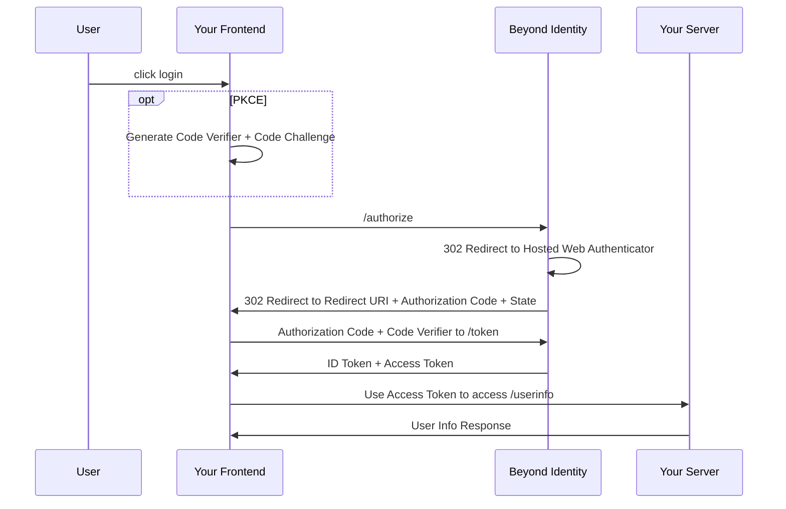

```mermaid
sequenceDiagram
    participant user as User
    participant frontend as Your Frontend
    participant bi as Beyond Identity
    participant server as Your Server
    user ->> frontend: click login
    opt PKCE
    frontend->>frontend: Generate Code Verifier + Code Challenge
    end
    frontend->>bi: /authorize
    bi->>bi: 302 Redirect to Hosted Web Authenticator
	bi->>frontend: 302 Redirect to Redirect URI + Authorization Code + State
    frontend->>bi: Authorization Code + Code Verifier to /token
    bi->>frontend: ID Token + Access Token
    frontend->>server: Use Access Token to access /userinfo
    server->>frontend: User Info Response
```
