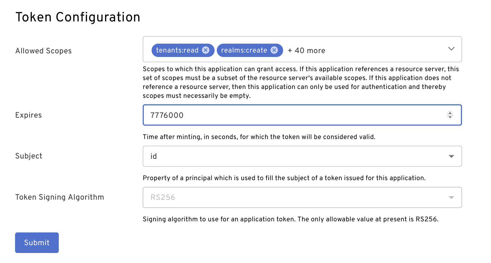

## Why scopes

Have you ever heard the saying _People don't want a quarter-inch drill. They want quarter inch holes_?  

While we're not sure whether the person responsible for this quote ever sold drills, or holes for that matter, it is a useful way to illustrate the relationship between tokens and scopes.  

Like holes are to drills, scopes are one step closer to your ultimate goal than tokens. If your token does not have the correct scopes, it will not enable the right access and will therefore be useless for your purposes.  

APIs look for specific scopes within a token. Tokens that authorize requests to APIs must contain the appropriate scopes for the actions being taken. 

## Where do scopes come from

Token scopes are the result of a negotiation between the token requestor (you / your app) and the token issuer (such as Beyond Identity).

There are three components to this negotiation:  

- Scopes included in the token request

- Scopes allowed for an application

- Scopes authorized for the identity approving the authorization request (this one only applies when the authorization_code grant type is used for the token request)

### Scopes included in the token request

Scopes included in the token request refers to the space-delimited set of scopes sent as the 'scope' parameter in the OAuth/OIDC [client credentials](./create-api-token.md#client-credentials-grant-type-confidential-client) or [authorization code](./create-api-token.md#authorization-code-with-pkce-confidential-client) grant request.  


### Scopes allowed for an application

Scopes allowed for an application refers to the **Allowed Scopes** property of an [application defined in Beyond Identity](/docs/next/add-an-application). In order for an app to have allowed scopes, it must be linked to a [**Resource Server** defined in Beyond Identity](/docs/next/add-resource-server).  

The setting is located in the Beyond Identity console on the app's External protocol tab under **Token Configuration**.  

  
### Scopes authorized for the identity approving the authorization request

When using the authorization code grant type, an interactive user must authorize the token request.  In this case, the user must be authorized for the scopes being requested.  

To enable a user to authorize particular scopes, you'll need the following: 

- a [role](/docs/next/create-role) that contains the scopes

- a user (an [identity](/docs/next/add-an-identity)) that is a [member of the role](/docs/next/add-user-group-to-role), either individually or via a [group](/docs/next/add-groups)

## Beyond Identity Management API Scopes

Calls to the Beyond Identity Management API require access token scopes as defined in the [API documentation](https://developer.beyondidentity.com/api/v1).

### How Beyond Identity API scopes are structured

The scopes required for a given request are intended to be intuitive based on the API being called. They are formatted as `<resource>:<action>`, where `resource` will map exactly to the resource being requested (in the URL), and `action` will be a CRUD action (Create, Read, Update, Delete) that can be performed on that resource.

For example, the following curl request would require the scope `applications:read`:

```bash
curl https://api-us.beyondidentity.com/v1/tenants/$TENANT_ID/realms/$REALM_ID/applications/$APPLICATION_ID \
  -X GET \
  -H "Authorization": "Bearer: $TOKEN" \
```

### Scope Types


#### `<resource>:read`

- Allows for the retrieval of the resource information via a GET request to `/v1/tenants/$TENANT_ID/realms/$REALM_ID/<resource>/$RESOURCE_ID`.

  - For realms, paths omit `/<resource>/$RESOURCE_ID`

  - For tenants, paths omit `/realms/$REALM_ID/<resource>/$RESOURCE_ID`

- This same scope also gates requests to list more than one resource via a GET request to `/v1/tenants/$TENANT_ID/realms/$REALM_ID/<resource>`. 

- Requests to list multiple resources will always be filtered to the tenant and realm for which they are requested.

#### `<resource>:create`

- Allows for the creation of a new resource via a POST request to `/v1/tenants/$TENANT_ID/realms/$REALM_ID/<resource>`.

- Resource creation may involve the auto-population of one or many fields on the resource itself. At a minimum, this will include an identifier (`id`) field. Other fields not required to be sent on creation will be returned in the API response. Documentation of which fields are required for which resources is available in our [API documentation](https://developer.beyondidentity.com/api/v1).

- Note that the resource creation request returns the same response as the read request. Therefore, while it is allowable to provide `<resource>:create` without `<resource>:read`, it does not change the end result.

#### `<resource>:update`

- Allows for the updating of an existing resource via a PATCH request to `/v1/tenants/$TENANT_ID/realms/$REALM_ID/<resource>/$RESOURCE_ID`.

- Resource patching may disallow the updating of certain fields. Documentation of which fields are available for which resources is available in our [API documentation](https://developer.beyondidentity.com/api/v1).

- Note that the resource update request returns the same response as the read request. Therefore, while it is allowable to provide `<resource>:update` without `<resource>:read`, it does not change the end result.

#### `<resource>:delete`

- Allows for the deletion of an existing resource via a DELETE request to `/v1/tenants/$TENANT_ID/realms/$REALM_ID/<resource>/$RESOURCE_ID`.

- Deletion requests return empty responses.

