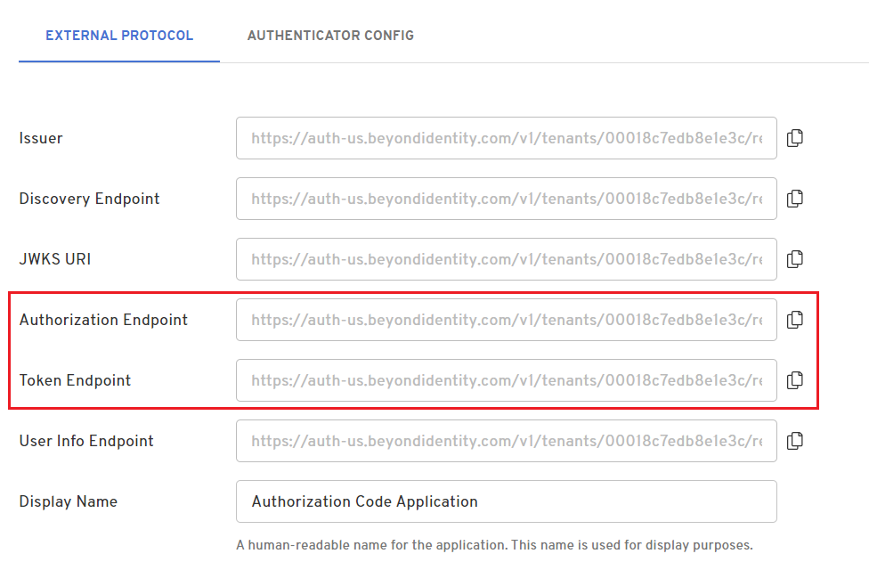

import CodeChallengeVerifier from '../includes/_code-challenge-verifier.mdx';
import MultiLanguageCodeBlock from '@site/src/components/CodeBlocks/MultiLanguageCodeBlock';
import Tabs from '@theme/Tabs';
import TabItem from '@theme/TabItem';
import AccessTokenCreatePublicClientPkce from '../includes/_access_token_create_public_client_pkce.mdx';
import AccessTokenCreateConfClientPkce from '../includes/_access_token_create_conf_client_pkce.mdx';
import AccessTokenCreateConfClientCreds from '../includes/_access_token_create_conf_client_creds.mdx';

## Prerequisites

In order to request a token, you need to have an [app configured in your Beyond Identity tenant](/docs/add-an-application).

This can be an application you configure yourself, or you can request a token for the built in Beyond Identity Management API app.

Several [app properties](/docs/api-token-overview#app-properties-that-impact-token-requests-and-token-validation) impact how tokens should be requested and validated. The examples below illustrate several variations of those properties.

## Admin Console

The simplest way to acquire an access token is through the Beyond Identity Admin Console.
The console enables you to create an access token for applications that use the client credentials grant type, such as the built in Beyond Identity Management API. For apps that use the authorization code grant type, you'll need to [request the token programmatically](#api).

### Create an access token in the console

import CreateApiTokenConsole from '../includes/_create-api-token-console.mdx';

<CreateApiTokenConsole />

:::note
Note that the list of **Scopes** available to request comes from the **Resource Server** associated with the app.
:::

## API

Using API requests, you can create tokens for apps that use either the client credentials or the authorization code grant type. To request tokens for an app programmatically, send a request to the app's `/authorize` and/or `/token` API endpoints. The requests follow the OAuth and OIDC protocols as described below.

### Token Request Scenarios

There are three main scenarios for requesting an access token:

1. Using the OAuth [client credentials grant type with a confidential client](#client-credentials-grant-type-confidential-client)

   Use this grant type for an app or script that accesses resources under its own identity with no user involved (machine to machine). The app must provide its own credentials for authentication to the authorization server.

2. Using the OIDC [authorization code grant type with a public client (PKCE required)](#authorization-code-with-pkce-public-client)

   The authorization code grant type is intended for scenarios in which a user must provide their credentials and authorize access. Based on the user's authentication and consent, the authorization server returns a code that the app can then exchange for access tokens. In addition, the OIDC protocol provides for an id_token that the client app itself can consume for information about the user.

   A "public client" refers to an app that runs on the client side, such as a native mobile app or a javascript app that runs entirely in the browser, that cannot protect client credentials. [PKCE](https://datatracker.ietf.org/doc/html/rfc7637) is required for such apps.

3. Using the OIDC [authorization code grant type with a confidential client (PKCE recommended)](#authorization-code-with-pkce-confidential-client)

   This scenario is like the above, except that a "confidential client" is an app with a back end that can protect client credentials. [PKCE](https://datatracker.ietf.org/doc/html/rfc7637) is recommended but not required for such apps.

### Authorization and Token request URLs

The URLs to send authorization and token requests for an app are based on the Beyond Identity tenant, realm, and application ID.

There are two main endpoints for requesting tokens:

The `/authorize` endpoint:

```http
https://auth-{us|eu}.beyondidentity.com/v1/tenants/{tenant_id}/realms/{realm_id}/applications/{application_id}/authorize
```

and the `/token` endpoint:

```http
https://auth-{us|eu}.beyondidentity.com/v1/tenants/{tenant_id}/realms/{realm_id}/applications/{application_id}/token
```

where:

  - `{tenant_id}` is the [ID of the tenant](/docs/find-tenant-id) in which the app is configured

  - `{realm_id}` is the **Realm Id** of the realm in which the application is configured

  - `{application_id}` is the **Application ID** of the app

### Finding app endpoint URLs

For any Beyond Identity application, you can find the authorization and token request URLs in the Admin Console on the app's External Protocol tab.

#### App that uses the Client Credentials grant type

An app that uses the client credentials grant type will only have a `/token` endpoint as shown here:


#### App that uses the Authorization Code grant type

An app that uses the authorization code grant type will have both `/authorize` and `/token` endpoints as shown below:



### Client credentials grant type (Confidential client)


<AccessTokenCreateConfClientCreds />

### Authorization code with PKCE (Public client)


<AccessTokenCreatePublicClientPkce />

### Authorization code with PKCE (Confidential client)

<AccessTokenCreateConfClientPkce />

### Token response

#### Client credentials response

The reponse to a `/token` request using the client credentials grant type for an OAuth app is a json object that contains an access_token:

```json
{
  "access_token": "eyJ0eXAiOiJKV1QiLCJh ... VC-aYWQ62_A1WJj3fPZVEvXhClbZUhGbE3Eu78z",
  "token_type": "Bearer",
  "expires_in": 86400,
  "scope": "myapp:read"
}
```

#### Access token response

The reponse to a `/token` request using the authorization code grant type for an OIDC app is a json object that contains an access_token and an id_token:

```json
{
  "access_token": "eyJ0eXAiOiJKV1QiLCJh ... WRDP_TWtJJe_qKiX6l4HiTFBv6jcPf2chkroDm",
  "token_type": "Bearer",
  "expires_in": 86400,
  "scope": "myapp:read",
  "id_token": "eyJhbGciOiJSUzI1NiIsImtpZ ... RedXTbWhBjxcYfh3MTWCnijaozSEud4S8WatKsvg"
}
```

#### Access token and refresh token response

The reponse to a `/token` request using the authorization code grant type for an OIDC app that has <b>Enable Refresh Tokens</b> checked is a json object that contains an access_token, refresh_token, and id_token:

```json
{
  "access_token": "eyJ0eXAiOiJKV1QiLCJh ... 0NJrpbRJjyafVvV3iFgwgf51y9HO",
  "token_type": "Bearer",
  "expires_in": 86400,
  "refresh_token": "eyJ0eXAiOiJKV1QiLCJh ... _ATJOHUEeKuScnIWnHtNdmxwIT2H",
  "scope": "myapp:read",
  "id_token": "eyJhbGciOiJSUzI1Ni ... rApNYtgqpWY7ripecTXqoHXHna8kq2M7W"
}
```

### Example: Create a Token for the Beyond Identity Management API

import CreateBiApiTokenExample from '../includes/_access_token_create_bi_api_example.mdx';

<CreateBiApiTokenExample />

### Example: Create a Token with a Limited Expiration Time

This parameter is used to set a custom expiration time on individual tokens, to a value that is less than what was originally configured. This is done by passing an `expiration_time` parameter to the `/token` endpoint.

<Tabs>
<TabItem value="client-credentials" label="Client Credentials">

  <MultiLanguageCodeBlock
  curl='curl "https://auth-$(REGION).beyondidentity.com/v1/tenants/$(TENANT_ID)/realms/$(REALM_ID)/applications/$(APPLICATION_ID)/token" \
  -X POST \
  -u "$(CLIENT_ID):$(CLIENT_SECRET)" --basic \
  -H "Content-Type: application/x-www-form-urlencoded" \
  -d "grant_type=client_credentials&scope=$(SCOPES)&expiration_time=3600"'
  title="/token"
  />

  where:

    - CLIENT_ID and CLIENT_SECRET are the **Client ID** and **Client Secret**, respectively, of the app

    - SCOPES is one or more of the app's **Allowed Scopes**, space delimited

    - the value of expiration_time parameter is the desired lifetime, in seconds, of the requested token, for example 3600 would indicate 1 hour

</TabItem>
<TabItem value="authorization-code" label="Authorization Code">

  <MultiLanguageCodeBlock
  curl='curl -G "https://auth-$(REGION).beyondidentity.com/v1/tenants/$(TENANT_ID)/realms/$(REALM_ID)/applications/$(APPLICATION_ID)/authorize" \
  --data-urlencode "response_type=code" \
  --data-urlencode "client_id=$(APPLICATION_CLIENT_ID)" \
  --data-urlencode "redirect_uri=$(REDIRECT_URI)" \
  --data-urlencode "scope=$(SCOPES)" \	//for example scope=openid%20myapp%3Aread%20myapp%3Awrite
  --data-urlencode "state=$(STATE)" \
  --data-urlencode "code_challenge=$(CODE_CHALLENGE)" \
  --data-urlencode "code_challenge_method=S256"'
  title="/authorize"
  />

  where:

    - APPLICATION_CLIENT_ID is your app's **Client ID**

    - REDIRECT_URI is one of the app's configured **Redirect URI** values

    - SCOPES is 'openid' plus one or more of the app's **Allowed Scopes**, space delimited

    - STATE is a value generated by your app to maintain state betewen the request and response

    - CODE_CHALLENGE is generated as defined in [RFC 7636](https://datatracker.ietf.org/doc/html/rfc7636#section-4.2), example JavaScript snippet below:<br/><br/><CodeChallengeVerifier/>

  <MultiLanguageCodeBlock
  curl='curl "https://auth-$(REGION).beyondidentity.com/v1/tenants/$(TENANT_ID)/realms/$(REALM_ID)/applications/$(APPLICATION_ID)/token" \
  -X POST \
  -u "$(CLIENT_ID):$(CLIENT_SECRET)" --basic \
  -H "Content-Type: application/x-www-form-urlencoded" \
  -d "grant_type=authorization_code&code=$(CODE)&redirect_uri=$(REDIRECT_URI)&client_id=$(CLIENT_ID)&code_verifier=$(CODE_VERIFIER)&expiration_time=3600"'
  title="/token"
  />

  where:

    - CLIENT_ID and CLIENT_SECRET are the **Client ID** and **Client Secret**, respectively, of the app

    - CODE is the code returned from the `/authorize` call

    - REDIRECT_URI is one of the app's configured **Redirect URI** values and matches the redirect_uri sent in the `/authorize` call

    - CLIENT_ID is the app's configured **Client ID**

    - CODE_VERIFIER is defined as in [RFC 7636](https://datatracker.ietf.org/doc/html/rfc7636#section-4.1), example JavaScript snippet below:<br/><br/><CodeChallengeVerifier/>

    - the value of expiration_time parameter is the desired lifetime, in seconds, of the requested token, for example 3600 would indicate 1 hour

</TabItem>
</Tabs>

When calling inspect on the newly created token you will see the following fields. You can now verify that the difference between expiration time ('exp') and issued at time ('iat') is equal to the value sent as the expiration_time request parameter, in this example 3600 seconds.

```json
{
  "active": true,
  "bi_ty": "authorization_code",
  "iss": "https://auth-us.beyondidentity.com/v1/tenants/00018c7edb8e1e3c/realms/1fa458f68ece5b5d/applications/235231f7-bd5d-404a-bb58-c6370b544c54",
  "sub": "7a8cce58fd160449",
  "aud": [
    "RY-N2xUjQb5PqKl9HwBLgpnV",
    "http://myexampleapi"
  ],
  "exp": 1689041630,
  "nbf": 1689038030,
  "iat": 1689038030,
  "jti": "7USu6gCUKhmQuvMmrhwam7QnYiGyl4aq",
  "scope": "myapp:write myapp:read",
  "azp": "tenants/00018c7edb8e1e3c/realms/1fa458f68ece5b5d/applications/235231f7-bd5d-404a-bb58-c6370b544c54",
  "bi_p": "tenants/00018c7edb8e1e3c/realms/1fa458f68ece5b5d/identities/7a8cce58fd160449",
  "bi_s": "",
  "bi_x": "n3eBAmnWIDw3amXoCgaSn-b2Yo3_JtWe"
}
```

### Example: Create a Token with Custom Claims

The `custom_claims` parameter allows for additional information to be stored within a token. The provided data must be a valid JSON object. Upon a successful token request, the data will be available within the `bi_custom` field of the response JWT payload.

<Tabs>
<TabItem value="client-credentials" label="Client Credentials">

  <MultiLanguageCodeBlock
  curl='curl "https://auth-$(REGION).beyondidentity.com/v1/tenants/$(TENANT_ID)/realms/$(REALM_ID)/applications/$(APPLICATION_ID)/token" \
  -X POST \
  -u "$(CLIENT_ID):$(CLIENT_SECRET)" --basic \
  -H "Content-Type: application/x-www-form-urlencoded" \
  -d "grant_type=client_credentials&scope=$(SCOPES)&custom_claims=$("a": "b", "c": "d")"'
  title="/token"
  />

  where:

    - CLIENT_ID and CLIENT_SECRET are the **Client ID** and **Client Secret**, respectively, of the app

    - SCOPES is one or more of the app's **Allowed Scopes**, space delimited

    - the value of the custom_claims parameter is a JSON string containing the key/value pairs you wish the token to include

</TabItem>
<TabItem value="authorization-code" label="Authorization Code">

  <MultiLanguageCodeBlock
  curl='curl -G "https://auth-$(REGION).beyondidentity.com/v1/tenants/$(TENANT_ID)/realms/$(REALM_ID)/applications/$(APPLICATION_ID)/authorize" \
  --data-urlencode "response_type=code" \
  --data-urlencode "client_id=$(APPLICATION_CLIENT_ID)" \
  --data-urlencode "redirect_uri=$(REDIRECT_URI)" \
  --data-urlencode "scope=$(SCOPES)" \	//for example scope=openid%20myapp%3Aread%20myapp%3Awrite
  --data-urlencode "state=$(STATE)" \
  --data-urlencode "code_challenge=$(CODE_CHALLENGE)" \
  --data-urlencode "code_challenge_method=S256"'
  title="/authorize"
  />

  where:

    - APPLICATION_CLIENT_ID is your app's **Client ID**

    - REDIRECT_URI is one of the app's configured **Redirect URI** values

    - SCOPES is 'openid' plus one or more of the app's **Allowed Scopes**, space delimited

    - STATE is a value generated by your app to maintain state betewen the request and response

    - CODE_CHALLENGE is generated as defined in [RFC 7636](https://datatracker.ietf.org/doc/html/rfc7636#section-4.2), example JavaScript snippet below:<br/><br/><CodeChallengeVerifier/>

  <MultiLanguageCodeBlock
  curl='curl "https://auth-$(REGION).beyondidentity.com/v1/tenants/$(TENANT_ID)/realms/$(REALM_ID)/applications/$(APPLICATION_ID)/token" \
  -X POST \
  -u "$(CLIENT_ID):$(CLIENT_SECRET)" --basic \
  -H "Content-Type: application/x-www-form-urlencoded" \
  -d "grant_type=authorization_code&code=$(CODE)&redirect_uri=$(REDIRECT_URI)&client_id=$(APP_CLIENT_ID)&code_verifier=$(CODE_VERIFIER)&expiration_time=3600&custom_claims=("a": "b", "c": "d")"'
  title="/token"
  />

  where:

    - CLIENT_ID and CLIENT_SECRET are the **Client ID** and **Client Secret**, respectively, of the app

    - CODE is the code returned from the `/authorize` call

    - REDIRECT_URI is one of the app's configured **Redirect URI** values and matches the redirect_uri sent in the `/authorize` call

    - CLIENT_ID is the app's configured **Client ID**

    - CODE_VERIFIER is defined as in [RFC 7636](https://datatracker.ietf.org/doc/html/rfc7636#section-4.1), example JavaScript snippet below:<br/><br/><CodeChallengeVerifier/>

    - the value of the custom_claims parameter is a JSON string containing the key/value pairs you wish the token to include

</TabItem>
</Tabs>

After a token is created, when introspected, the token will contain the `bi_custom` field with all of the claims. In this case, we sent `{"a": "b", "c": "d"}` as the custom_claims parameter.

```json
{
  "active": true,
  "bi_ty": "authorization_code",
  "iss": "https://auth-us.beyondidentity.com/v1/tenants/00018c7edb8e1e3c/realms/1fa458f68ece5b5d/applications/c08e8bd9-d41d-4fc8-aa8e-309fe8843d5d",
  "sub": "7a8cce58fd160449",
  "aud": [
    "btSEEvQcWay6F_lGI6lI-V8z",
    "http://myexampleapi"
  ],
  "exp": 1689126046,
  "nbf": 1689039646,
  "iat": 1689039646,
  "jti": "xJE5aS6_nZgmmWaY9fMnFD6F3YxiwjmL",
  "scope": "myapp:read myapp:write",
  "azp": "tenants/00018c7edb8e1e3c/realms/1fa458f68ece5b5d/applications/c08e8bd9-d41d-4fc8-aa8e-309fe8843d5d",
  "bi_p": "tenants/00018c7edb8e1e3c/realms/1fa458f68ece5b5d/identities/7a8cce58fd160449",
  "bi_custom": {
    "a": "b",
    "c": "d"
  },
  "bi_s": "",
  "bi_x": "UdTa2Lh1_bRKr3mdOTt3yE1dHE1UlUlH"
}
```
