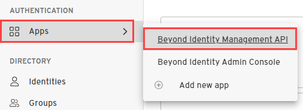

import MultiLanguageCodeBlock from '@site/src/components/CodeBlocks/MultiLanguageCodeBlock';


## Prerequisites

In order to list tokens, you need the following:

- the application_id of the application that was used to issue the token

- a bearer token with the `tokens:read` scope and audience 'beyondidentity' for authorization (to create a Beyond Identity API token, see examples [here](/docs/create-api-token#example-create-tokens-for-the-beyond-identity-management-api))


## Admin Console

The console enables you to view issued API tokens for applications that use the client credentials grant type, such as the built in Beyond Identity Management API. For apps that use the authorization code grant type, you'll need to [list tokens via the API](#api).

For applications that use the client credentials grant type, view issued API tokens in the Admin console as follows:

1. Under **Apps**, select the app for which you want to view issued tokens, such as the **Beyond Identity Management API** application.

  

1. Select the **API Tokens** tab.

## API

Use the [list tokens API](https://developer.beyondidentity.com/api/v1#tag/Tokens/operation/ListTokens) to list tokens for a given application or principal.

### List Access Tokens Request

Create the HTTP request with the following properties:

**Request method:** GET

**Request URL:**

```http
https://api-{us|eu}.beyondidentity.com/v1/tenants/{tenant_id}/realms/{realm_id}/applications/{application_id}/tokens?principal_type={principal_type}
```

where

`{principal_type}` is either 'application' or 'identity' (see [List Tokens API](https://developer.beyondidentity.com/api/v1#tag/Tokens/operation/ListTokens) for more details on query parameters)

:::note
The list tokens API hostname is prefixed with "api-us" or "api-eu", not "auth-us" or "auth-eu"
:::

**Request headers:**

```http
Authorization: {authorization_token}
content-type: application/x-www-form-urlencoded
```

where

`{authorization_token}` contains scope 'tokens:read' and audience 'beyondidentity'

### Example: List access tokens for an application

<MultiLanguageCodeBlock
curl='curl -G "https://api-$(REGION).beyondidentity.com/v1/tenants/$(TENANT_ID)/realms/$(REALM_ID)/applications/$(APPLICATION_ID)/tokens" \
--data-urlencode "principal_type=application" \
--data-urlencode "principal_id=$(APPLICATION_ID)" \
-H "Authorization Bearer $(MANAGEMENT_API_TOKEN)"'
title="/tokens"
/>

### Example Response

```json
{
  "tokens": [
    {
      "id": "uZcs8hF4_vR69eonor3U_lottYxtSfrX",
      "scopes": ["tenants:create"],
      "expires": 1675177245,
      "issued_at": 1675090845,
      "token_type": "access",
      "token_format": "self_contained"
      "token_suffix": "Jv_1828r9",
    }
  ],
  "total_size": 1
}
```

### Example: List access tokens for an identity

<MultiLanguageCodeBlock
curl='curl -G "https://api-$(REGION).beyondidentity.com/v1/tenants/$(TENANT_ID)/realms/$(REALM_ID)/applications/$(APPLICATION_ID)/tokens" \
--data-urlencode "principal_type=identity" \
--data-urlencode "principal_id=$(IDENTITY_ID)" \
-H "Authorization Bearer $(MANAGEMENT_API_TOKEN)"'
title="/tokens"
/>


### Example Response

```json
{
    "tokens": [
        {
            "id": "cKigHwlWRW5h3Dv4CCMBICiqf-j1i1yJ",
            "scopes": ["myapp:read"],
            "expires": 1688488934,
            "issued_at": 1688402534,
            "token_type": "access",
            "token_format": "self_contained"
        },
        {
            "id": "Kh-yAOSh9ex7cVuVbVUr84EMmou6VBA-",
            "scopes": ["myapp:read"],
            "expires": 1688488934,
            "issued_at": 1688402534,
            "token_type": "access",
            "token_format": "self_contained"
        }
    ],
    "total_size": 2,
    "next_page_token": null
}
```
