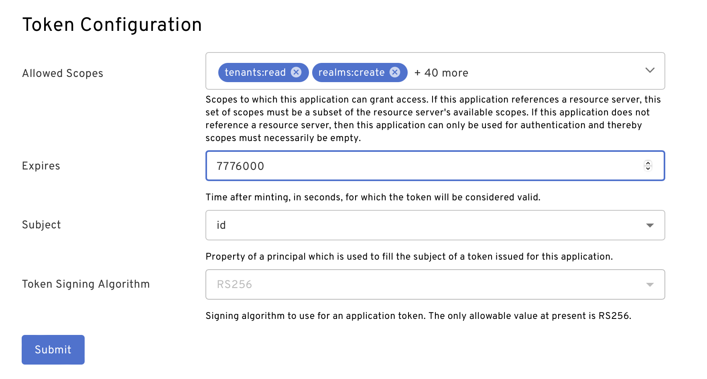

import { Alert, Col, Row } from 'antd';

<Row>
  <Col span={12}>
    <Alert message="The info here has been moved to the Add an application article. We can remove this. (Jen)" type="info" />
  </Col>
</Row>
 
<Alert
   message="Action items"
   description="IMO this should be included in the Add an app article. These are app policy options. -Jen"
   type="error"
/>

Token configuration, such as expiration and default allowed scopes, can be modified either through the Beyond Identity Admin Console or through API on [application update](https://developer.beyondidentity.com/api/v1#tag/Applications/operation/UpdateApplication).

In the Beyond Identity Admin Console under the "Apps" tab, select the "Beyond Identity Management API" application. Then tap on "EXTERNAL PROTOCOL" and scroll down to the bottom to see "Token Configuration".

