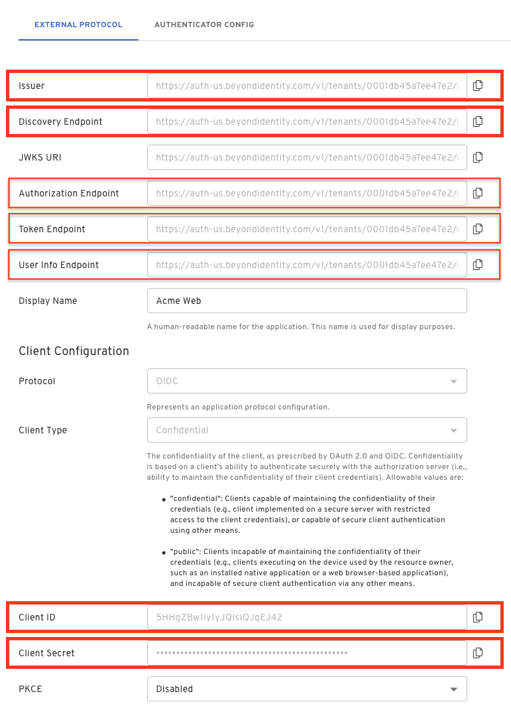
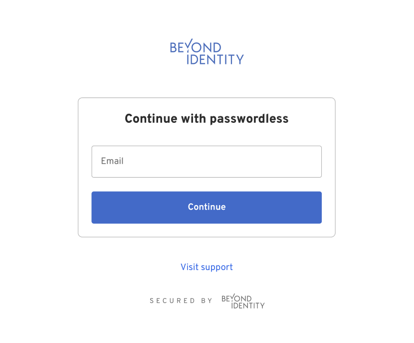
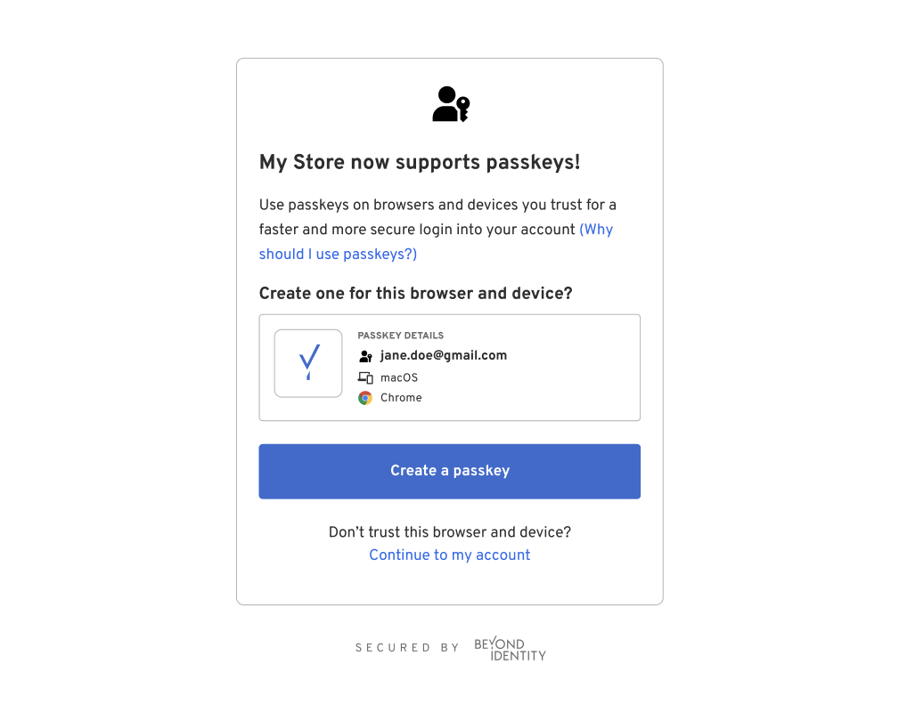
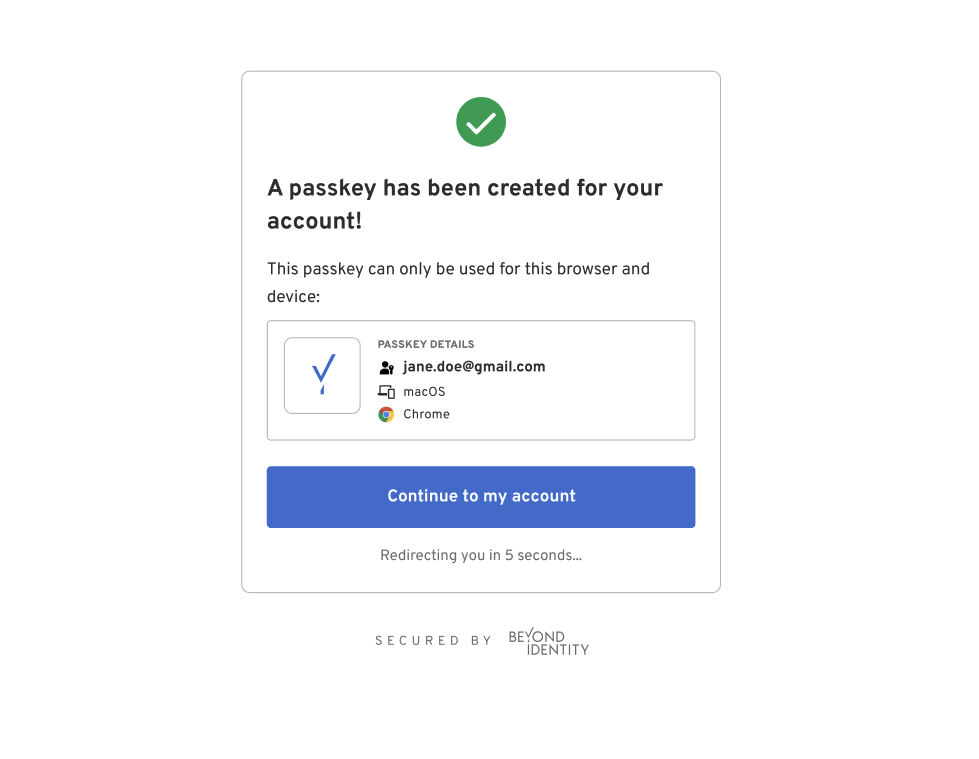

import Tabs from '@theme/Tabs';
import TabItem from '@theme/TabItem';
import MultiLanguageCodeBlock from '@site/src/components/MultiLanguageCodeBlock';

import ProtocolOIDC from '../includes/_protocol_oidc.mdx';
import PKCES256 from '../includes/_pkce_s256.mdx';
import HostedWeb from '../includes/_hosted-web.mdx';
import ClientTypeConfidential from '../includes/_client-type_confidential.mdx';
import GrantTypeAuthorizationCode from '../includes/_grant-type_authorization-code.mdx';
import TokenEndpointAuthMethodClientSecretBasic from '../includes/_token-endpoint-auth-method_client-secret-basic.mdx';
import HWADiagram from '../includes/_hwa-diagram.mdx';

This guide shows how to add authentication to your application using Hosted Web Authenticator integration model. Hosted Web handles passkey registration and authentication and offers an easy developer integration experience to your application.

**Hosted Web** is one of two Configuration Types that can be configured when [creating an application](/docs/next/add-an-application). Selecting this option requires less configuration and code. Your app simply needs to redirect to Beyond Identity's Hosted Web Authenticator, and we do the rest.

The Hosted Web Authenticator can be set up using an OpenID Connect client library. Many frameworks and languages have their own. If you wish to find an OpenID Connect client, we recommend looking for one on the list of [certified OpenID Connect clients](https://openid.net/developers/certified/).

## Overview

With this guide you will:

1. Create a Beyond Identity application using the Hosted Web Authenticator
1. Configure an OpenID Connect client library or build your own.

## Create your Beyond Identity application

### Prerequisites

- [x] A [developer account](https://www.beyondidentity.com/developers)
- [x] Logged into your admin console

Depending on the region you chose when you signed up, you can access the Beyond Identity admin console for your tenant at:   
- [BI admin console US](https://console-us.beyondidentity.com/login)  
- [BI admin console EU](https://console-eu.beyondidentity.com/login)

:::tip  
_If you are signing in from a different computer or browser, you can enter the email address you used when you signed up. Beyond Identity will send you a one time link you can use to sign in and enroll a passkey from the new browser._  
:::

### Create a new realm

So far, you have the Beyond Identity Admin Realm for your Beyond Identity tenant only. In this step, you'll create a new Realm to hold your users' identities and the configuration. 

import CreateRealmConsole from '../includes/_create-realm-console.mdx';

<CreateRealmConsole />

### Create an application

In this step, you'll create a new Application containing the configuration for your users.

import AddAppAdminConsole from '../includes/_add-application-console.mdx';

<AddAppAdminConsole />

On the **External Protocol** tab, use the following values to complete this tab.

  | Property | Value |
  | --- | --- |
  | **Display Name** | Descriptive name you choose |
  | **Protocol** | OIDC<br /><ProtocolOIDC/> |
  | **Client Type** | Confidential<br /><ClientTypeConfidential/> |
  | **PKCE** | S256<br /><PKCES256/> |
  | **Redirect URIs** | Use a route in your app this is capable of handling the authorization code exchange.<br /><br />If you are using an OpenID Connect client library, a redirect URI may be specified for you. <br /><br />For example: In a Next.js application using NextAuth, your redirect URI follows the pattern:<br /><br /><pre>http://localhost:3000/api/auth/callback/beyondidentity</pre><div class= "note-message note-message-table"><p>where `beyondidentity` in this URI is the ID of the Auth provider as configured in the providers array in NextAuth.js and `/api/auth/callback/` is based on the Next.js route file structure.</p></div> |
  | **Token Endpoint Auth Method** | Client Secret Basic<br /><TokenEndpointAuthMethodClientSecretBasic/> |
  | **Grant Type** | Authorization Code<br /><GrantTypeAuthorizationCode/> |
  | **All other options** | Use the default values for the remaining options |

On the **Authenticator Config** tab, use the following values to complete this tab.

   | Property | Value | 
   | ----------- | ----------- |
   | **Configuration Type** | Hosted Web <br /><HostedWeb/> |
   | **Authentication Profile** | Use the default values for the remaining options |

:::tip **CHECKPOINT**
Congrats!
You've created and configured a Beyond Identity application. You're now ready to use the values from this applications for your OpenID Connect client.
:::

## Configure an OpenID Connect client library

Using a library is the recommended approach becasue it handles authorization, token exchange and accessing user info for you. 

There are many libraries available depending on your application's tech stack. If you need help finding an OpenID Connect client for your tech stack, we recommend looking for one on the list of [certified OpenID Connect clients](https://openid.net/developers/certified/).

While there are many libraries available, they all need similar values to configure. You can find all the values you need under your **External Protocol** section of the application you created above. 

`Client ID` and `Client Secret` will be needed for all of them, but there may be some variation in the URLs needed.

:::note
Remeber, if your **Client Type** is set to **Confidential** in your application's **External Protocol** tab then you will have a `Client Secret`. If the **Client Type** is set to **Public** then you will not have this value. 
:::

The `Issuer` and the `Discovery Endpoint` URL are both used by the client to identify the OpenID endpoints. The Discovery Endpoint is the _Issuer_ + _/.well-known/openid-configuration_

You can also access individual endpoints in this tab. Some libraries require copying over these URLs individually rather than using an issuer/discovery endpoint. These URLs are `Authorization Endpoint`, `Token Endpoint` and `User Info Endpoint`.

:::tip
Some libraries will require you to explicitly pass **scopes** or explicitly define that you are using **PKCE** or **state**. Be sure to use **"openid"** as a scope and configure all relevant values.    

For example using a NextAuth Provider:
```javascript
{
    id: "beyondidentity",
    name: "Beyond Identity",
    type: "oauth",
    wellKnown: process.env.BEYOND_IDENTITY_DISCOVERY,
    authorization: { params: { scope: "openid" } },
    clientId: process.env.BEYOND_IDENTITY_CLIENT_ID,
    clientSecret: process.env.BEYOND_IDENTITY_CLIENT_SECRET,
    idToken: true,
    checks: ["pkce", "state"],
    profile(profile) {
      return {
        id: profile.sub,
        name: profile.name,
        email: profile.email,
      }
    },
},
```
:::

Consult your library for more details on which values are needed.

 

## How it works / Configure your own client

If you are not using a library, you will need to configure your own client. Use the **Authorization Endpoint**, **Token Endpoint**, and **User Info Endpoint** found in your application's **External Protocol** tab. 

<HWADiagram/>

### Authorization

Start with the **Authorization Endpoint** found in your application's **External Protocol** tab. 

This url should look like the following:

```bash title="Authorization Endpoint"
https://auth-$REGION.beyondidentity.com/v1/tenants/$TENANT_ID/realms/$REALM_ID/applications/$APPLICATION_ID/authorize
```

Copy the **Authorization Endpoint** from to console and append the following parameters:

```bash title="/authorize"
$(Authorization Endpoint)?
response_type=code
&client_id=$CLIENT_ID
&redirect_uri=$REDIRECT_URI
&scope=openid
&state=$STATE
&code_challenge_method=256
&code_challenge=$PKCE_CODE_CHALLENGE
```

| Parameter | Value |
| --- | --- |
| **response_type** | code <br /><br />This parameter specifies that the authorization server should return an authorization code to the client. The code will be used by the client to request an access token.<div class= "note-message note-message-table"><p>**Grant Type** must be set to **Authorization Code** in the console application. </p></div> |
| **client_id** | Copy and paste the **Client ID** value from your application's **External Protocol** tab. |
| **redirect_uri** | This parameter specifies the URL to which the authorization server can send an authorization code. If a state parameter was specified in the /authorize request, then that will be echoed back to this URL as well.<br /><br /><div class= "note-message note-message-table"><p>This must match one of the **Redirect URIs** registered in your console application.</p></div> |
| **scope** | openid |
| **state** | This parameter is a random value generated by the client. It is included in the authorization request and returned in the response. This parameter helps the client maintain state between the request and the callback to prevent cross-site request forgery (CSRF) attacks. |
| **code_challenge_method** | 256 <br /><PKCES256/><div class= "note-message note-message-table"><p>This value is optional. **PKCE** must be enabled to **S256** in the console application. If it is not enabled then you should not send the **code_challenge_method** or **code_challenge** parameters</p></div>|
| **code_challenge** | This used in conjunction with **code_challenge_method** ensures that the authorization code obtained by the client can only be used by the client that originally requested it.<br /><br />You will need to store the hash of the **code_challenge** so that it can be passed to the token exchange endpoint later as a **code_verifier**.<br /><br /><div class= "note-message note-message-table"><p>This value is optional. **PKCE** must be enabled in the console application. If it is not enabled then you should not send the **code_challenge_method** or **code_challenge** parameters.</p></div> |

:::tip
The **code_challenge** is generated as defined in [**RFC 7636**](https://datatracker.ietf.org/doc/html/rfc7636#section-4.2), example JavaScript snippet below:

```javascript
  codeVerifier = crypto.randomBytes(32).toString('base64url');
  codeChallenge = crypto.createHash('sha256').update(codeVerifier).digest().toString('base64url');
```
:::

#### Initiate Authorization

After you have constructed the authorization URL, ensure to URL encode it and then incorporate it into your application:

```html
<a href="https://auth-$REGION.beyondidentity.com/v1/tenants/$TENANT_ID/realms/$REALM_ID/applications/$APPLICATION_ID/authorize?response_type=code&amp;scope=email%20openid&amp;client_id=$CLIENT_ID&amp;state=$STATE&amp;redirect_uri=$REDIRECT_URI">
Login with passwordless
</a>
```

#### Hosted Web Authenticator

When a user taps the above link, they will be redirected to the Beyond Identity Hosted Web Authenticator. The user will be presented with UI that handles passkey registration and authentication. The URL that the user will land on will look like the following:

```bash title=302
https://auth-$REGION.beyondidentity.com/authenticator/v1/tenants/$TENANT_ID/realms/$REALM_ID/authenticator-configs/$AUTHENTICATOR_CONFIG_ID/bi-authenticate?request=$JWT
```

 
 
 

#### Back to your application

Upon successfully completing the UI flow, the Hosted Web Authenticator will redirect the user back to your application based on the provided **redirect_uri** in the authorization request appended with an **authorization code** and a **state**. 

```bash title=302
$(REDIRECT_URI)
&code=$(AUTHORIZATION_CODE)
&state=$(STATE)
```

The **code** is a short-lived authorization code that the client can exchange with the authorization server for an access token. The access token is what the client application uses to access protected resources on behalf of the user.

The **state** should be the same random value that the client included in the initial authorization request. This helps the client maintain the integrity of the authorization process. The client should then compare the received state with the original state to ensure that the response corresponds to the correct request and that the process wasn't tampered with (to prevent CSRF attacks).


### Token Exchange

Now that your client has recieved an **authorization code** it's time to exchange the code for an **access token**. An access token is used to access protected resources on behalf of a user. 

Use the **Token Endpoint** value from your application's **External Protocol** tab.

:::note
If the **Client Type** is set to **Public** then you will not have a `Client Secret`. You can still make a token exchange without the `Client Secret`, but it is highly recommended that you do use **PKCE S256** throughout this process. POST all of the below parameters as part of the request body.  
:::

<Tabs groupId="token-auth-method" queryString>
<TabItem value="client_secret_basic" label="Client Secret Basic">

The `$CLIENT_ID` and `$CLIENT_SECRET` are sent in the Basic Authorization header.

<MultiLanguageCodeBlock
  curl='curl "https://auth-$(REGION).beyondidentity.com/v1/tenants/$(TENANT_ID)/realms/$(REALM_ID)/applications/$(APPLICATION_ID)/token" \
-X POST \
-u "$(CLIENT_ID):$(CLIENT_SECRET)" --basic \
-H "Content-Type: application/x-www-form-urlencoded" \
-d "grant_type=authorization_code&code=$(AUTHORIZATION_CODE)&code_verifier=$(CODE_VERIFIER)&redirect_uri=$(REDIRECT_URI)"'
  title="/token"
/>
</TabItem>

<TabItem value="client_secret_post" label="Client Secret Post">

The `$CLIENT_ID` and `$CLIENT_SECRET` are sent in the body of the POST request as a form parameter.

<MultiLanguageCodeBlock
  curl='curl "https://auth-$(REGION).beyondidentity.com/v1/tenants/$(TENANT_ID)/realms/$(REALM_ID)/applications/$(APPLICATION_ID)/token" \
-X POST \
-H "Content-Type: application/x-www-form-urlencoded" \
-F "grant_type=authorization_code" \
-F "code=$(AUTHORIZATION_CODE)" \
-F "client_id=$(CLIENT_ID)" \
-F "client_secret=$(CLIENT_SECRET)" \
-F "code_verifier=$(CODE_VERIFIER)" \
-F "redirect_uri=$(REDIRECT_URI)"'
  title="/token"
/>

</TabItem>
</Tabs>

| Parameter | Value |
| --- | --- |
| **grant_type** | authorization_code <br /><br />This indicates the grant type of this token request. |
| **code** | This is the authorization code that was obtained in the last redirect. |
| **redirect_uri** | This must match the redirect URI that was used in the initial authorization request |
| **client_id** | Copy and paste the **Client ID** value from your application's **External Protocol** tab. |
| **client_secret** | Copy and paste the **Client Secret** value from your application's **External Protocol** tab.<div class= "note-message note-message-table"><p>This value is optional. The **Client Type** must be set to **Confidential** in the console application.</p></div> |
| **code_verifier** | The hashed value of the **code_challenge** sent in the original authorization request. <div class= "note-message note-message-table"><p>This value is optional. **PKCE** must be enabled in the console application. If it is not enabled then you should not send the **code_challenge_method**, **code_challenge** or **code_verifier**.</p></div>|

### User Info

Once you have an **access token** you can use this to access information about the user. Use the **User Info Endpoint** value from your application's **External Protocol** tab.

```bash /userinfo
GET /userinfo HTTP/1.1
Host: User Info Endpoint
Authorization: Bearer <access_token>
```

<MultiLanguageCodeBlock
  curl='curl "https://auth-$(REGION).beyondidentity.com/v1/tenants/$(TENANT_ID)/realms/$(REALM_ID)/applications/$(APPLICATION_ID)/userinfo" \
-X GET \
-H "Authorization: Bearer $(ACCESS_TOKEN)"'
  title="/token"
/>

The following user values may be returned:

| Parameter | Value |
| --- | --- |
| **subject** | The subject is used to uniquely identify the user within the context of Beyond Identity. |
| **name** | The name of the user<div class= "note-message note-message-table"><p>This value is optional.</p></div> |
| **preferred_username** | The preferred username is often a user-friendly string that identifies the user.<div class= "note-message note-message-table"><p>This value is optional.</p></div> |
| **email** | The email address associated with the authenticated user's account.<div class= "note-message note-message-table"><p>This value is optional.</p></div> |