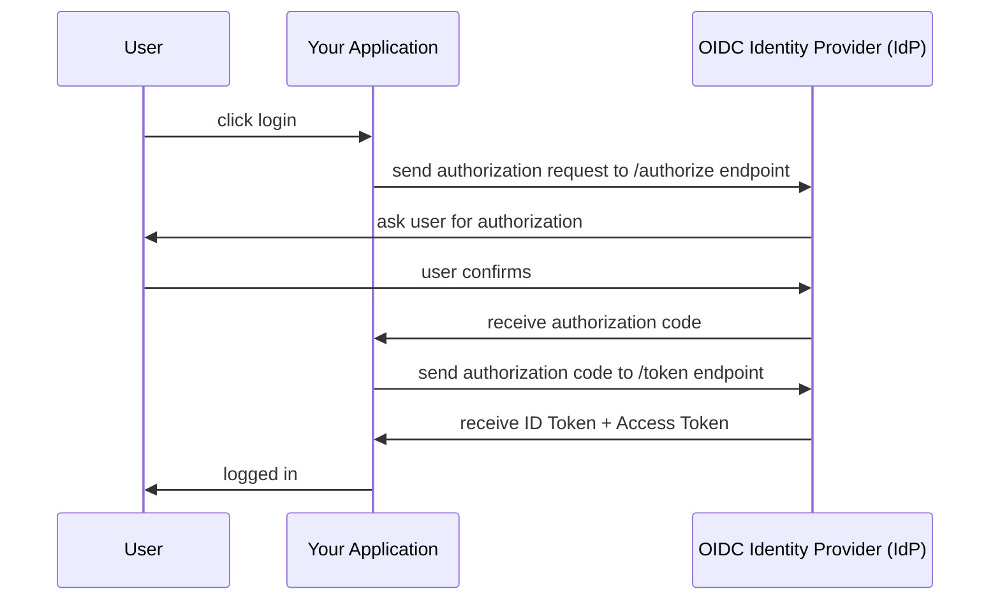

## Overview

[OpenID Connect (OIDC)](/docs/terms/oidc) is an identity layer built on top of the [OAuth 2.0 framework](/docs/terms/oauth). While OAuth 2.0 helps with _authorization_ (allowing access), OIDC helps with _authentication_ (identification). OIDC enables your application to verify an end user based on authentication performed by the OIDC Provider's Authorization Server as well as to obtain basic information about the end user. OIDC adds an [ID token](/docs/terms/id-token.md) to OAuth's [access token](/docs/terms/access-token.md). Together, OAuth and OIDC provide a comprehensive solution for secure authentication and authorization used by many identity providers (think "Sign in with Google").

## Authorization Code

There are several [Grant Types](/docs/terms/grant-type.md), but the most common grant type is [Authorization Code](/docs/terms/authorization-code.md). This type is recommended for applications authenticating users. An application using the Authorization Code grant type obtains a temporary code, called an **authorization code**, that can be exchanged for an **access token** and **id token**. You specify this grant type in the **response_type** parameter of your authorization request [(see below)](#what-to-do-in-your-application).

## How it works

In the below diagram:

- **User**: This represents the end user who is attempting to log in or authenticate with your application.

- **Your Application**: This is your application, which initiates the authentication process with the OIDC Identity Provider.

- **OIDC Identity Provider (IdP)**: The Identity Provider is the OIDC service responsible for verifying the user's identity and providing the necessary tokens for authentication.



Here's a step-by-step breakdown of the flow:

1. The user initiates the login process by clicking on the login button within your application.
1. Your application sends an authorization request to the OIDC Identity Provider by making an HTTP request to the /authorize endpoint.
1. The OIDC Identity Provider responds by asking the user for authorization. The user confirms their identity.
1. Upon successful confirmation, the OIDC Identity Provider issues an authorization code to your application.
1. Your application then exchanges this authorization code for both an ID Token and an Access Token by making another HTTP request to the /token endpoint of the identity provider.
1. The OIDC Identity Provider responds by providing the ID Token and Access Token to your application.
1. With these tokens, your application can now consider the user as logged in and provide access to the protected resources.

## Access Tokens vs ID Tokens

**Access Tokens** come from the [OAuth 2.0 framework](/docs/terms/oauth) and are used to access protected resources. [Access Tokens](/docs/terms/access-token.md) are used in API calls as [bearer tokens](/docs/terms/bearer-token.md). They do not guarantee that the user is currently authenticated.

**ID Tokens** come from [OIDC](/docs/terms/oidc.md) and are used to prove that the user has been authenticated. [ID Tokens](/docs/terms/id-token.md) are always [JSON Web Tokens (JWT)](/docs/terms/jwt.md). When inspected, the payload of the JWT contains claims, which is information about the user such as the user's name, email, and the OIDC service. You can use this token to determine if the user is logged in.

## What to do in your application

The first step is to request authorization from the user. To do this you will need to create an authorization url for the user to click on. Your OIDC identity provider (IdP) should provide the authorization endpoint but you will need to add additional parameters to this URL:

The authorization URL follows the format below:

```http /authorize
https://idp-auth-server/authorize
?response_type=code
&scope=openid
&client_id=12345
&redirect_uri=https%3A%2F%2Fyour-site.com
```

:::tip
Other parameters such as **state**, **code_challenge_method** and **code_challenge** may be set for higher security, but the above are the minimum required. You can see an [example here](/docs/create-api-token#authorization-code-with-pkce-confidential-client)
:::

| Parameter         | Value                                                                                                                                                           |
| ----------------- | --------------------------------------------------------------------------------------------------------------------------------------------------------------- |
| **response_type** | Set this to `code` to specify the Authorization Code grant type                                                                                                 |
| **scope**         | Set this to `openid` to specify an OIDC request. This tells the authorization server to return an [id token](/docs/terms/id-token.md) from the /token endpoint. |
| **client_id**     | This is a unique identifier for your application after registering it with an identity provider.                                                                |
| **redirect_uri**  | Location to send your user after successfully authorizing.                                                                                                      |

<br />

When a user taps on the authorization URL, authorization begins. The user is sent to the identity provider to confirm login.

:::tip
If you are using the Beyond Identity **[Hosted Web Authenticator](/docs/authentication)**, all you need to do is add a button for your user with the authorization URL to start the sign in flow.
:::

After the user confirms login, the identity provider redirects back to your application with the authorization code.

```http
https://your-site.com?code=the_authorization_code
```

Take the authorization code and make a request to the identity provider's token endpoint. This is called the [token exchange](/docs/terms/token-exchange.md). The result of the token exchange is the [ID token and access token](#id-tokens-vs-access-tokens). You can uses these tokens to create a session for your user.
