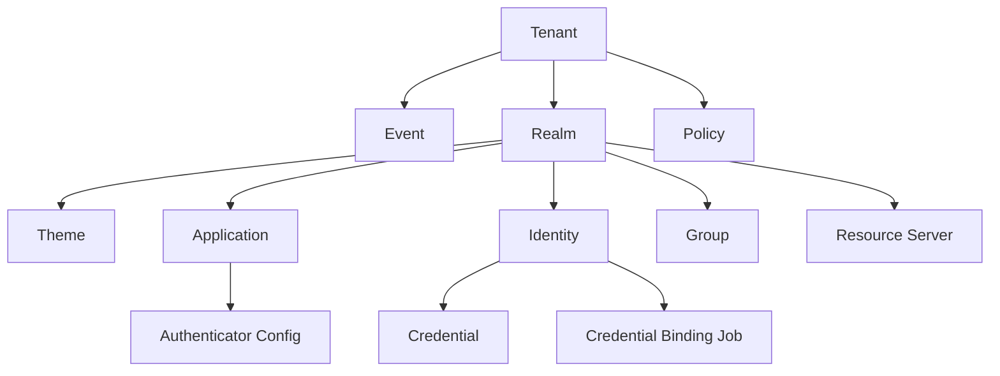

import { Alert, Col, Row } from 'antd';

<Row>
  <Col span={24}>
    <Alert message="In progress (We're missing the content for the Theme section (branding).)" type="info" />
  </Col>
</Row>
<br />

<Alert message="@Patricia to add CTA's to the bottom for the most used How-to's for admin features." type="error" />
<br />

Beyond Identity uses the Beyond Identity Cloud and Beyond Identity Authenticators to establish user identity and authorization. 

The **Cloud** hosts user directories, authentication servers, event logs, and policy rules, while **Authenticators** are endpoint components embedded in applications that work with the Cloud to authenticate users and authorize actions based on configured policies.



## Tenant

import TenantDescription from '../includes/_tenant-description.mdx'; 

<TenantDescription />

<center>


</center>


## Realm

import AdminRealmDescription from '../includes/_admin-realm-description.mdx'; 

<AdminRealmDescription />


## Event

Events are an immutable record of all transactions that occur in a Realm. Events can be exported to a number of SIEM products or viewed within your Console.


## Policy

A Realm Policy is a collection of rules that determine how to treat any given transaction managed by the Beyond Identity Cloud. Policy rules can be thought of as match action pairs. Where the match could be a complex predicate describing which transactions it governs and the action states how to handle the matching transactions.

Each registration (credential binding) and authentication operation consults the Realm’s Policy for an Allow or Deny decision before completion. A Deny decision results in rejection of the operation.


## Directory

A Directory contains the Identities, associated Credentials and Groups within a Realm. Directories are not shared across Realms.

Beyond Identity offers a SCIM 2.0 compliant server for standardized approach to managing Users and Groups. It uses common REST API endpoints to create, update, and delete these entities. An access token with `scim:all` scope is required to use any SCIM functionality. For more details, see [SCIM server setup](../scim-server).


import ScimDescription from '../includes/_scim-description.mdx';

<ScimDescription />


### Identity

An identity is a unique identifier that may be used by an end-user to gain access governed by Beyond Identity. An end-user may have multiple identities. A realm can have many identities.

An identity can have one or many credentials, also known as passskeys.  

A passkey is a public-private key pair that belongs to an identity. The public key is stored in the Beyond Identity Cloud and the private key never leaves the device. Passkeys are created through binding jobs, in which a binding link is generated to bind a passkey to a specific device or browser. The passkey gets stored in the device hardware root of trust (secure enclave). All cryptographic operations that use the private key are handled by the Beyond Identity SDKs. For more details, see [Univeral Passkeys](universal-passkeys.mdx). 

import { Badge } from "@nextui-org/react";

### Group

A group is a logical collection of identities. A realm can have many groups. An identity can belong to many groups. Groups are commonly used as a predicate in a policy rule. (e.g. Allow group "Beyond Identity Administrators" to access the "Beyond Identity Admin Console" application)


import ResourceServerDescription from '../includes/_resource-server-description.mdx';

<ResourceServerDescription />

## Application

import AppDescription from '../includes/_application-description.mdx';

<AppDescription />


## Authenticator Config

import AuthenticatorConfigDescription from '../includes/_authenticator-config-description.mdx';

<AuthenticatorConfigDescription />

<br />

For more details, see [Authenticator Types](authenticator-config.mdx).


## API Token

import ApiTokenDescription from '../includes/_api-token-description.mdx';

<ApiTokenDescription />

## Admin Console

The Beyond Identity Admin Console provides you with a UI for administering your tenant. The Console utilizes your **Beyond Identity Admin** Realm and Console application configuration to authenticate and authorize admin logins. In addition, an initial Policy gets created in the Beyond Identity Admin Realm on the deployment of your tenant. 

When the tenant gets deployed, the **Beyond Identity Admin Console** gets created as a managed object under **Beyond Identity Admin > Apps**. As a managed object, it is not editable through the Console.

You'll access the Admin Console at any time using your selected region:

```https
https://console-{REGION}.beyondidentity.com
```

The **Admin Console Access** User Group is created, and the identity established at sign-up is added. Adding users to the group will allow them to log into the Console as Administrators of your tenant utilizing any credentials established within the Admin Realm.

:::caution important
It's possible to lock yourself out of the Console with this policy and group control access.
:::


import { Divider, Button } from 'antd';

<Divider />

<h2>What can you do next?</h2>

<div class="container next-steps-cards">
<div class="row">
    <div class="col col--6">
      <div class="col-demo">
        <div class="card-demo next-steps-card">
  <div class="card shadow--lw">
    <div class="card__header ">
      <h4>Create new realm</h4>
    </div>
    <div class="card__body">
      <p>
        description of topic
      </p>
    </div>
    <div class="card__footer">
      <Button type="link" shape="round" block href="../how-to/create-realm">Learn more</Button>      
    </div>
  </div>
</div>
      </div>
    </div>
    <div class="col col--6">
      <div class="col-demo">
        <div class="card-demo next-steps-card">
  <div class="card shadow--lw">
    <div class="card__header">
      <h4>Add new app</h4>
    </div>
    <div class="card__body">
      <p>
        description of topic
      </p>
    </div>
    <div class="card__footer">   
      <Button type="link" block href="../how-to/add-an-application">Learn more</Button>
    </div>
  </div>
</div>
      </div>
    </div>
  </div>
  <div class="row">
    <div class="col col--6">
      <div class="col-demo">
        <div class="card-demo next-steps-card">
  <div class="card shadow--lw">
    <div class="card__header ">
      <h4>Create a role&nbsp;&nbsp;<Badge color="secondary" variant="flat" >New!</Badge></h4>
    </div>
    <div class="card__body">
      <p>
        description of topic
      </p>
    </div>
    <div class="card__footer">
      <Button type="link" shape="round" block href="../how-to/create-role">Learn more</Button>      
    </div>
  </div>
</div>
      </div>
    </div>
    <div class="col col--6">
      <div class="col-demo">
        <div class="card-demo next-steps-card">
  <div class="card shadow--lw">
    <div class="card__header">
      <h4>Create an identity</h4>
    </div>
    <div class="card__body">
      <p>
        description of topic
      </p>
    </div>
    <div class="card__footer">
      <Button type="link" shape="round" block href="../how-to/add-an-identity">Learn more</Button>
    </div>
  </div>
</div>
      </div>
    </div>
  </div>
</div>
