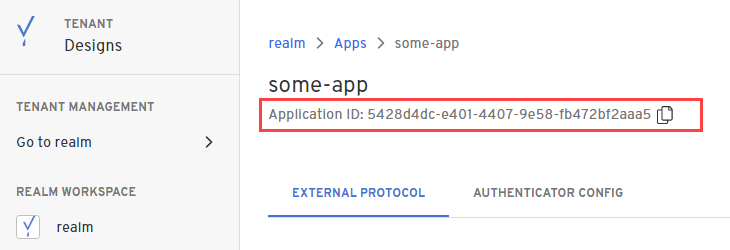

import Tabs from '@theme/Tabs';
import TabItem from '@theme/TabItem';


In this guide, you'll create a free Beyond Identity developer account and connect it to our sample application. 

This application demonstrates common tasks, like creating <a href="#" data-tooltip="A realm is a unique administrative domain within a tenant. Each realm contains a unique set of Directory, Policy, Event, Application, and Branding objects.">realms</a>, applications, and <a href="#" data-tooltip="A public and private key pair. The private key is generated and stored and never leaves the user’s devices’ hardware root of trust. The public key, on the other hand, is sent to the Beyond Identity cloud. All keys are cryptographically linked to the user and can be centrally managed using our APIs.">passkeys</a> (public-private key pairs) for user authentication. 


## 1. Sign up for a developer account

import DeveloperSignUpProcess from '../includes/_developer-sign-up-process.mdx';

<DeveloperSignUpProcess />

--- 


## 2. Clone the sample app


--- 

## 3. Set your environment variables


In this step, you'll make a copy of the ??? config file and rename it.  Making a copy of it allows you to start from scratch if needed. 

### Region variable


---

### Tenant ID variable

In this step, you'll hop on over to the Admin Console to get your tenant ID and then add it to the ??? config file you copied in the previous step.  


--- 

### API token variable

In this step, you'll continue to work in the Admin Console to create an API token for your tenant. Then you'll add to the ??? config file. 


---

:::tip **CHECKPOINT**

Guess what? You're halfway there! So far in your getting started journey, you should have completed the following:

- [x] Signed up for a free Beyond Identity developer account, which created a passkey, tenant, and Admin Realm for you automatically.

- [x] Cloned the example application.

- [x] Updated the .env.local config file with your **Region**, **Tenant ID**, and **API token** variables. 

    In the next step, you'll set the following variables:
    
    - Realm ID
    - Application ID
    - Client ID
    - Client Secret
    - Authenticator Config ID<br /><br />

Don't forget, if you get stuck, let us know in our **[Slack community](https://join.slack.com/t/byndid/shared_invite/zt-1anns8n83-NQX4JvW7coi9dksADxgeBQ)**.

:::

---

## 4. Configure Beyond Identity

In this step, you'll create a set of Beyond Identity resources containing your end users' identities and the configuration. First, you'll create a new realm, which holds your users' identities. Next, you'll create a new application that contains the configuration for your users.

### Create a new realm

So far, you have the Beyond Identity Admin Realm for your Beyond Identity tenant only. In this step, you'll create a new Realm to hold your users' identities.  

import CreateRealmConsole from '../includes/_create-realm-console.mdx';

<CreateRealmConsole />

4. <mark>These are the steps after switching to the new realm</mark>

### Create an application

In this step, you'll create a new Application that will contain the configuration for your users.

import AddAppAdminConsole  from '../includes/_add-application-console.mdx';

<AddAppAdminConsole />

3. <mark>these are the steps after the user enters a name for the app</mark>


### Complete the configuration

In this step, you'll complete the application's configuration by adding a few more things to the ??? config file.  You'll add the Application ID, Client ID, Client Secret, and Authenticator Config ID to your env.local config file.  

1. From the Apps page in the console, select the new application you created. 

2. Copy the **Application ID**, which can be found under the application name. Then paste it into the ??? config file.

  

3. Scroll down to the **Client Configuration** section and copy the **Client ID**. Then paste it into the ??? config file.

4. Copy the **Client Secret**. Then paste it into the ??? config file. 

5. Select the **Authenticator Config** tab and copy the **Authenticator Config ID**.  Then paste it into the ??? config file and save and close it.  
  
  


---

## 5. Run the example application

In this step, you'll start the backend and frontend to run the example app locally.

<Tabs>
<TabItem value="yarn" label="Yarn">

```bash
yarn start
```

</TabItem>
<TabItem value="npm" label="NPM">

```bash
npm start
```

</TabItem>
</Tabs>

A new browser tab opens automatically. If it doesn't, open a web browser and navigate to [http://localhost:8083](http://localhost:8083). The example application will now appear and allow you to create passkeys in the browser. 

<div style={{position: 'relative', paddingBottom: 'calc(73% + 20px)', height: '0'}}>
	<iframe src='https://demo.arcade.software/6kUN385qBx2Jju7wugbM?embed&forceNoOpeningAnimation=true' frameBorder="0" style={{position: 'absolute', top: '0', left: '0', width: '100%', height: '100%'}}>
	</iframe>
</div>

You can also see this example in action by visiting: [https://acme.beyondidentity.com/](https://acme.beyondidentity.com/)

---

