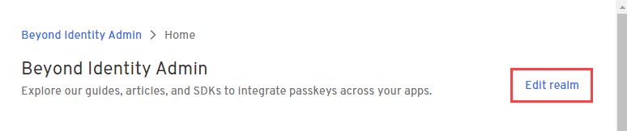
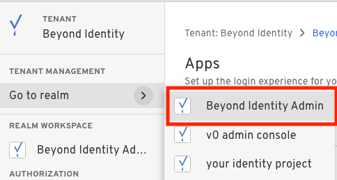
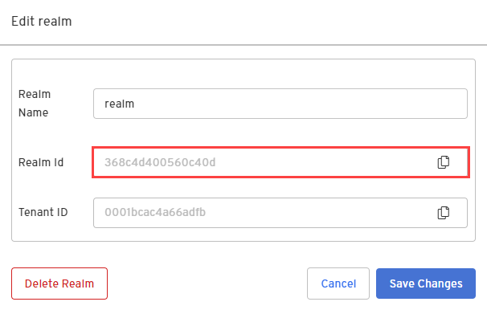
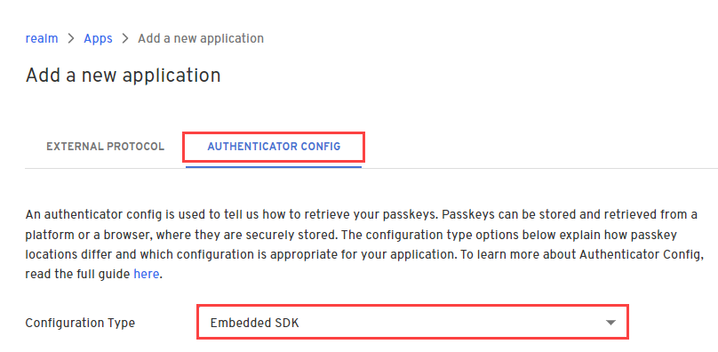
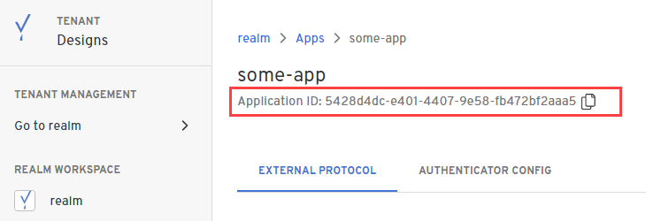
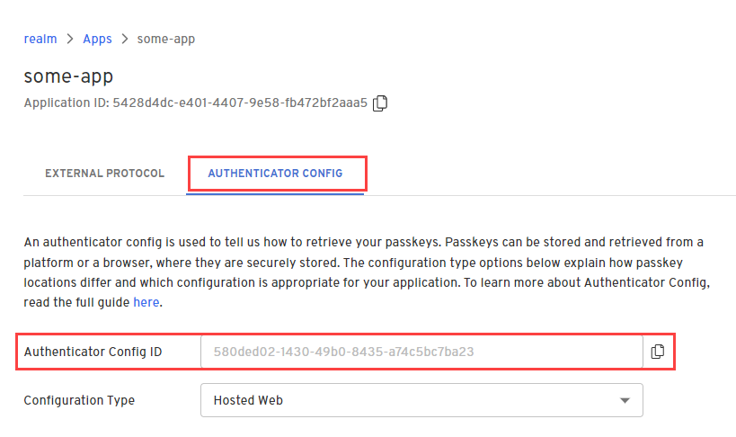

import Tabs from '@theme/Tabs';
import TabItem from '@theme/TabItem';


In this guide, you'll create a free Beyond Identity developer account and connect it to our sample application.

This application demonstrates common tasks, like creating <a href="#" data-tooltip="A realm is a unique administrative domain within a tenant. Each realm contains a unique set of Directory, Policy, Event, Application, and Branding objects.">realms</a>, applications, and <a href="#" data-tooltip="A public and private key pair. The private key is generated and stored and never leaves the user’s devices’ hardware root of trust. The public key, on the other hand, is sent to the Beyond Identity cloud. All keys are cryptographically linked to the user and can be centrally managed using our APIs.">passkeys</a> (public-private key pairs) for user authentication.


## 1. Sign up for a developer account

import DeveloperSignUpProcess from '../includes/_developer-sign-up-process.mdx';

<DeveloperSignUpProcess />

---


## 2. Clone the sample app

Before you start working in the Admin Console of your developer account, let's clone the sample app hosted on [Github](https://github.com/gobeyondidentity/getting-started). Then you'll want to make sure you have the tools and dependencies installed. The Beyond Identity example application uses [node.js](https://nodejs.org) for the backend and [NextJS](https://next-auth.js.org/) for the front end. So you'll need everything to get up and running quickly.


<details><summary>Set up your environment</summary>
<Tabs>
	<TabItem value="macOS" label="macOS" default>
    <ol>
		<li>Install Git using xcode-select from the terminal.<p>
<pre>xcode-select --install</pre></p>
</li>
		<li>Download and install <a href="https://nodejs.org/en/download/">NodeJS</a>.<br /><br /></li>
		<li>Install the yarn package manager.<p>
<pre>sudo npm install --global yarn</pre></p>
		</li>
	</ol>
  </TabItem>
	<TabItem value="Windows" label="Windows">
    <ol>
		<li>Download and install <a href="https://git-scm.com/downloads">Git</a>.<br /><br /></li>
		<li>Download and install <a href="https://nodejs.org/en/download/">NodeJS</a>.<br /><br /></li>
		<li>Install the yarn package manager.<p>
<pre>npm install --global yarn</pre></p>
</li>
	</ol>
  </TabItem>
</Tabs>

</details>

```bash
git clone https://github.com/gobeyondidentity/getting-started.git
cd getting-started
```


---

## 3. Set your environment variables


In this step, you'll make a copy of the local environment config file and rename it.  Making a copy of it allows you to start from scratch if needed.

### Region variable

1. Make a copy of the example environment variable file for the example app.

	<Tabs>
	<TabItem value="macOS" label="macOS">

	```bash
	cp .env.local.example .env.local
	```

	</TabItem>
	<TabItem value="windows" label="Windows">

	```bash
	copy .env.local.example .env.local
	```

	</TabItem>
	</Tabs>

2. Edit the **.env.local** file and set the `REGION` value according to the region you selected during the signup process (`us` or `eu`).

  ```javascript title=".env.local"
  # -- Next Auth
  NEXTAUTH_URL=http://localhost:8083
  NEXTAUTH_SECRET= # Linux: `openssl rand -hex 32` or go to https://generate-secret.now.sh/32

  # -- Beyond Identity
  // highlight-next-line
  REGION=

  TENANT_ID=
  REALM_ID=
  API_TOKEN=

  APPLICATION_ID=
  AUTHENTICATOR_CONFIG_ID=

  APP_CLIENT_ID=
  APP_CLIENT_SECRET=
  ```


3. Save your changes, but don't close the file because you'll use it to add the TENANT_ID, REALM_ID, API_TOKEN, and other variables to complete the setup.

---

### Tenant ID variable

In this step, you'll hop on over to the Admin Console to get your tenant ID and then add it to the .env.local config file you copied in the previous step.

1. In the Admin Console, from a realm's home page, click **Edit realm**.

  

2. Copy the **Tenant_ID** value and paste it into the `.env.local` file in `TENANT_ID`. Then save your changes but don't close it because you still have values to add.

  ```javascript title=".env.local"
  # -- Next Auth
  NEXTAUTH_URL=http://localhost:8083
  NEXTAUTH_SECRET= # Linux: `openssl rand -hex 32` or go to https://generate-secret.now.sh/32

  # -- Beyond Identity
  REGION=

  // highlight-next-line
  TENANT_ID=
  REALM_ID=
  API_TOKEN=

  APPLICATION_ID=
  AUTHENTICATOR_CONFIG_ID=

  APP_CLIENT_ID=
  APP_CLIENT_SECRET=
  ```

---

### API token variable

In this step, you'll continue to work in the Admin Console to create an API token for your tenant. Then you'll add to the .env.local config file.

1. In the Admin Console, switch to the **Beyond Identity Admin** realm by selecting **Go to realm > Beyond Identity Admin**.

  

1. Select **Apps > Beyond Identity Management API**.

  

1. Select the **API Tokens** tab and click **Create a token**.

1. Enter a name for the token and click **Create token**.

1. In the confirmation message, copy the API token and click **Close this message**.

  :::caution IMPORTANT
  You must copy the API token because after you close the confirmation message, the full token will not be displayed again. You'll only have access to the token suffix.
  :::

1. In the `.env.local` config file, paste the `API_TOKEN`. Then save your changes but don't close it becuase you'll need it for the next step.

  ```javascript title=".env.local"
  # -- Next Auth
  NEXTAUTH_URL=http://localhost:8083
  NEXTAUTH_SECRET= # Linux: `openssl rand -hex 32` or go to https://generate-secret.now.sh/32

  # -- Beyond Identity
  REGION=

  TENANT_ID=
  REALM_ID=
  // highlight-next-line
  API_TOKEN=

  APPLICATION_ID=
  AUTHENTICATOR_CONFIG_ID=

  APP_CLIENT_ID=
  APP_CLIENT_SECRET=
  ```


---

:::tip **CHECKPOINT**

Guess what? You're halfway there! So far in your getting started journey, you should have completed the following:

- [x] Signed up for a free Beyond Identity developer account, which created a passkey, tenant, and Admin Realm for you automatically.

- [x] Cloned the example application.

- [x] Updated the .env.local config file with your **Region**, **Tenant ID**, and **API token** variables.

    In the next step, you'll set the following variables:

    - Realm ID
    - Application ID
    - Client ID
    - Client Secret
    - Authenticator Config ID<br /><br />

Don't forget, if you get stuck, let us know in our **[Slack community](https://join.slack.com/t/byndid/shared_invite/zt-1anns8n83-NQX4JvW7coi9dksADxgeBQ)**.

:::

---

## 4. Configure Beyond Identity

In this step, you'll create a set of Beyond Identity resources containing your end users' identities and the configuration. First, you'll create a new realm, which holds your users' identities. Next, you'll create a new application that contains the configuration for your users.

### Create a new realm

So far, you have the Beyond Identity Admin Realm for your Beyond Identity tenant only. In this step, you'll create a new Realm to hold your users' identities.

:::note
You can skip straight to **Step 4** below, as we've already created **My First Realm** for you. But if you want to go through the steps of creating a new realm yourself, follow the **Steps 1 thru 3** below.
:::

import CreateRealmConsole from '../includes/_create-realm-console.mdx';

<CreateRealmConsole />

4. Copy the **Realm Id** value and paste it into the `.env.local` file in `REALM_ID`. Then save your changes but don't close it yet because you're not done.

  

  ```javascript title=".env.local"
  # -- Next Auth
  NEXTAUTH_URL=http://localhost:8083
  NEXTAUTH_SECRET= # Linux: `openssl rand -hex 32` or go to https://generate-secret.now.sh/32

  # -- Beyond Identity
  REGION=

  TENANT_ID=
    // highlight-next-line
  REALM_ID=
  API_TOKEN=

  APPLICATION_ID=
  AUTHENTICATOR_CONFIG_ID=

  APP_CLIENT_ID=
  APP_CLIENT_SECRET=
  ```


### Create an application

In this step, you'll create a new Application that will contain the configuration for your authentication.

:::caution note:
You will need to create a new Application. **My First Application** is to be used only with our [**Getting Started with NextJS**](/docs/next/get-started-nextjs) guide.
:::

import AddAppAdminConsole  from '../includes/_add-application-console.mdx';

<AddAppAdminConsole />

3. Scroll down to the **Redirect URIs** field and enter the API callback localhost URL.

  ```http
  http://localhost:8083/api/auth/callback/beyondidentity
  ```

4. Ensure that **Client Secret Basic**, under the Redirect URIs, is selected for the **Token Endpoint Auth Method**.

  The client uses HTTP Basic as defined in OAuth 2.0, Section 2.3.1. Namely, client_id and client_secret are sent in the Basic Authorization header.

5. Select the **Authenticator Config** tab and select **Embedded SDK** for the Configuration Type.

  Selecting Embedded SDK means that your app will host the authentication and provide the experience for users to create, select and use passkeys.

  

6. Scroll down and set the **Invoke URL** and **Trusted Origins** to the following localhost and port. For more details about these settings, see about [Authenticator Types](/docs/next/authentication).

  The **Invoke URL** is a single URL that "points" to where your application is: an App Scheme or a Universal URL/App Link.

  The **Trusted Origins** whitelists it and allows request to be made to our server. By default, our server blocks cross-origin requests (COR).

   ```http
   http://localhost:8083
   ```

6. Click **Submit** to save the changes. You're taken to the Apps page in the console automatically.


### Complete the configuration

In this step, you'll complete the application's configuration by adding a few more things to the `.env.local` config file.  You'll add the Application ID, Client ID, Client Secret, and Authenticator Config ID to your env.local config file.

1. From the Apps page in the console, select the new application you created.

2. Copy the **Application ID**, which can be found under the application name. Then paste it into the `.env.local` config file.

  

  ```javascript title=".env.local"
  # -- Next Auth
  NEXTAUTH_URL=http://localhost:8083
  NEXTAUTH_SECRET= # Linux: `openssl rand -hex 32` or go to https://generate-secret.now.sh/32

  # -- Beyond Identity
  REGION=

  TENANT_ID=
  REALM_ID=
  API_TOKEN=

    // highlight-next-line
  APPLICATION_ID=
  AUTHENTICATOR_CONFIG_ID=

  APP_CLIENT_ID=
  APP_CLIENT_SECRET=
  ```

3. Scroll down to the **Client Configuration** section and copy the **Client ID**. Then paste it into the `.env.local` config file.

4. Copy the **Client Secret**. Then paste it into the `.env.local` config file.

5. Select the **Authenticator Config** tab and copy the **Authenticator Config ID**.  Then paste it into the `.env.local` config file and save and close it.

  


---

## 5. Run the example application

In this step, you'll start the backend and frontend to run the example app locally.

<Tabs>
<TabItem value="yarn" label="Yarn">

```bash
yarn start
```

</TabItem>
<TabItem value="npm" label="NPM">

```bash
npm start
```

</TabItem>
</Tabs>

A new browser tab opens automatically. If it doesn't, open a web browser and navigate to [http://localhost:8083](http://localhost:8083). The example application will now appear and allow you to create passkeys in the browser.

<div style={{position: 'relative', paddingBottom: 'calc(73% + 20px)', height: '0'}}>
	<iframe src='https://demo.arcade.software/6kUN385qBx2Jju7wugbM?embed&forceNoOpeningAnimation=true' frameBorder="0" style={{position: 'absolute', top: '0', left: '0', width: '100%', height: '100%'}}>
	</iframe>
</div>

You can also see this example in action by visiting: [https://acme.beyondidentity.com/](https://acme.beyondidentity.com/)

---

