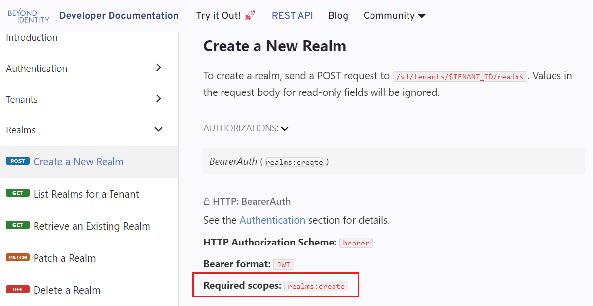

---
title: Create a Beyond Identity Management API token
id: create-bi-api-token
description: ''
slug: /create-bi-api-token
keywords: 
 - management api
 - access token
pagination_next: null
pagination_prev: null
last_update: 
   date: 08/21/2023
   author: Jen Field
draft: false
doc_type: how-to
displayed_sidebar: mainSidebar
---  

You can automate administrative tasks for your Beyond Identity tenant using the [Beyond Identity Management API](https://developer.beyondidentity.com/api/v1).  
All of the functionality available in the Beyond Identity Admin Console is also available through the API.  
In order to call the API, you must create access tokens for the Beyond Identity Management API resource server that include the [scopes](/docs/next/api-scopes) your app or script will need, and then configure your app or script to use the the tokens in API calls.  

## Prerequisites

In order to request an access token, you need to have an [app configured in your Beyond Identity tenant](/docs/next/add-an-application). 

For Beyond Identity Management API access tokens, this can be the built in Beyond Identity Management API app or another app you create that points to the 'Beyond Identity Management API' Resource Server.   

## Select your scopes
Before creating or requesting any tokens for the Beyond Identity Management API (or for any resource), determine the list of scopes the tokens must have, which will determine what access your app or script will have to which resources.  
The [Beyond Identity Management API documentation](https://developer.beyondidentity.com/api/v1) provides the required scopes for each supported API action within the "Authorizations" section.  
For example, when creating a Realm, the access token must contain the `realms:create` scope as shown below:  

## Admin Console

The simplest way to acquire an access token for the Beyond Identity Management API is interactively through the Beyond Identity Admin Console.  

You can also [request the token programmatically](#create-access-token-via-api) using OAuth or OIDC flows.

### Create access token in the console

import CreateApiTokenConsole from '../includes/_create-api-token-console.mdx';

<CreateApiTokenConsole />  

:::note  
Note that the list of **Scopes** available to request comes from the **Resource Server** associated with the app.  
::: 

## Create access token via API
 
import CreateBiApiTokenExample from '../includes/_access_token_create_bi_api_example.mdx';

<CreateBiApiTokenExample />  
