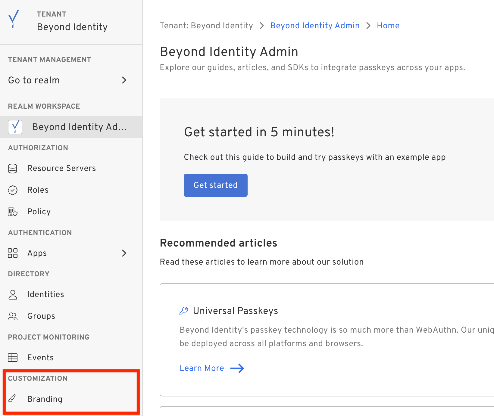
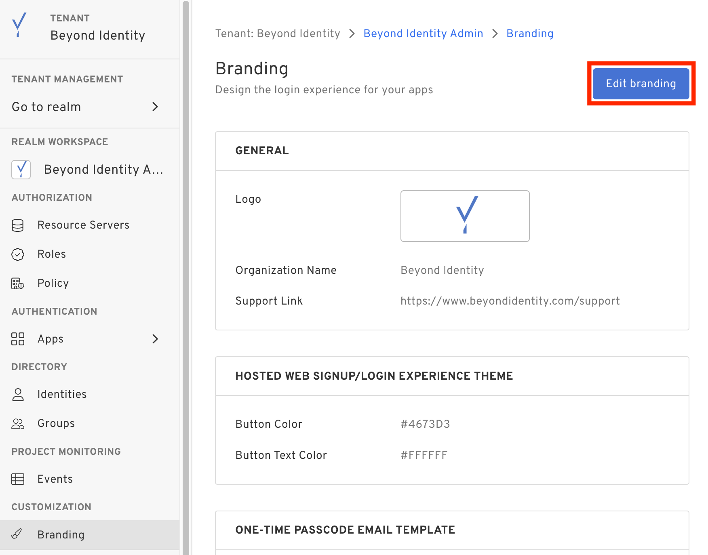
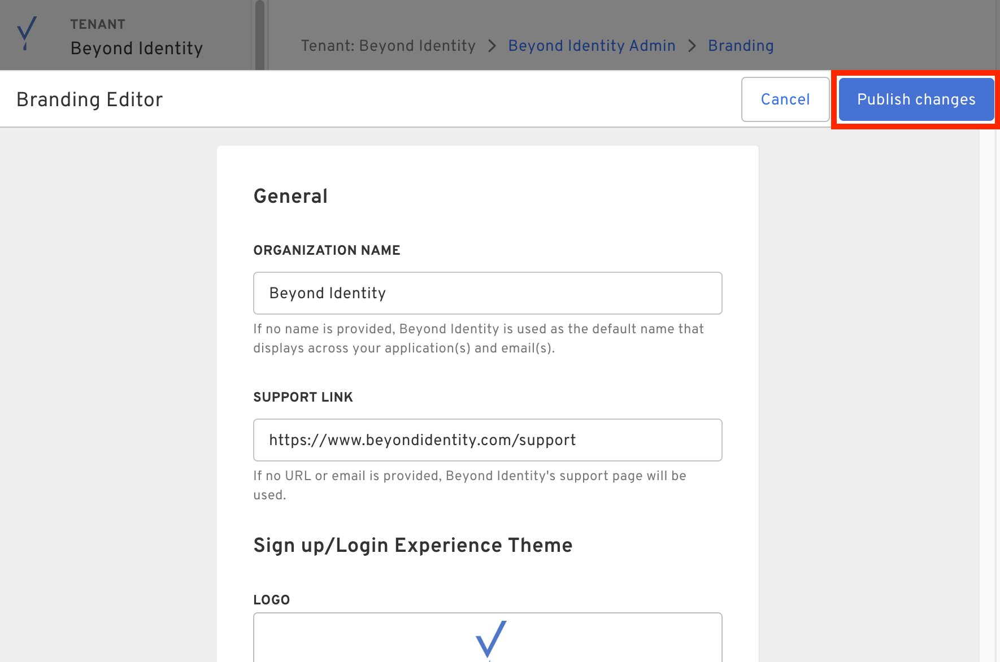

## Introduction

In the Beyond Identity Console, there are a couple of places where you can customize the branding to fit your organization's needs. 
The branding configuration is **realm-specific** and we've broken it down to the sections below.

## How to customize branding

To access branding configuration, navigate to the Admin Console and select **Branding** under **Customization**.

To edit the branding configuration, click **Edit branding**.

To save the branding configuration, click **Publish changes** once complete.

## General

These are the general fields that will be displayed across your application(s) and email(s).

Currently, there are three general fields:
- **Organization Name**: your organization name.
- **Logo**: visual logo that is on display.
- **Support Link**: the support link that is displayed.

By default, this values are prefilled with Beyond Identity name, logo, and support link.

## Sign up/Login Experience Theme

In our Hosted Web Signup and Login experience, you're able to customize the button and text color.

By default, these values are prefilled with the Beyond Identity colors.

## One-time Passcode Email Template

When an end user receives a One-time Passcode (OTP) email, you're able to customize the email Subject.

By default, this value is “Login instructions”.

## Credential Binding Email Template

When an end user receives a Credential Binding email, you're able to customize the email Subject.

By default, this value is “Welcome to Beyond Identity”.