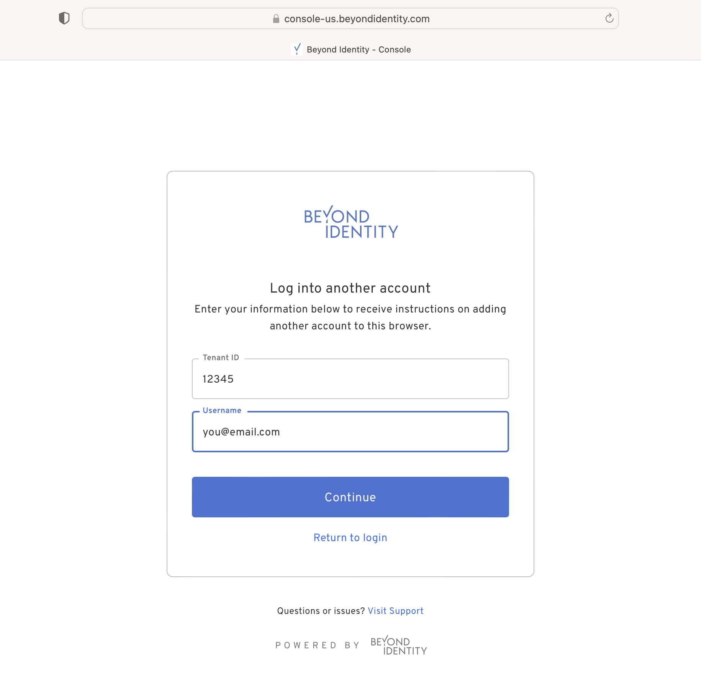

import TenantIdNote from '../includes/_tenant-id-note.mdx';

<TenantIdNote />

import FindTenantIdSteps from '../includes/_find-tenant-id.mdx';

<FindTenantIdSteps />

3. From the new device or browser, open the **Admin Console**.

   - https://console-us.beyondidentity.com/login

   - https://console-eu.beyondidentity.com/login

4. Enter the Tenant ID and email address for the Username. 

  

  If the Tenant ID and email are found in our system, you'll receive an email with a link to bind another passkey to your new device or browser. 
  
4. Follow the link in the email to log into the Beyond Identity Admin Console from another device or browser. 