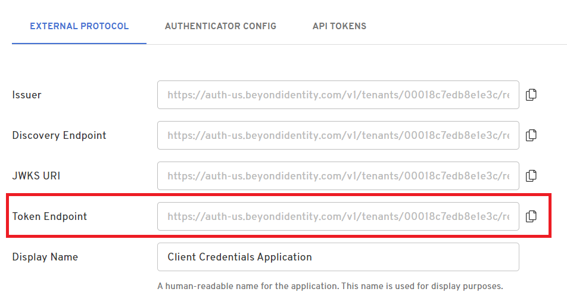

In this simple flow, you will use the app's credentials to authenticate a single API call to the app's `/token` endpoint.

First, create the app:

import AddAppAdminConsole from '../includes/\_add-application-console.mdx';

<AddAppAdminConsole />

3. On the **External Protocol** tab, use the following values to complete this tab.

| Property                       | Value                                                                                                                                                                                                                                                                                                                                                                                                                              |
| ------------------------------ | ---------------------------------------------------------------------------------------------------------------------------------------------------------------------------------------------------------------------------------------------------------------------------------------------------------------------------------------------------------------------------------------------------------------------------------- |
| **Display Name**               | Descriptive name you choose                                                                                                                                                                                                                                                                                                                                                                                                        |
| **Protocol**                   | OAuth2                                                                                                                                                                                                                                                                                                                                                                                                                             |
| **Client Type**                | Confidential                                                                                                                                                                                                                                                                                                                                                                                                                       |
| **PKCE**                       | Disabled                                                                                                                                                                                                                                                                                                                                                                                                                           |
| **Redirect URIs**              | Use your application's App Scheme or Universal URL.<br /><br />Your redirect URI follows the pattern:<br /><br /><pre>http://localhost:3000/api/auth/callback/beyondidentity</pre><div class= "note-message note-message-table"><p>`beyondidentity` in this URI is the ID of the OAuth provider as configured in the providers array in NextAuth.js. `/api/auth/callback/` is based on the Next.js route file structure.</p></div> |
| **Token Endpoint Auth Method** | Client Secret Basic                                                                                                                                                                                                                                                                                                                                                                                                                |
| **Grant Type**                 | Client Credentials                                                                                                                                                                                                                                                                                                                                                                                                                 |

4. Click **Submit** to save the new app.

Next, create the HTTP request:

**Request url:**

```http
https://auth-{us|eu}.beyondidentity.com/v1/tenants/{tenant_id}/realms/{realm_id}/applications/{application_id}/token
```

You can find the `/token` url in the Admin Console on the app's External Protocol tab as shown here:



**Request method:** POST

**Request headers:**

```http
Authorization: Basic {client_credentials}
content-type: application/x-www-form-urlencoded
```

where `{client_credentials}` is value of the app's **Client ID** and **Client Secret**, concatenated together in the format `{client_id}:{client_secret}` and base64 encoded

**Request body:**

```http
grant_type: "client_credentials"
scope: {scopes}
expiration_time: {seconds}
custom_claims: {custom_claims_json}
```

where:

| Property            | Value                                                                                                                                                                                                                                                                                                      |
| ------------------- | ---------------------------------------------------------------------------------------------------------------------------------------------------------------------------------------------------------------------------------------------------------------------------------------------------------- |
| **scope**           | `{scopes}` is one or more of the app's **Allowed Scopes**, space delimited.                                                                                                                                                                                                                                |
| **expiration_time** | expiration_time is an OPTIONAL parameter, and `{seconds}` is the desired time after minting, in seconds, for which the token will be considered valid. If included, this value must be less than or equal to the app's configured **Expires** setting                                                      |
| **custom_claims**   | custom_claims is an OPTIONAL parameter, and `{custom_claims_json}` is a JSON string containing the desired additional claims as key value pairs, for example `{"a": "b", "c": "d"}`. Upon successful token request, the resulting token will contain additional field 'bi_custom' with the desired claims. |
