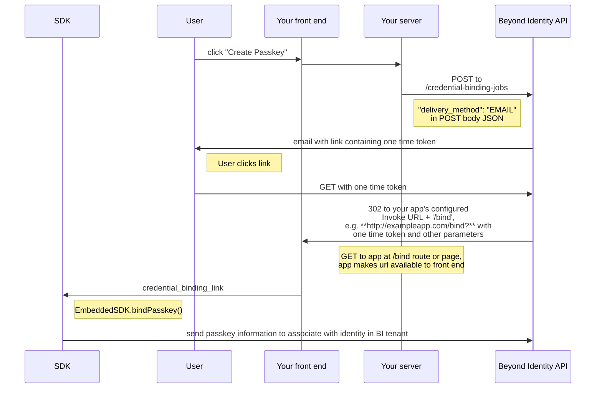

```mermaid
sequenceDiagram
    participant SDK
    participant User
    participant Your front end
    participant Your server
    participant Beyond Identity API 
    User ->> Your front end: click "Create Passkey"
    Your front end ->> Your server: 
    Your server ->> Beyond Identity API: POST to <br/>/credential-binding-jobs
    Note Right of Your server: "delivery_method": "EMAIL"<br/> in POST body JSON
    Beyond Identity API ->> User: email with link containing one time token
    Note Right of User: User clicks link
    User ->> Beyond Identity API: GET with one time token
    Beyond Identity API ->> Your front end: 302 to your app's configured<br/> Invoke URL + '/bind',<br/> e.g. **http://exampleapp.com/bind?** with<br/> one time token and other parameters
    Note Over Your server: GET to app at /bind route or page,<br/> app makes url available to front end
    Your front end ->> SDK: credential_binding_link
    Note Right of SDK: EmbeddedSDK.bindPasskey()
    SDK ->> Beyond Identity API: send passkey information to associate with identity in BI tenant
```
