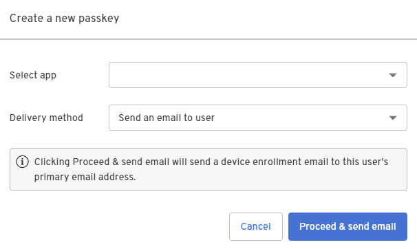

1. In the Admin Console, under Directory, select **Identities**.

2. Select the identity you want to bind a passkey to and click **Add a passkey**.

3. Select the app and then select one of the two delivery methods:

   - **Send an email to user** <mark>We don't provide a lot of information on when to use this option vs. the Generate curl from link from the API option. What are some best practices for these options?</mark>

   - **Generate curl form link from the API**

  

4. Click **Proceed & send email**. 

  A device enrollment email is sent to your user's primary email address with a link to create their passkey. Clicking or tapping the link redirects your user to the Beyond Identity Cloud. The Beyond Identity Cloud then looks up the Authenticator Config associated with that passkey creation link. Finally, it redirects your user to your application using the Authenticator Config's Invoke URL specified.