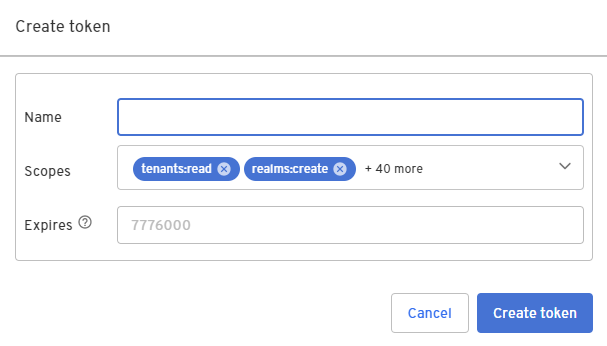

1. Under **Apps**, select the app for which you want a token, such as the **Beyond Identity Management API** application.

  

2. Select the **API Tokens** tab, and then click on **Create token**. (Note that the **API Tokens** tab only exists for apps that use the client credentials grant type. For apps that use the authorization code grant type, you'll need to [request the token programmatically](/docs/next/create-api-token#api). )

  

3. Configure the token with a **Name**, modify the list of **Scopes** based on your use case, and click **Create token**.