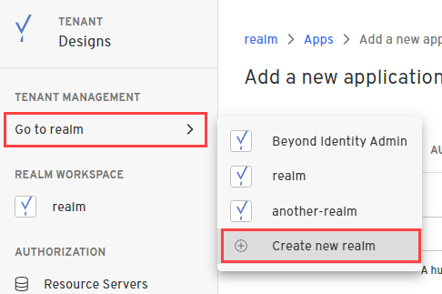
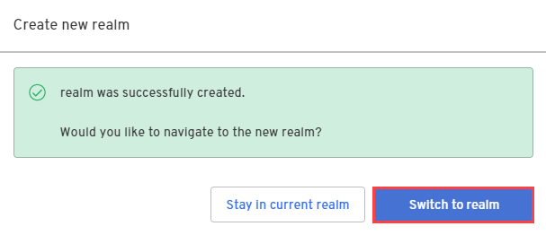

Creating a realm from the Beyond Identity Admin Console is easy. 

1. In the Admin Console, under **Tenant Management**, select **Go to realm > Create new realm**.

  

2. Enter a name for your realm and click **Create realm**.

3. In the confirmation dialog, switch to the new realm. 

  

