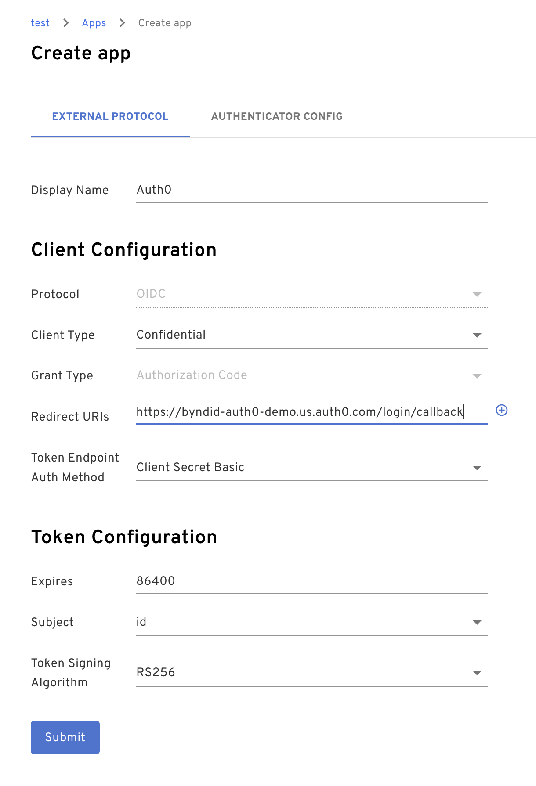
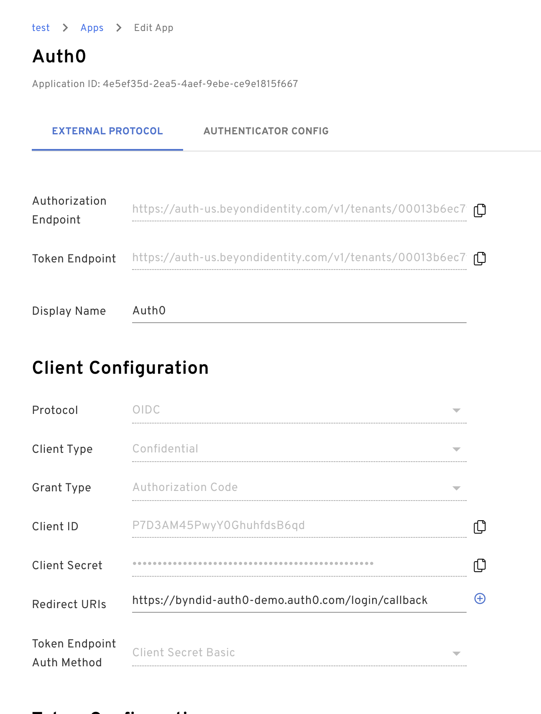
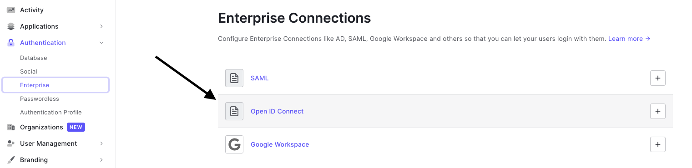
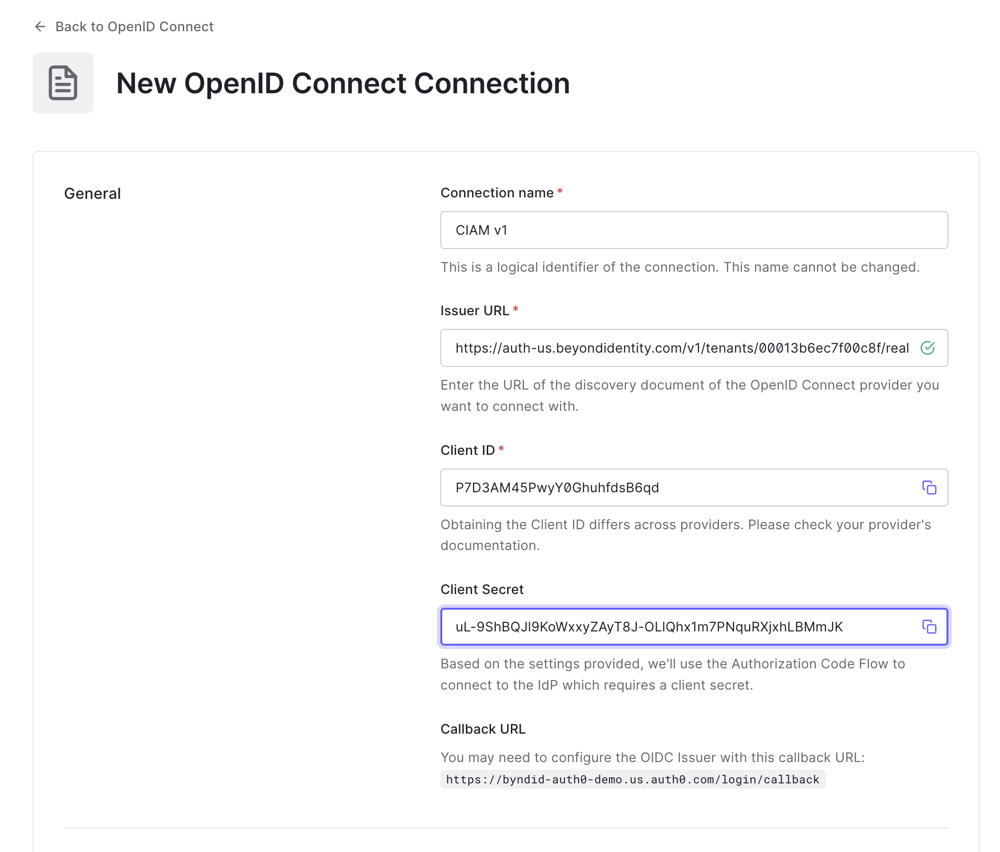
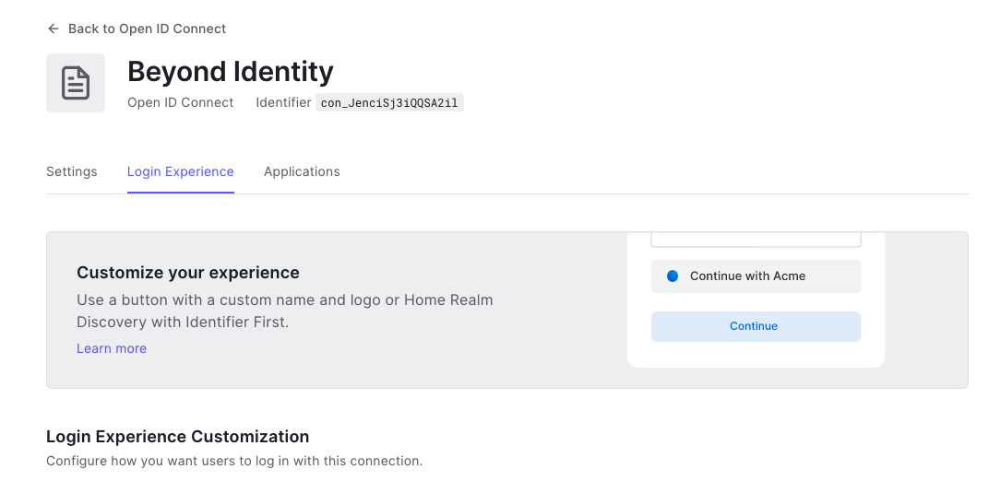
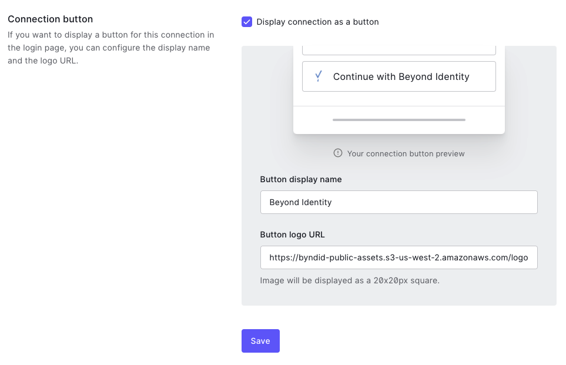
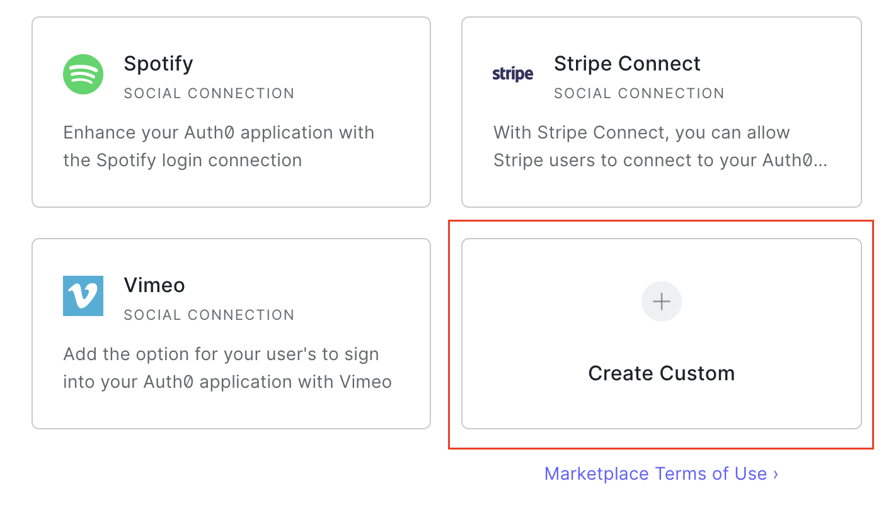
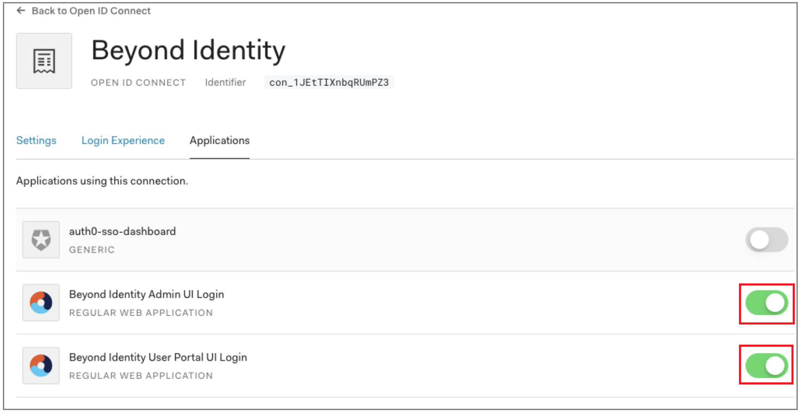

This guide provides information on how to set up Beyond Identity as a passwordless authentication provider in an Auth0 environment.

Here's what you'll do in this guide:
* Configure Beyond Identity as an Identity provider

* Provision users when Auth0 is the master directory

:::info
You can find us in the [Auth0 Marketplace](https://marketplace.auth0.com/integrations/beyond-identity).
:::

## Prerequisites

Before continuing, make sure you've met the following prerequisites:

* Ensure that you have an Auth0 account with admin privileges

* Access to a Beyond Identity tenant. If you still need to, [sign up for a tenant](https://www.beyondidentity.com/developers/signup).

## Add Beyond Identity as an Identity Provider

Depending on your Auth0 subscription (license), you can add Beyond Identity as an identity provider using the [Enterprise OIDC connection](#enterprise-oidc-connection) or as a [custom social OAuth2.0 connection](#custom-social-oauth20-connection). 

### Step 1. Create an Inbound OIDC client in Beyond Identity

1. From the Admin Console, under **Authentication**, select **Apps > Add new app** and use the following values:

   * **Display Name** = Auth0 SSO

   * **Redirect URIs** = `https://DOMAIN.auth0.com/login/callback`

   * Replace `DOMAIN` with your Auth0 domain URL

     **Example:** 

     ```http
     https://byndid-auth0-demo.us.auth0.com/login/callback
     ```

3. Leave all other fields with their default values and click **Submit**. 

  <p><mark>It looks like this image is old.  If so, we'll need a new image.</mark></p>

  

4. Select the newly created OIDC client configuration and copy and save the following values because you'll need them for the next few steps.

   * **Authorization Endpoint**

   * **Token Endpoint**

   * **Client ID**

   * **Client Secret**

  <p><mark>Do we need a screenshot here because the instruction (step) is explicit enough?</mark></p>

  

### Step 2. Enterprise OIDC Connection

1. On the left side menu, click **Authentication**,  and click **Enterprise** from the expanded menu.

2. On the **Enterprise Connections** page,  click **Open ID Connect**.

  

3. Within the Open ID Connect menu, click **Create Connection** and enter the following values:

  | Field | Value |
  | --- | --- |
  | **Connection Name**  | **Beyond-Identity**  |
  | **Issuer URL**  | Issuer corresponding to Beyond Identity app  |
  | **Client ID** | From OIDC client created in Beyond Identity  |
  | **Client Secret**  | From OIDC client created in Beyond Identity  |

  

5. Click **Create**.

6. Scroll up, and click the **Login Experience** tab.

  

1. Find the **Connection button** section and do the following:

   1. Select (enable) the **Display connection as a button** checkbox.

   1. Enter **Beyond Identity** for the Button display name.

   1. Add the following URL for the Button Logo URL:  
      
     https://byndid-public-assets.s3-us-west-2.amazonaws.com/logos/beyondidentity.png

    

1. Scroll down and click **Save**.

### Step 3. Custom Social (OAuth2.0) Connection

1. On the left side menu, click **Authentication**, and from the expanded menu, click **Social**.

2. On the **Social Connections** page,  click the **+ Create Connection** button in the top right corner:

  

3. On the **New Social Connection** page, scroll down to **Create Custom**.

  

4. On the new connection form, enter the following values:

  | Field | Value |
  | --- | --- |
  | **Connection Name**  | **Beyond Identity**  |
  | **Authorization URL**  | From Authorization URL created in Beyond Identity  |
  | **Token URL**  | From Token URL created in Beyond Identity  |
  | **Scope**  | `openid email`  |
  | **Client ID**  | From OIDC client created in Beyond Identity  |
  | **Client Secret**  | From OIDC client created in Beyond Identity  |

5. Enter the following code snippet under **Fetch User profile Script**:

  ```javascript
  function(accessToken, ctx, cb) {

  request.get('<BEYOND_IDENTITY_BASE_URL>/userinfo',    {
        headers: {
        'Authorization': 'Bearer' + accessToken
        }
     },
     function(err, r, body) {
        if (err) {
        return cb(err);
        }
        try {
        var profile = JSON.parse(body);
        profile.provider = 'beyond';
        profile.id = profile.sub;
        profile.displayName = profile.display_name;
        profile.email = profile.email;
        cb(null, profile);
        } catch (e) {
        cb(e);
        }
     });
  }
  ```

5. Leave the other values as default and click **Create**.

  The connection is saved, and the **Applications** tab is displayed. You can now configure which applications should use this connection. Use the toggle switches to enable the connection for the applications you wish to use Beyond Identity. 

7. (Optional) If you use Auth0-hosted pages, you must update the button text and button logo. Auth0 only supports this via the API at the point rather than the UI. You can follow the Auth0 docs to configure this last part:

   * https://auth0.com/docs/connections/social/oauth2#modify-the-icon-and-display-name

   * The Beyond Identity logo URL is: https://byndid-public-assets.s3-us-west-2.amazonaws.com/logos/beyondidentity.png

  :::tip recommendation
  We recommend labeling the button **Beyond Identity** or **Passwordless**.
  :::

8. If you use your own login form, you can add the button manually and call the authorize endpoint specifying the connection parameter where the connection is the name of the connection you just created:

  - https://auth0.com/docs/connections/social/oauth2#log-in-using-the-custom-connection
  
  - Auth0's API reference: https://auth0.com/docs/api/authentication#social 

### Step 4. Enable the Beyond Identity connection in Auth0

1. From the left side menu, select **Connections > Enterprise > Beyond-Identity > Applications**.

2. Enable OIDC or Custom OAuth2.0 for the Beyond Identity Admin portal and any applications you wish to use Beyond Identity.


### Step 5. Confirm Callback URL

:::note important
Check that the Auth0 callback URL is correct in the Beyond Identity OIDC integration.
:::

1. In Auth0, under the **Settings** tab of the **Beyond Identity OIDC connection** created above, make a note of the Callback URL as shown below:

  

2. Navigate to the Beyond Identity Admin portal, select the **Integrations tab**, and click **OIDC Clients**. <mark>This sounds like the Secure Workforce BI Admin Console.</mark>

1. Select the OIDC client you created above and click **Edit**.

3. Ensure that the **Redirect URI** value matches the value in the Auth0 connection. If the values do not match, update the value with the **Callback URL** from Auth0.

### Step 6. Provision a test user

Before users can authenticate with Beyond Identity, you must provision them in the Beyond Identity Directory. As Auth0 does not support SCIM, you must manually provision users using the Beyond Identity Admin Portal or the [Create User API](https://developer.beyondidentity.com/api/v0#tag/Users/operation/CreateUser). See the [Admin Console video tutorial](https://www.beyondidentity.com/resources/beyond-identity-admin-console-overview) that shows how to navigate to the directory area of the admin portal. 

import AddAnIdentity from '../includes/_add-an-identity.mdx';

<AddAnIdentity />

<mark>Will the user need to add a passkey at this point?</mark>

:::tip Deprovision users
To deprovision users from the Beyond Identity experience, access the Beyond Identity Admin Console and manually delete the appropriate user(s).
:::

## Configure Auth0 to delegate to Beyond Identity

<p><mark> I'm not quite sure what to call this section, but it's specific for JavaScript, Kotlin, and so forth. </mark></p>

This section of the guide describes how to configure Auth0 to delegate to Beyond Identity for authentication during an OAuth2 authorization flow. 

import IntegrateWithAuth0Flow from '../images/integration-guides/integrate-with-auth0-flow.png';


import Tabs from '@theme/Tabs';
import TabItem from '@theme/TabItem';

import JavascriptAuth0 from '../includes/_sdks/_javascript-auth0.mdx';
import KotlinAuth0 from '../includes/_sdks/_kotlin-auth0.mdx';
import FlutterAuth0 from '../includes/_sdks/_flutter-auth0.mdx';
import ReactNativeAuth0 from '../includes/_sdks/_react-native-auth0.mdx';
import SwiftAuth0 from '../includes/_sdks/_swift-auth0.mdx';


<Tabs>
  <TabItem value="javascript" label="JavaScript" default>
    <JavascriptAuth0 />
  </TabItem>
  <TabItem value="kotlin" label="Kotlin">
    <KotlinAuth0 />
  </TabItem>
  <TabItem value="flutter" label="Flutter">
    <FlutterAuth0 />
  </TabItem>
  <TabItem value="react-native" label="React Native">
    <ReactNativeAuth0 />
  </TabItem>
  <TabItem value="swift" label="Swift">
    <SwiftAuth0 />
  </TabItem>
</Tabs>