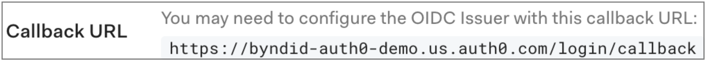

This guide provides information on how to set up Beyond Identity as a passwordless authentication provider in an Auth0 environment.

Here's what you'll do in this guide:
* Configure Beyond Identity as an Identity provider

* Provision users when Auth0 is the master directory

:::info
You can find us in the [Auth0 Marketplace](https://marketplace.auth0.com/integrations/beyond-identity).
:::

## Prerequisites

Before continuing, make sure you've met the following prerequisites:

* Ensure that you have an Auth0 account with admin privileges

* Access to a Beyond Identity tenant. If you still need to, [sign up for a tenant](https://www.beyondidentity.com/developers/signup).

## Add Beyond Identity as an Identity Provider

Depending on your Auth0 subscription (license), you can add Beyond Identity as an identity provider using the [Enterprise OIDC connection](#enterprise-oidc-connection) or as a [custom social OAuth2.0 connection](#custom-social-oidc-connection). 

### Create an OIDC App in Beyond Identity

import AddAppAdminConsole  from '../includes/_add-application-console.mdx';

<AddAppAdminConsole />

3. Select **Protocol** 'OIDC'.  

4. Configure the **Redirect URIs** as follows:

   `https://DOMAIN.auth0.com/login/callback`

   where `DOMAIN` is replaced with your Auth0 domain URL

     **Example:** 

     ```http
     https://dev-myauth099.us.auth0.com/login/callback
     ```  

5. On the **Authenticator Config** tab, for **Configuration Type** select 'Hosted Web'.  

6. Leave all other fields with their default values and click **Submit**.  

7. Click the newly created OIDC client app and copy and save the following values because you'll need them for the next few steps.

   * **Issuer**

   * **Authorization Endpoint**

   * **Token Endpoint**

   * **Client ID**

   * **Client Secret**


### Enterprise OIDC Connection

1. On the left side menu, click **Authentication**,  and click **Enterprise** from the expanded menu.

2. On the **Enterprise Connections** page,  click **Open ID Connect**.

  

3. Within the Open ID Connect menu, click **Create Connection** and enter the following values:

  | Field | Value |
  | --- | --- |
  | **Connection Name**  | **Beyond-Identity**  |
  | **Issuer URL**  | Issuer corresponding to Beyond Identity app  |
  | **Client ID** | From OIDC client created in Beyond Identity  |
  | **Client Secret**  | From OIDC client created in Beyond Identity  |

  

5. Click **Create**.

6. Scroll up, and click the **Login Experience** tab.

  

1. Find the **Connection button** section and do the following:

   1. Select (enable) the **Display connection as a button** checkbox.

   1. Enter **Beyond Identity** for the Button display name.

   1. Add the following URL for the Button Logo URL:  
      
     https://byndid-public-assets.s3-us-west-2.amazonaws.com/logos/beyondidentity.png

    

1. Scroll down and click **Save**.

### Custom Social OIDC Connection

1. On the left side menu, click **Authentication**, and from the expanded menu, click **Social**.

2. On the **Social Connections** page,  click the **+ Create Connection** button in the top right corner, then scroll down and select **Create Custom**:

  

3. On the new connection form, enter the following values:

  | Field | Value |
  | --- | --- |
  | **Connection Name**  | **Beyond-Identity**  |
  | **Authorization URL**  | From the **Authorization Endpoint** for the app created in Beyond Identity  |
  | **Token URL**  | From the **Token Endpoint** for the app created in Beyond Identity  |
  | **Scope**  | `openid email`  |
  | **Client ID**  | From the **Client ID** of the app created in Beyond Identity  |
  | **Client Secret**  | From the **Client Secret** of the app created in Beyond Identity  |

5. Enter the following code snippet under **Fetch User profile Script**:

  ```javascript
  function(accessToken, ctx, cb) {

  request.get('<BEYOND_IDENTITY_BASE_URL>/userinfo',    {
        headers: {
        'Authorization': 'Bearer' + accessToken
        }
     },
     function(err, r, body) {
        if (err) {
        return cb(err);
        }
        try {
        var profile = JSON.parse(body);
        profile.provider = 'beyond';
        profile.id = profile.sub;
        profile.displayName = profile.display_name;
        profile.email = profile.email;
        cb(null, profile);
        } catch (e) {
        cb(e);
        }
     });
  }
  ```  
  where `<BEYOND_IDENTITY_BASE_URL>/userinfo` is replaced with the **User Info Endpoint** from the app you created in Beyond Identity  


5. Leave the other values as default and click **Create**.

  The connection is saved, and the **Applications** tab is displayed. You can now configure which applications should use this connection. Use the toggle switches to enable the connection for the applications you wish to use Beyond Identity. 

7. (Optional) If you use Auth0-hosted pages, you must update the button text and button logo. Auth0 only supports this via the API at the point rather than the UI. You can follow the Auth0 docs to configure this last part:

   * https://auth0.com/docs/connections/social/oauth2#modify-the-icon-and-display-name

   * The Beyond Identity logo URL is: https://byndid-public-assets.s3-us-west-2.amazonaws.com/logos/beyondidentity.png

  :::tip recommendation
  We recommend labeling the button **Beyond Identity** or **Passwordless**.
  :::

8. If you use your own login form, you can add the button manually and call the authorize endpoint specifying the connection parameter where the connection is the name of the connection you just created:

  - https://auth0.com/docs/connections/social/oauth2#log-in-using-the-custom-connection
  
  - Auth0's API reference: https://auth0.com/docs/api/authentication#social 


### Confirm Auth0 Callback URL in Beyond Identity

:::note important
Check that the Auth0 callback URL is correct in the Beyond Identity OIDC integration.
:::

1. In Auth0, under the **Settings** tab of the **Beyond Identity OIDC connection** created above, make a note of the Callback URL as shown below:  
  


2. Navigate to the Beyond Identity Admin portal, Under **Authentication** click  **Apps**.  

3. Click the Auth0 app you created above.

4. Ensure that the **Redirect URI** value matches the value in the Auth0 connection. If the values do not match, update the value with the **Callback URL** from Auth0 and click **Submit**.


## Configure Auth0 to delegate to Beyond Identity
This section of the guide describes how to configure Auth0 to delegate requests to Beyond Identity for authentication during an OAuth2 authorization flow. 

import IntegrateWithAuth0Flow from '../images/integration-guides/integrate-with-auth0-flow.png';

  


In this section you will
 - Configure your example app to use Auth0 for authentication, including creating the app in Auth0
 - Configure Auth0 to ensure the authentication requests from the app to Auth0 can use Beyond Identity for authentication  

### Create the app in Auth0
In your Auth0 tenant:  
1. On the left side menu, click **Applications**,  and then **Applications** from the expanded menu.

2. On the **Applications** page, click **Create Application**.  

3. Provide the app a name such as "NextAuth.js App" or similar and select the appropriate app type based on your platform, then click **Create**

4. Click the **Settings** tab 

5. In the **Allowed Callback Urls**, specify a route in your app that is capable of handling the code that is returned from the authorization call and exchanging it for access and/or refresh tokens. For a web app this will be a URL, or for a native app this will be an App Scheme or Universal URL.  

  For example: In a Next.js application using NextAuth, your redirect URI would follow the pattern:
`http://localhost:3000/api/auth/callback/auth0`

6. Copy the values for **Domain**, **Client ID**, and **Client Secret** 

7. Click **Save** to save the new app

### Enable the app on your Beyond Identity connection in Auth0
In order for Beyond Identity to show up as an authentication option for your app, you need to enable the Beyond Identity connection for that app in Auth0:

1. In Auth0, navigate to the Enterprise or Social connection you created above for Beyond Identity.  

2. Within the Enterprise or Social connection, click the **Applications** tab and toggle the entry for the app you have just created.

#### Configure Auth0 connection in the NextAuth.js sample app
Now you will create Auth0 as an OAuth provider in your app:  


import Tabs from '@theme/Tabs';
import TabItem from '@theme/TabItem';

import JavascriptAuth0 from '../includes/_sdks/_javascript-auth0.mdx';
import KotlinAuth0 from '../includes/_sdks/_kotlin-auth0.mdx';
import FlutterAuth0 from '../includes/_sdks/_flutter-auth0.mdx';
import ReactNativeAuth0 from '../includes/_sdks/_react-native-auth0.mdx';
import SwiftAuth0 from '../includes/_sdks/_swift-auth0.mdx';


<Tabs>
  <TabItem value="javascript" label="JavaScript" default>
    <JavascriptAuth0 />
  </TabItem>
  <TabItem value="kotlin" label="Kotlin">
    <KotlinAuth0 />
  </TabItem>
  <TabItem value="flutter" label="Flutter">
    <FlutterAuth0 />
  </TabItem>
  <TabItem value="react-native" label="React Native">
    <ReactNativeAuth0 />
  </TabItem>
  <TabItem value="swift" label="Swift">
    <SwiftAuth0 />
  </TabItem>
</Tabs>  

