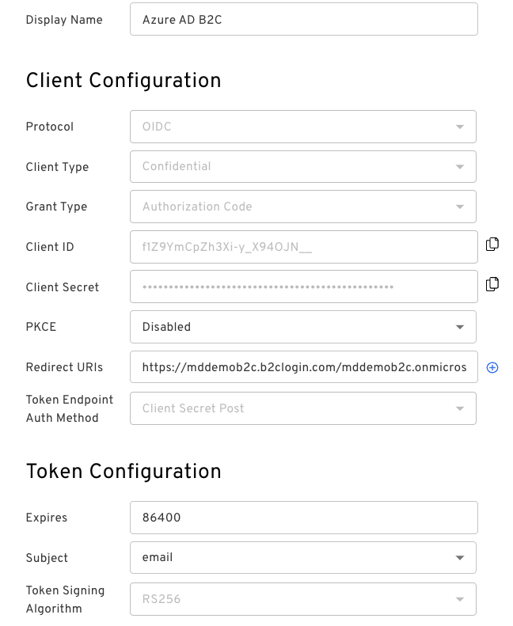
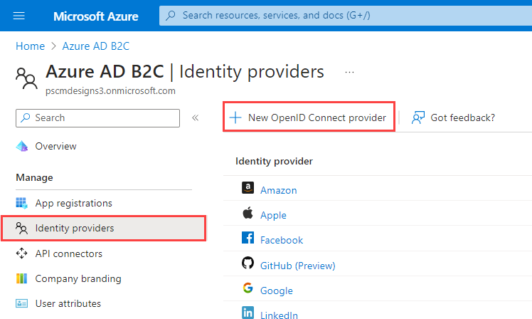
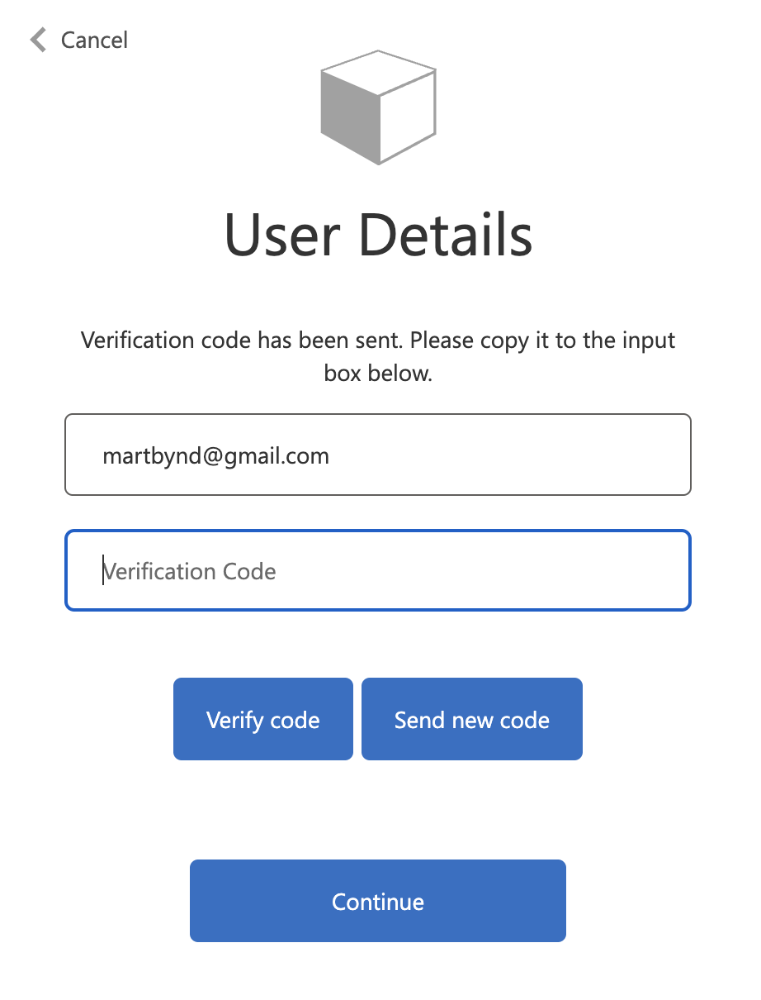
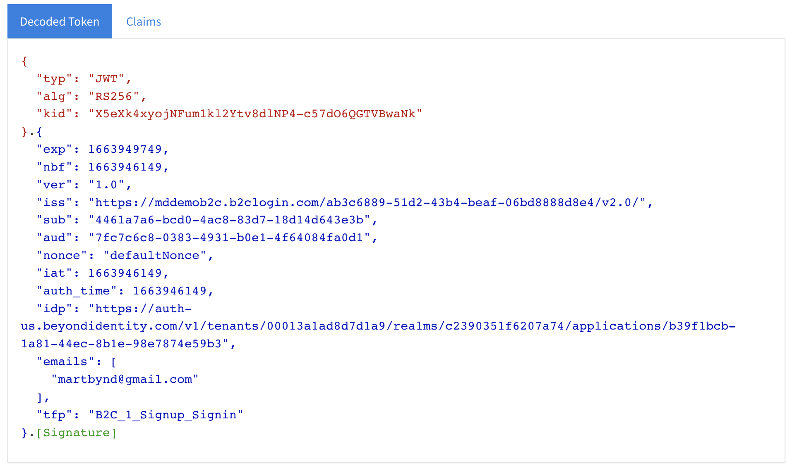

import Tabs from '@theme/Tabs';
import TabItem from '@theme/TabItem';

This guide provides information on how to set up Beyond Identity as a passwordless authentication provider in an Azure AD environment.

In this scenario, you'll use the Beyond Identity Hosted Web Authenticator, but an almost identical process can be followed should you wish to use the Beyond Identity Embedded SDK.

In this guide, you'll:

1. Configure Beyond Identity as an Identity Provider

1. Configure an Azure AD B2C tenant as a relying party to Beyond Identity

## Prerequisites

Before continuing, make sure you've met the following prerequisites:

* Access to an Azure AD B2C tenant with admin privileges

* Access to a Beyond Identity tenant with admin privileges. Sign up for a [developer account](https://www.beyondidentity.com/developers/signup) to create your Beyond Identity tenant.

## Configure Beyond Identity as an Identity Provider

### Create a realm

Add a realm to your Beyond Identity tenant to contain your application and users (separate from the default Admin realm).

import CreateRealmAdminConsole from '../includes/_create-realm-console.mdx';

<CreateRealmAdminConsole />

### Create OIDC Application

The application you create in this step will represent the Azure AD B2C client.

import AddAppAdminConsole  from '../includes/_add-application-console.mdx';

<AddAppAdminConsole />

3. On the **External Protocol** tab, use the following values to complete this tab.

  <h4>Client Configuration</h4>

  | Property | Value |
  | ----------- | ----------- |
  | **Protocol** | OIDC |
  | **Client Type** | Confidential |
  | **PKCE** | Disabled  |
  | **Redirect URIs** | https://(your-tenant-name).b2clogin.com/(your-tenant-name).onmicrosoft.com/oauth2/authresp  If you use a custom domain, enter https://(your-domain-name)/(your-tenant-name).onmicrosoft.com/oauth2/authresp   Replace **(your-tenant-name)** with the name of your Azure tenant, and **(your-domain-name)** with your custom domain.  |
  | **Token Endpoint Auth Method** | Client Secret Post |
  | **Resource Server** | None |
  | **Grant Type** | Authorization Code |
  | **Token Format** | Use the default value |

  <h4>Token Configuration</h4>

  | Property | Value |
  | --- | --- |
  | **Expires** | Use the default value |
  | **Subject** | email |

1. Click the **Authenticator Config** tab, select **Hosted Web** as the Configuration Type, and click **Submit**.

  

1. Select the newly created OIDC client configuration, copy and save the following values because you'll need them in the next step:

   - **Discovery Endpoint**

   - **Client ID**

   - **Client Secret**

## Configure Azure AD B2C
In your Azure AD B2C tenant, you'll need to register an application and configure an OIDC provider.

1. First, register a web application following [this tutorial from Microsoft]](https://learn.microsoft.com/en-us/azure/active-directory-b2c/tutorial-register-applications?tabs=app-reg-ga).

2. Next, in the Azure portal, select **Identity Providers > New OpenID Connect provider** and use the following values. Then click **Save**.

  

  | Property | Value |
  | ----------- | ----------- |
  | **Name** | Beyond Identity |
  | **Metadata url** | Beyond Identity Discovery Endpoint value |
  | **Client ID** | Beyond Identity Client ID value |
  | **Client secret** | Beyond Identity Client secret value |
  | **Scope** | openid  For more details on scopes and claims mappings, see [More Complex Integrations](#more-complex-integrations). |
  | **Response type** | code |
  | **Response mode** | query  For more information see the [OAuth2 specification for response_mode](https://openid.net/specs/oauth-v2-multiple-response-types-1_0.html#ResponseModes) |
  | **User ID** | sub |
  | **Display name** | sub |
  | **Email** | sub |
  | **All other options** | Use the default values for the remaining options |

1. Under **Policies**, select **User flows**, and then select **New user flow**.

    

2. On the **Create a user flow** page, select the **Sign up and sign in** user flow.

    

3. Under **Version**, select **Recommended**, and then select **Create**.

    

4. Enter a **Name** for the user flow. For example, *Signup\_Signin\_BI*. Note ***B2C\_1\_*** will prepend the name.

5. For **Identity providers**, select the **Custom identity provider** (Beyond Identity) you created earlier.

  :::tip
  Optionally, select **Email signup** if you want to have the ability to support local accounts (using passwords).
  :::

4. For **User attributes and claims**, select the option to collect **Email address**. In this scenario, we're using the Beyond Identity-provided email address.

5. Select **Show more** to expand the list and, in the **Return claim** column, select the following:

   - **Email Addresses**

   - **Identity Provider**

6. Select **OK** and then **Create**.

## Test the configuration
To test your application's integration easily, Azure AD B2C includes a test utility.

### Invoke Authentication Flow
1. Select the **User flow** you created earlier in the Azure portal.

2. At the top of the user flow overview page, select **Run user flow**. A pane opens at the right side of the page.

3. For **Application**, select the web application that you previously registered. The **Reply URL** should show https://jwt.ms rather than the real Reply URL for your application. That URL is a test target application for displaying identity tokens.

4. Select **Run user flow**. If you configure your user flow only to use the Beyond Identity IdP, you'll be taken directly to Beyond Identity for authentication. Otherwise, you'll see the Azure AD B2C login/register form from where you should select the Beyond Identity option.

5. If this is the first time the test user has authenticated, Azure AD prompts the user to verify their email address by sending an email containing an OTP, which the user must enter into the login form and verify.

  

6. Following authentication (and email verification, if required), observe the decoded identity token that Azure returns.

  

## Use a custom policy to get additional claims

As mentioned earlier, when using user flow policies, Azure AD B2C is only able to extract a single identifier from the sub(ject) of the Beyond Identity identity token. It does NOT attempt to retrieve additional claims from Beyond Identity's userinfo endpoint.

If additional claims are required, it is necessary to configure a custom policy rather than a standard user flow to invoke the userinfo endpoint. See https://learn.microsoft.com/en-us/azure/active-directory-b2c/tutorial-create-user-flows?pivots=b2c-custom-policy for more details.

In this case, we recommend changing the Beyond Identity application configuration to send the "ID" rather than email as the Subject parameter. Additionally, it will be necessary to set the Identity Provider configuration within Azure AD B2C to request additional scopes:

- **email** - which will return the user's email attribute

- **profile** - which will return the user's Name and Username unique ID

All Beyond Identity user attributes can be consumed and mapped within Azure AD B2C as required.
