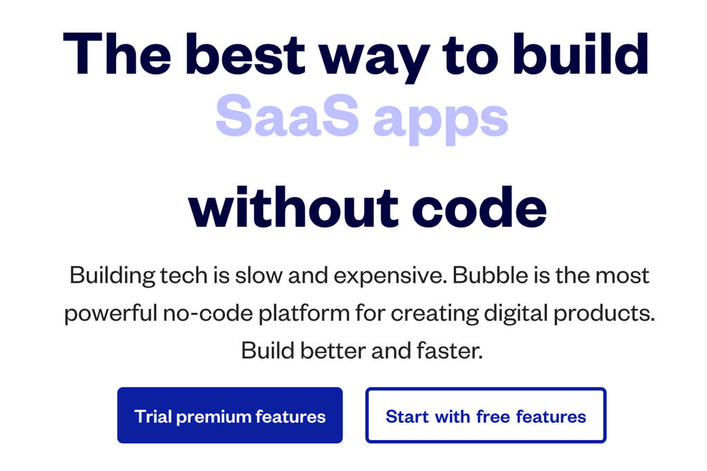
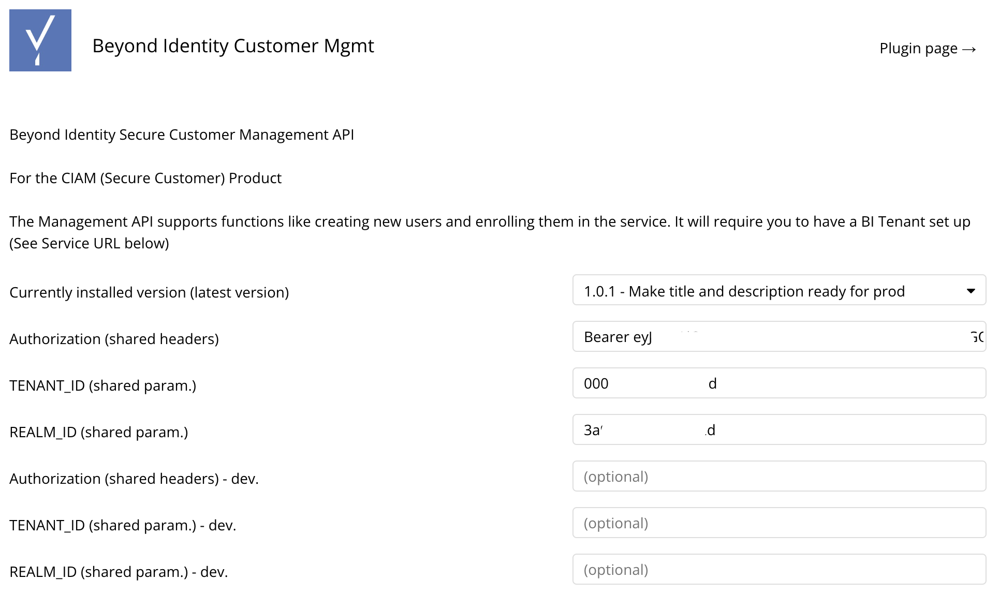
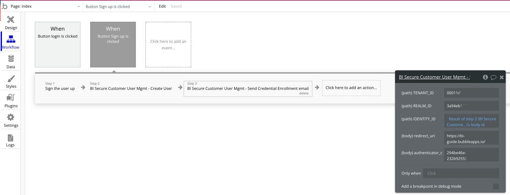
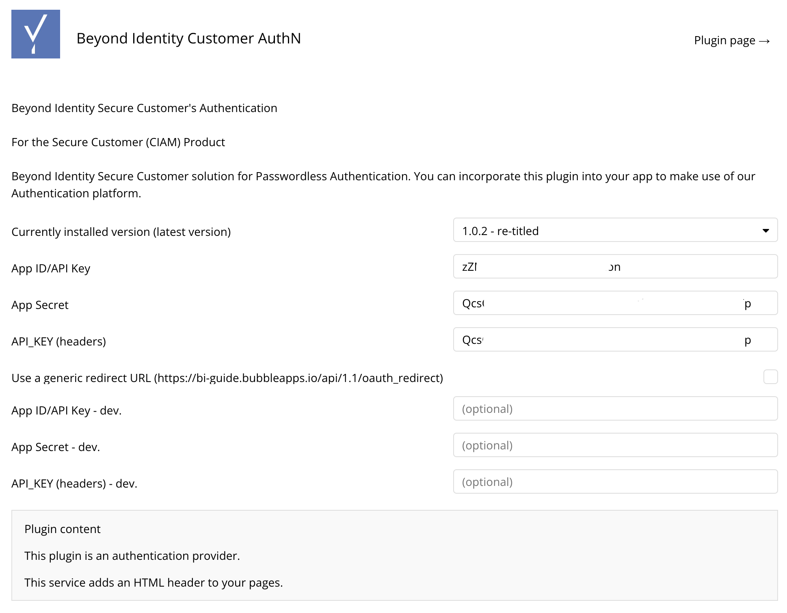
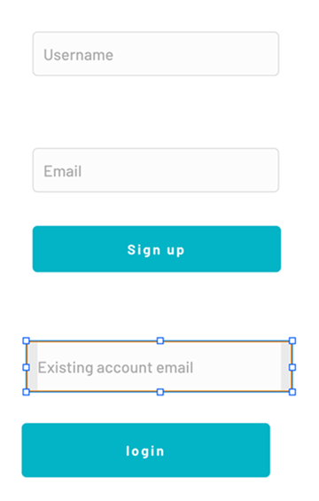
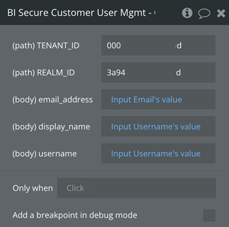
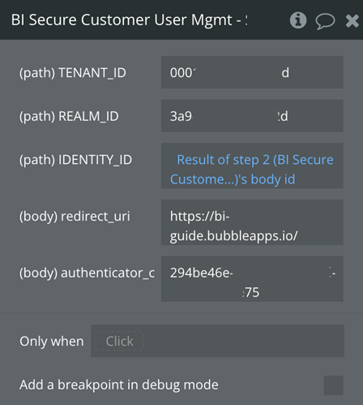

[Bubble.io](https://bubble.io/) is a no-code platform that non-developers and developers can use to build apps. We found it to be quite easy to use and extremely powerful. It has plugins and an app ecosystem to make sharing code easy. It also has numerous useful foundational components like an OIDC client that made it easy for us to build a foundation for others to use in their apps.

It is handy as a prototyping platform and can host real production apps. This tutorial will show how to integrate Beyond Identity's Secure Customer passwordless authentication into your bubble.io app.

## Demo Application

You can visit a [Demo Application](https://beyondid-secure-customer.bubbleapps.io/) to see one in action.

The user flow to set up a passwordless account is as follows:

1. User enters a username and email address and clicks **Sign up and Bind a Credential**.

1. Application creates an identity and sends the user a credential-binding enrollment email.

1. When the user clicks the link in the enrollment email, Beyond Identity uses WebAuthN to create and bind a credential to the user's current browser.

1. The user can log in now and in the future with their email, which triggers a step-up (on most devices) and retrieves the credential.

1. That credential is presented to Beyond Identity to authenticate the user.

## Beyond Identity plugins

There are two plugins you can use for bubble apps. Before use, you must customize them with the tenant, realm, and client id/secret of your own Beyond Identity application. 

1. [Beyond Identity Customer AuthN](https://bubble.io/plugin_editor?id=1663167119592x240371050688282620&tab=tabs-1): Performs the authentication flow after initial signup. 

2. [Beyond Identity Customer Mgmt](https://bubble.io/plugin_editor?id=1663167558199x986364837141938200&tab=tabs-1): Helps perform user management. In our demo application, it is used to create a new identity and send a Credential Binding request to the email address on record. This plugin can also be used to retrieve a list of identities for the current tenant.

You can see these in action in the Demo App that is linked above.

## Getting started

### Prerequisites

Before you get started, please set up the following.

- A free account on [bubble.io](https://bubble.io) and some basic familiarity with their UI

- A free account in your region on [Beyond Identity Secure Customer](https://www.beyondidentity.com/developers/signup)

- A [realm](../how-to/create-realm.mdx) and [application](/docs/next/add-an-application) set up in Beyond Identity. 

  :::note
  You must select **Client Secret Post** for the **Token Endpoint Auth Method** in your application.
  :::

- A [bubble app](https://bubble.io/home?tab=apps).

### Add the Beyond Identity plugins

Once you have created a bubble application, you'll see the **New Application Assistant**. 

1. Click through the assistant's steps until you reach the **Install Plugin** page. Then click **Install Plugin**.

1. In the upper left, click **Sort by > Name** and search for **Beyond Identity**. 

1. Click **install** for the **Beyond Identity Customer AuthN** and **Beyond Identity Customer Mgmt** plugins.

Here are the direct URLs to the plugins as well:

[Beyond Identity Customer Mgmt](https://bubble.io/plugin/beyond-identity-customer-mgmt-1663167558199x986364837141938200)

[Beyond Identity Customer AuthN](https://bubble.io/plugin/beyond-identity-customer-authn-1663167119592x240371050688282620)

You do not need the API connector for BI services, but you may wish to use it to integrate with your other services.

### Configure the plugins with values from Beyond Identity

This step involves copying OIDC and client/secret values from the Beyond Identity Admin Console into the bubble's plugin configuration page.

#### Customer Mgmt plugin

This plugin manages identities and credentials, and more.

You must create and copy an API key from the Beyond Identity admin console to use it.

1. In your bubble.io app, click **Plugins > Beyond Identity Customer Mgmt**.

1. you'll need an API token from the Beyond Identity Admin Console for the Authorization token.

    1. Log in to the [Beyond Identity Admin Console](https://console-us.beyondidentity.com/).

    1. Ensure you're logged into the **Beyond Identity Admin Realm** and select **Applications > Beyond Identity Management API > API TOKENS**.

    1. Create a new token and name it **bubble io plugin** or something you choose.

    1. Copy and save that API token in a text editor because you won't see it again.

1. Go back to the bubble.io plugin configuration page. In the field for **Authorization (shared headers)**, type **Bearer** and then paste your API token from the previous step.

  

1. In the Beyond Identity Admin Console, ensure you're in the new realm you created in the prerequisites.

1. Click **Edit realm** and copy the **TENANT_ID** and **REALM_ID** into the bubble.io plugin's configuration page.

  

#### Customer AuthN plugin

This plugin uses OIDC to follow the Authentication (AuthN) flow.

1. In your bubble.io app, click **Plugins > Beyond Identity Customer AuthN**.

1. In another tab or window, open the [Beyond Identity Admin Console](https://console-us.beyondidentity.com/) and navigate to the new realm you created in the prerequisites.

1. Next, navigate to the application you created under **Applications**.

1. Paste the **Client ID** into bubble.io plugin's **App ID/API Key** field.

1. Paste the **Client Secret** into bubble.io plugin's **App secret** field and into the **API_KEY** field.

  

### Create a user signup flow

This flow will enable a new user to input their username and email address and create a new identity. It will also send a credential-binding email to the new user's specified email address.

1. Once you're in your new app and on the page you want to add the login flow to, add two **Input** fields:

   - Username (content format: Text)
  
   - Email address (content format: Email)

1. Label each box with a Visual Element > Text for Username and Email address.

1. Add a Button for **Sign up** and click **Start/Edit workflow**.

  

1. For the first action, click **Account > Sign the user up**, which creates an entry in the local database for the user.

1. Add a second action. Click **Plugins > BI Secure Customer User Mgmt - Create User**.

1. Enter the **TENANT_ID** and **REALM_ID** copied from the Beyond Identity console **Home > Edit Realm**.

1. In the **email_address** field, remove the existing text and click **Insert dynamic data > Input Email's value**.

1. In the **display_name** field, remove the existing text and click **Insert dynamic data > Input Username's value**.

1. In the **username** field, remove the existing text and click **Insert dynamic data > Input Username's value**.

  

1. Next, you'll call the Beyond Identity API to send a credential-binding email to the user.

1. Add another action with **Click here to add another action > Plugins > BI Secure Customer User Mgmt > Send Credential Enrollment email**.

1. In the **IDENTITY_ID**, delete the existing text, and click **Insert dynamic text - "Result of Step 2's body id**.

1. Replace **redirect_uri** with the expected URL of your hosted app. 

  :::tip
  You can edit this field later if you don't yet know the final URL. If you leave it as localhost, the Credential Enrollment portion will attempt to redirect you to localhost.
  :::

2. Replace the **authenticator_config_id** with the value from your Beyond Identity Admin Console at **Applications > &#060;your_new_app&#062; > Authenticator config -> Authenticator config id**.

3. At this point, you can tell bubble to redirect to a page confirming authentication with a text field, redirect back to the index, or do nothing.

4. (Optional) Create another page that tells the user to check their email and hit the credential enrollment link to complete the signup.

### Set up the login button

For users who have already signed up and enrolled in a credential, you'll create a Login button because they'll need to enter their email address.

1. Create a text field and title it **Existing user email address**.

1. Create a button **Login** and click **Start/edit workflow**.

  

1. For the first action, select **Account > Log the user in**. For Email, use **Input Existing user email's value**, and the same value for the password. Upon user login, this will set up the browser session and update a row in the app's local database.

1. Create a second action to perform the OAuth login. Click to create a second action and select **Account > Signup/login with a social network**.

1. In the popup, select **Provider > BI Secure Customer AuthN** and click  **Add API Key**.

1. Copy and paste the **App ID** and **App Secret** from the Beyond Identity Admin Console.

    **Applications > &#060;your_new_app&#062; > Client ID** should be pasted into **App ID/API Key**

    **Applications > &#060;your_new_app&#062; > Client Secret** should be pasted into **App Secret**

### Preview the site

In this step, you'll preview the site, correct any visual design problems, and copy the bubble URL back into the workflow to enable the Beyond Identity web authenticator to redirect to your application after it has bound a credential to your devices.

1. In the bubble.io editor, click **Preview** in the top right corner of the screen.

2. Copy the URL of your preview app.

3. Paste that URL into the bubble editor: **Workflow > When Button Sign Up is clicked > Step 3 - Send Credential Enrollment email > redirect uri**.

  
  
1. Add that URI to the permitted list of redirects in the Beyond Identity Admin Console.

  1. From the Beyond Identity Admin Console, go to your new application. 

  1. Paste the URL of your preview app into the **Redirect URIs** field, add the suffix **/api/1.1/oauth_redirect**, and click **Submit**. 
   
    For example, https://bi-guide.bubbleapps.io/api/1.1/oauth_redirect. You can have multiple URLs here.
 
2. Click the Design editor and fix any UI issues and close the browser tab for the older preview.

3. Click **Preview** again.

## Sign up a user

1. Enter a username and email address (they can be the same). Then click **Signup**.  

   - It creates a new identity in the bubble.io app and the Beyond Identity tenant and realm.

   - It sends you a credential-binding email at the address you specified.

1. Click that link to bind a credential to your device. 
  
  :::caution important
  Do not use an Incognito/private browser for this; your credential will be created and discarded.
  :::

## Log in the user

1. Visit the main page of your app. Again, don't use an Incognito/private browsing window, or the credentials will be discarded.

1. Enter the email address you used in the signup process and click **Log in**.

1. Observe the browser step up and verify it with biometrics if prompted.

1. You'll be redirected back to the bubble.io app home and see that you've been logged in.