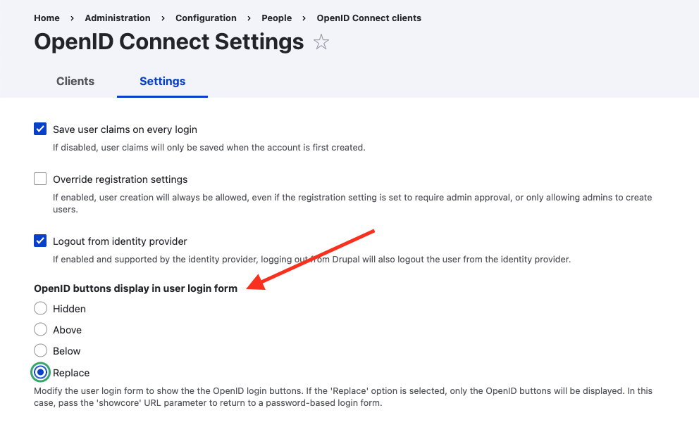

Make your Drupal admin login more secure!

This guide provides information on how to set up Beyond Identity as a passwordless authentication provider for a Drupal site.
 

In this guide, you'll:

- Configure Beyond Identity as an Identity Provider
- Install and configure the required module to support an OpenID Connect (OIDC) integration

## Prerequisites

Before continuing, make sure that the following prerequisites have been met:

- A [Beyond Identity developer account](https://beyondidentity.com/developers).

- A live Druapl site running and administrator privileges to install and configure modules.

## Set up Beyond Identity as an Identity Provider

To set up Beyond Identity as an Identity Provider, you need to create a Realm to hold identities and configuration. Inside that realm, you'll need to create an [Application](/docs/next/add-an-application) that contains the authentication flow configuration. These can be configured in you admin console that was created for you when you signed up for a developer account.

### Create a Realm

import CreateRealmAdminConsole from '../includes/_create-realm-console.mdx';

<CreateRealmAdminConsole />

### Create an Application

import AddAppAdminConsole  from '../includes/_add-application-console.mdx';

<AddAppAdminConsole />

3. On the **External Protocol** tab, use the following values to complete this tab.  

   

  <h4>Client Configuration</h4>

  | Property | Value | 
  | ----------- | ----------- |
  | **Protocol** | OIDC |
  | **Client Type** | Confidential | 
  | **PKCE** | Disabled  | 
  | **Redirect URIs** | This URL will also be generated for you in the OIDC module. You can always come back to change it.  Your redirect URI follows the pattern:   `https://${your-website-domain.com}/openid-connect/${client_machine_name}` | 
  | **Token Endpoint Auth Method** | Client Secret Post | 
  | **Grant Type** | Authorization Code | 
  | **All other options** | Use the default values for the remaining options | 

   

4. Click the **Authenticator Config** tab and use the following values. 
  
  | Property | Value | 
  | ----------- | ----------- |
  | **Configuration Type** | Hosted Web |
  | **Authentication Profile** | Use the default values for the remaining options |

4. Click **Submit** to save the new app. 

At this point, your Beyond Identity Admin Console should be configured with a realm and an application set up. The Hosted Web handles passkey registration and authentication for you, including generating new passkeys, presenting users with authenticator choice options as needed, and validating passkey assertions. You are now ready to configure the OpenID Connect Drupal module.

## Configure the OpenID Connect Drupal module

This module allows you to use an external OpenID Connect login provider to authenticate and log in users on your site. Existing users are automatically logged into your Drupal site, while new users get created in Drupal.

:::note
User roles will need to be managed from your admin dashboard. New users created in your Drupal database will have a default "Authenticated" user role. 
:::

### Install the OIDC module

This guide is based on the [OpenID Connect / OAuth client](https://www.drupal.org/project/openid_connect) and requires administrative privileges to install to your Drupal site.

Install the OIDC module as you would install a contributed Drupal module. 

### Configure the module 

After you've installed and enabled the module, you'll add the required values from your application you created in the Beyond Identity Admin Console.

1. Log into you Drupal admin console.

2. Go to **Home > Administration > Configuration > People > OpenID Connect clients**.

3. Under the **Clients** tab, select and enable **+ Generic OAuth 2.0**.

  

1. Navigate to **Add OpenID Connect client**. 

2. Enter **Beyond Identity** for the name.

3. Enter the values from the External Protocol tab of the application you created in the Beyond Identity Admin Console.

  | Property | Beyond Identity Admin Console value | 
  | --- | --- |
  | **Client ID** | Copy and paste the **Client ID** value from your application's **External Protocol** tab. |
  | **Client Secret Key** | Copy and paste the **Client Secret** value from your application's **External Protocol** tab. |
  | **Allowed domains** | _Ignore this field_ |
  | **Authorization endpoint** | Copy and paste the **Authorization Endpoint** value from your application's **External Protocol** tab. |
  | **Token endpoint** | Copy and paste the **Token Endpoint** value from your application's **External Protocol** tab. |
  | **Userinfo endpoint** | Copy and paste the **User Info Endpoint** value from your application's **External Protocol** tab. |
  | **End Session endpoint** | _Leave blank_ |
  | **Scopes** | email profile openid |

1. Click **Create OpenID Connect client**.

  A redirect URL is generated. 

  From the Beyond Identity Admin Console, under **Applications**, select your application, scroll down to the **Redirect URIs** field and paste the generated URL. 

  

### Allow exisiting users to login

You can allow existing users in your Drupal system to login.

1. Select the **Settings** tab and configure the plugin to the settings you prefer.

2. From the Advanced tab, select the **Automatically connect exisiting users** checkbox.

  

### Enable new user creation on successful login

If you send a passkey to a user not in your Drupal system, the login fails. You can mitigate that by overriding a setting.  

1. Select the **Settings** tab.

1. Select the **Override registration settings** checkbox. 

  This assigns a new user as an `Authenticated user` with no other defined role. You can change the user's role in your Drupal admin settings.

  

### Display login button on user login form

There are two ways to do this. You can either add a block provided by the module, or configure the **openID button display in user login form** in Settings. The easiest option is to configure the Settings.

Choose the option that works best for your site:

- **Hidden**: hides the login button and best to use when displaying a block

- **Above**: displays the login button above the login form

- **Below**: displays the login button below the login form

- **Replace**: hides the core login form and only shows the OIDC login option

### Try logging in

Test the log in and verify successful authentication.

1. From the same browser where you generated a passkey, visit your `/user/login` admin page.

2. Click **Login with Beyond Identity**.

  You'll be redirected to the Beyond Identity Web Authenticator.

1. Depending on how Policy is set up for your tenant, you may see a step-up authentication prompt.

  Aftert a successful authentication, you'll be redirected to your Drupal site. You'll also see successful authentication events in the Beyond Identity Admin Console under **Events**.