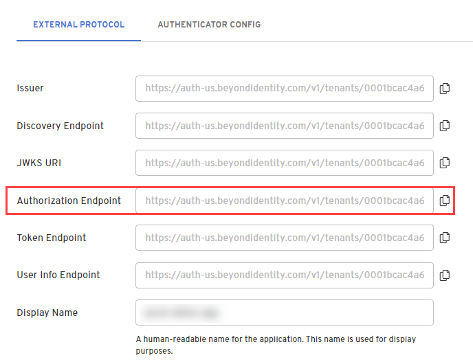

import Tabs from '@theme/Tabs';
import TabItem from '@theme/TabItem';


import RNExpoInstallation from '../includes/_sdk-setup/_installation-react-native-expo.mdx';
import PkceInfo from '../includes/_pkce-info.mdx';
import StateInfo from '../includes/_state-info.mdx';
import InvocationTip from '../includes/_invocation-type-tip.mdx';

import ProtocolOIDC from '../includes/_protocol_oidc.mdx';
import GrantTypeAuthorizationCode from '../includes/_grant-type_authorization-code.mdx';
import PKCES256 from '../includes/_pkce_s256.mdx';

import ClientTypeConfidential from '../includes/_client-type_confidential.mdx';


This guide provides information on how to set up Beyond Identity as a passwordless authentication provider for a React Native application that uses Expo.

In this guide, you'll:

1. Install the React Native SDK
1. Configure Beyond Identity as an Identity Provider
1. Create an identity and generate a passkey
1. Authenticate with a passkey

## Prerequisites

- A [Beyond Identity developer account](https://www.beyondidentity.com/developers/signup)

- An Expo application using a development build or prebuild

## Install the React Native SDK

To use Beyond Identity as a passwordless authentication provider in your Expo application, you'll need to install the SDK. The SDK is a wrapper around our native SDKs ([Android](https://github.com/gobeyondidentity/bi-sdk-android) and [iOS](https://github.com/gobeyondidentity/bi-sdk-swift)), so it has [custom native code](https://docs.expo.dev/workflow/customizing/). It provides functionality from passkey creation to passwordless authentication. 


:::note important
Expo Go only directly works with libraries in the Expo SDK, so to leverage the Beyond Identity React Native SDK and other libraries outside of Expo Go, you will need to either use an expo [development build](https://docs.expo.dev/development/introduction/) or a [prebuild](https://docs.expo.dev/workflow/prebuild/).
:::


<RNExpoInstallation />

## Initialize the React Native SDK

After you've installed the SDK, initialize it so that you can call the `Embedded` functions. A good place to initialize this is where you register your root component. You can also add a listener to log native events with `Embedded.logEventEmitter` after initializing.


```jsx title="index.tsx"
import { Embedded } from '@beyondidentity/bi-sdk-react-native';

Embedded.initialize(Config.biometricAskPrompt).catch(console.error);

Embedded.logEventEmitter.addListener(
  'BeyondIdentityLogger',
  (message: string) => {
    console.log(message);
  }
);

AppRegistry.registerComponent(appName, () => App);
```

## Set up Beyond Identity as an Identity Provider

To set up Beyond Identity as an Identity Provider, you need to create a Realm to hold identities and configuration. Inside that realm, you'll also create an [Application](/docs/next/add-an-application) that contains the authentication flow configuration. These can be configured in you admin console that was created for you when you signed up for a developer account.

### Create a Realm

import CreateRealmAdminConsole from '../includes/_create-realm-console.mdx';

<CreateRealmAdminConsole />

### Create an Application

import AddAppAdminConsole  from '../includes/_add-application-console.mdx';

<AddAppAdminConsole />

3. On the **External Protocol** tab, use the following values to complete this tab.  

  | Property | Value | 
  | ----------- | ----------- |
  | **Protocol** | OIDC<br /><ProtocolOIDC/> |
  | **Client Type** | Confidential<br /><ClientTypeConfidential/> | 
  | **PKCE** | S256<br /><PKCES256/> |
  | **Redirect URIs** | Use your application's App Scheme or Universal URL.<br /><br />If you are using an app scheme, your redirect URI may follow the pattern:<br /><br /> `myapp://` <br /> <br />Follow Expo's [deep linking guide](https://docs.expo.dev/guides/deep-linking/) and [linking to your development build](https://docs.expo.dev/guides/linking/#linking-to-your-app) | 
  | **Token Endpoint Auth Method** | Client Secret Post | 
  | **Grant Type** | Authorization Code<br /><GrantTypeAuthorizationCode/> |
  | **All other options** | Use the default values for the remaining options |  

1. Click the **Authenticator Config** tab and use the following values. 

  | Property | Value | 
  | ----------- | ----------- |
  | **Configuration Type** | Embedded SDK |
  | **Invocation Type** | Automatic or Manual |
  | **Invoke URL** | Use your application's App Scheme or Universal URL. | 
  | **Trusted Origin** | Use your application's App Scheme or Universal URL. | 

1. Click **Submit** to save the new app.  

## Create an Identity and generate a passkey

Once you have an application in the admin console you are ready to provision users in your realm's directory, generate passkeys, and handle those passkeys in your application.

### Create an Identity

Creating a user can be done either in the admin console or through an API. This guide will use the admin console. 

import AddAnIdentity from '../includes/_add-an-identity.mdx';

<AddAnIdentity />

For more information about identities, see [Directory](/docs/next/platform-overview#directory).

### Generate a passkey

Once you have an identity you can generate a passkey. This step can also be done either in the admin console or through an API. 

import BindPasskeyToAnIdentity from '../includes/_bind-passkey-to-an-identity-send-an-email-to-user.mdx';

<BindPasskeyToAnIdentity />

For more information, [Add a passkey](/docs/next/add-passkey).

### Bind passkey to device

When the user clicks or taps the link in the enrollment email, they are redirected to your application. Links that launched your app can be observed using [Linking](https://docs.expo.dev/versions/latest/sdk/linking/).

1. Follow Expo's [deep linking guide](https://docs.expo.dev/guides/deep-linking/) and [linking to your development build](https://docs.expo.dev/guides/linking/#linking-to-your-app).  

2. Register a scheme in your Expo config under the scheme key.

  ```json
  {
    "expo": {
      "scheme": "myapp"
    }
  }
  ```

1. Intercept the link from the enrollment email. The link that is redirected to your application will have the `/bind` path appended to your Invoke URL and several other query parameters.

  ```http
  $invoke_url/bind?api_base_url=<api_base_url>&tenant_id=<tenant_id>&realm_id=<realm_id>&identity_id=<identity_id>&job_id=<job_id>&token=<token>
  ```

2. Pass the link from the enrollment email into the SDK to complete the binding process. 

  You can validate the incoming URL with `isBindPasskeyUrl`. Upon success, a private key will have been created in the device's hardware trust module and the corresponding public key will have been sent to the Beyond Identity Cloud. At this point the user has a passkey enrolled on this device.

  ```javascript
  import { Embedded } from '@beyondidentity/bi-sdk-react-native';
  import * as Linking from 'expo-linking';

  export default function App() {
    const url = decodeURI(Linking.useURL());

    const isBindUrl = await Embedded.isBindPasskeyUrl(url)

    if (isBindUrl) {
      const bindResponse = await Embedded.bindPasskey(bindingLink);
      console.log(bindResponse);
    }
  }
  ```

## Authenticate with a passkey

Once you have one passkey bound to a device, you can use it to [authenticate](#authenticate), which you'll do below using the **Automatic** or **Manual** method.

### Craft an Authorization URL

Crafting an authorization URL is the first step in the authorization flow. 

1. In the Admin Console, under Apps, select the **External Protocol** tab, copy the **Authorization Endpoint** value and add it to the query parameters:

  

  ```bash title="/authorize"
  https://auth-$REGION.beyondidentity.com/v1/tenants/$TENANT_ID/realms/$REALM_ID/applications/$APPLICATION_ID/authorize?
  response_type=code
  &client_id=$APPLICATION_CLIENT_ID
  &redirect_uri=$REDIRECT_URI
  &scope=openid
  &state=$STATE
  &code_challenge_method=256
  &code_challenge=$PKCE_CODE_CHALLENGE
  ```

2. Copy and paste the **Application Client ID** to the query parameters.

1. Copy and paste the **Redirect URI**, which is your application's App Scheme or Universal URL, to the query parameters.

3. Set the PKCE (code_challenge_method) to **S256** or **Plain**.  The PKCE code challenge methods supported for applications are defined by [RFC-7636](https://datatracker.ietf.org/doc/html/rfc7636). 

  :::note PKCE
  Note that the following query parameters includes [PKCE](https://www.rfc-editor.org/rfc/rfc7636) as it is recommeded, but optional. If you send an authorization request with PKCE, you must store the hash of the `code_challenge` so that it can be passed to the token exchange endpoint later as a `code_verifier`.
  :::

1. Generate a random string from your application for **STATE** value and is returned back to you in the response. 

  The `STATE` parameter mitigates [CSRF attacks](https://en.wikipedia.org/wiki/Cross-site_request_forgery) by embedding a unique value for each authentication.

### Authenticate

There are two ways to authenticate depending on your Application Config's [Invocation Type](/docs/next/authentication#invocation-type). 

- **Automatic**
- **Manual**


<Tabs groupId="authenticate-invocation-type" queryString>
<TabItem value="automatic" label="Automatic">

If you select **Automatic**, Beyond Identity does the heavy lifting for you. If you initiate an OAuth2.0 request and specify the **Invoke URL** correctly, we'll get the Beyond Identity authentication URL to where it needs to be inside your native app. A 302 redirect is returned in response to your app's OIDC request, causing the user agent to automatically redirect to the authentication URL.

<br />

To handle a web browser based authentication you can use Expo's [Auth Session](https://docs.expo.dev/versions/latest/sdk/auth-session/).

:::note 
The `response` from `useAuthRequest` hook does not need to be of type 'success'. It's sufficient if it has a `url` becasue the state value is stored in a JWT in the URL 'request' paramater. The URL is validated through the Beyond Identity Embedded SDK.
:::

```jsx
import * as React from 'react';
import {
  makeRedirectUri,
  useAuthRequest,
  useAutoDiscovery,
} from 'expo-auth-session';
import { Button } from 'react-native';
import { Embedded } from '@beyondidentity/bi-sdk-react-native';

export default function App() {
  // Endpoint
  const discovery = useAutoDiscovery(
    `https://auth-${REGION}.beyondidentity.com/v1/tenants/${TENANT_ID}/realms/${REALM_ID}/applications/${APPLICATION_ID}`
  );

  // Request
  const [request, response, promptAsync] = useAuthRequest(
    {
      clientId: `${CLIENT_ID}`,
      scopes: ['openid'],
      redirectUri: makeRedirectUri({
        scheme: 'your.app',
      }),
    },
    discovery
  );

  React.useEffect(() => {
    const authenticate = async (url) => {
      // Display UI for user to select a passwordless passkey if there are multiple.
      const passkeys = await Embedded.getPasskeys();

      if (await Embedded.isAuthenticateUrl(url)) {
        // Pass url and a selected passkey ID into the Beyond Identity Embedded SDK authenticate function
        const { redirectUrl } = await Embedded.authenticate(
          url,
          passkeys[0].id
        );
      }
    };

    if (response?.url) {
      authenticate(url);
    }
  }, [response]);

  return (
    <Button
      disabled={!request}
      title="Passwordless Login"
      onPress={() => {
        promptAsync();
      }}
    />
  );
}
```
</TabItem>
<TabItem value="manual" label="Manual">

If you select **Manual**, you'll have a lot more control and flexibity when redirecting to your native app. For example, you can write your own intelligent routing layer using the Beyond Identity authentication URL to authenticate against passkeys. 

<br />

The authentication URL is returned to you as part of a JSON response. No redirects are needed and won't require authentication through a web service. The result is a completely silent OAuth 2.0 authentication using passkeys. Since the challenge is packaged as part of the authentication URL, the URL will result in the same behavior as the **Automatic** Invocation Type.

```jsx
import * as React from 'react';
import { Button } from 'react-native';
import { Embedded } from '@beyondidentity/bi-sdk-react-native';

export default function App() {
  async function authenticate() {
    const BeyondIdentityAuthUrl = `https://auth-${REGION}.beyondidentity.com/v1/tenants/${TENANT_ID}/realms/${REALM_ID}/applications/${APPLICATION_ID}/authorize?response_type=code&client_id=${CLIENT_ID}&redirect_uri=${URI_ENCODED_REDIRECT_URI}&scope=openid&state=${STATE}&code_challenge_method=S256&code_challenge=${PKCE_CODE_CHALLENGE}`;

    let response = await fetch(BeyondIdentityAuthUrl, {
      method: 'GET',
      headers: new Headers({
        'Content-Type': 'application/json',
      }),
    });
    const data = await response.json();

    // Display UI for user to select a passwordless passkey if there are multiple.
    const passkeys = await Embedded.getPasskeys();

    if (await Embedded.isAuthenticateUrl(data.authenticate_url)) {
      // Pass url and selected Passkey ID into the Beyond Identity Embedded SDK authenticate function
      const { redirectUrl } = await Embedded.authenticate(
        data.authenticate_url,
        passkeys[0].id
      );
    }
  }

  return <Button title="Passwordless Login" onPress={authenticate} />;
}
```
</TabItem>
</Tabs>

### Token Exchange

Calling the token endpoint is the second step in the authorization flow and usually happens in your backend if your application's Client Type is `Confidential`.

Parse the `redirectUrl` returned when calling the function `Embedded.authenticate` for a `code` in the query parameters and then exchange that code for an access token.

For more information on code for token exchange with a Beyond Identity app, see [call the token endpoint for token exchange](/docs/next/embedded-sdk-add-authentication#call-the-token-endpoint-for-token-exchange).  
