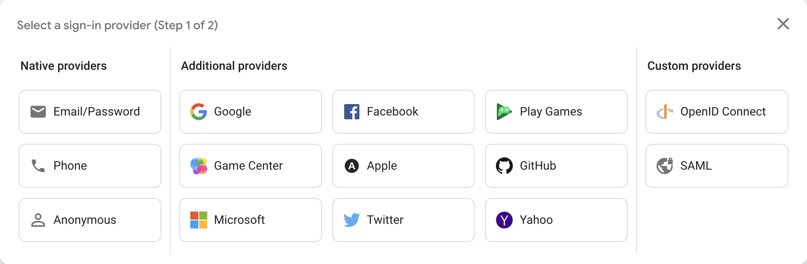
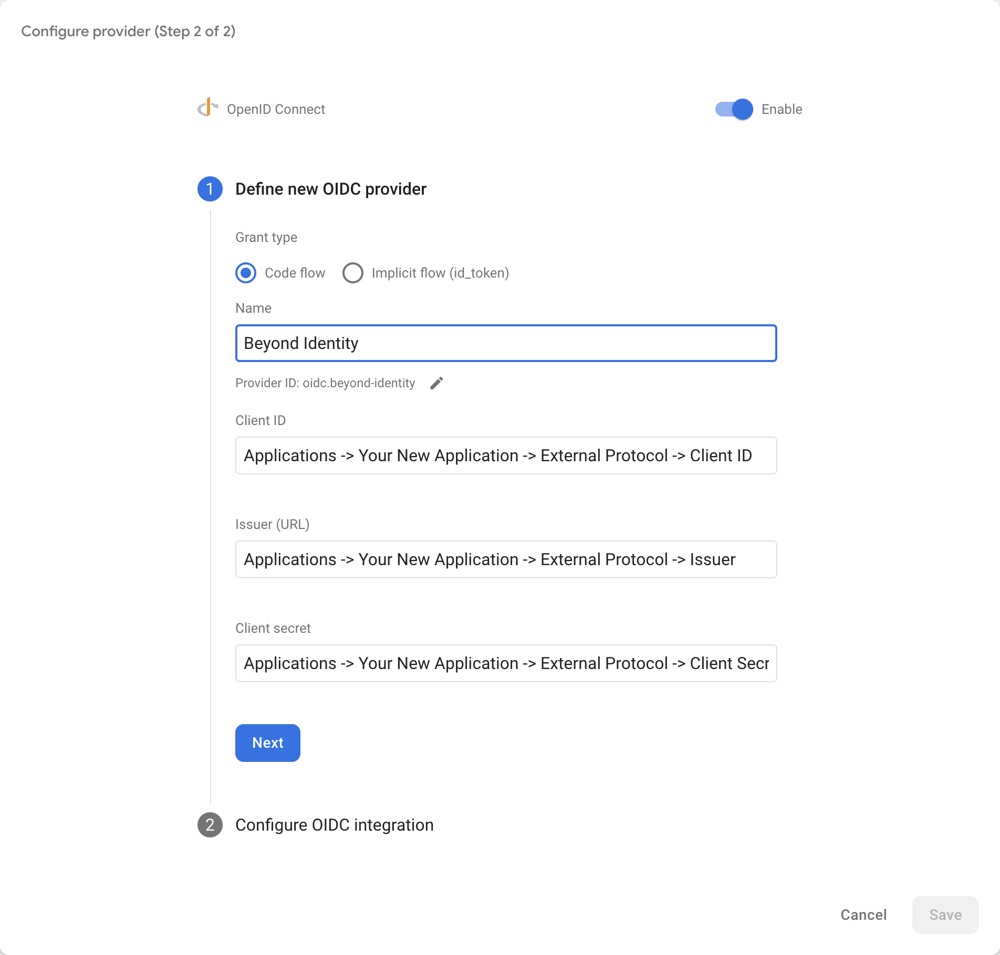
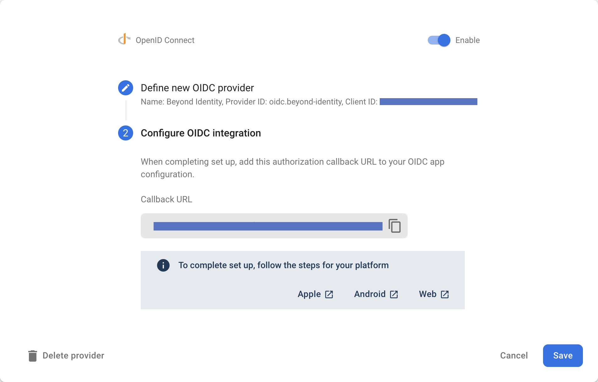

import Tabs from '@theme/Tabs';
import TabItem from '@theme/TabItem';
import SetupJavaScript from '../includes/_sdk-setup/_setup-javascript.mdx';
import SetupKotlin from '../includes/_sdk-setup/_setup-kotlin.mdx';
import SetupSwift from '../includes/_sdk-setup/_setup-swift.mdx';


This guide provides information on how to set up Beyond Identity as a passwordless authentication provider for an application that uses [Firebase](https://firebase.google.com/docs/auth).

This guide will cover:

- How to configure Beyond Identity as an Identity Provider
- How to create an identity and generate a passkey
- How to authenticate with a passkey
- How to configure the OpenID Connect plugin

## Prerequisites

- Set up a [developer account](https://www.beyondidentity.com/developers/signup)

## Firebase

- [Authenticate Using OpenID Connect on Android](https://firebase.google.com/docs/auth/android/openid-connect)
- [Authenticate Using OpenID Connect on Apple platforms](https://firebase.google.com/docs/auth/ios/openid-connect)
- [Authenticate Using OpenID Connect in web apps](https://firebase.google.com/docs/auth/web/openid-connect).

## Install the SDKs

### Install the Firebase Authentication SDK

In order to authenticate with Beyond Identity with Firebase Authentication, we need to use the custom OpenID Connect provider, which is supported on [iOS+](https://firebase.google.com/docs/auth/ios/openid-connect), [Android](https://firebase.google.com/docs/auth/android/openid-connect), and [Web](https://firebase.google.com/docs/auth/web/openid-connect). Please see the appropriate Get Started documentation ([iOS+](https://firebase.google.com/docs/auth/ios/start), [Android](https://firebase.google.com/docs/auth/android/start), [Web](https://firebase.google.com/docs/auth/web/start)) for instructions on how to install the Firebase Authentication SDK.

### Install the Beyond Identity SDK

In order to use Beyond Identity functionality in your application, you will need to install the Beyond Identity SDK. The [Android SDK](https://github.com/gobeyondidentity/bi-sdk-android), the [Swift SDK](https://github.com/gobeyondidentity/bi-sdk-swift), and the [JavaScript SDK](https://github.com/gobeyondidentity/bi-sdk-js) provides functionality from passkey creation to passwordless authentication. A set of functions are provided to you through an `Embedded` namespace.

## Initialize the Beyond Identity SDK

Once you've installed the SDK, initialize it so that you can call the Embedded functions.

<Tabs groupId="platform" queryString>
<TabItem value="android" label="Android">

<SetupKotlin />

</TabItem>
<TabItem value="ios" label="iOS">

<SetupSwift />

</TabItem>
<TabItem value="web" label="Web">

<SetupJavaScript />

</TabItem>
</Tabs>

## Set up Beyond Identity as an Identity Provider

To set up Beyond Identity as an Identity Provider, you need to create a [Realm](/docs/next/create-realm) to hold identities and configuration. Inside that realm, you'll need to create an [Application](/docs/next/add-an-application) that contains the authentication flow configuration. These can be configured in you admin console that was created for you when you signed up for a developer account.

### Create a Realm

import CreateRealmAdminConsole from '../includes/_create-realm-console.mdx';

<CreateRealmAdminConsole />

### Create an Application

From the admin console, click **Apps**, then click **Add app**.

There is a lot to configure when creating an application. When creating your application make sure:

- Redirect URIs contains your application's App Scheme or Universal URL
- Configuration Type (in the Authenticator Config tab) is set to `Embedded SDK`
- Invoke URL (in the Authenticator Config tab) contains your application's App Scheme or Universal URL
- Invocation Type (in the Authenticator Config tab) is set to `Automatic`.

For help choosing options, visit the following guides:

- [Applications](/docs/next/platform-overview#application)
- [Authenticator Config](/docs/next/authenticator-config)

<p><mark>We should use the include file with the step-by-step instructions with screenshots. Arcades are not scannable and they are not A11y compatible.  Reserve Arcades for the more complex configurations, tutorials, or demos of something they can do (an end-to-end process). </mark></p>

### Configure Custom OpenID Connect Provider

Now that we have created our application, we are ready to configure our custom OpenID Connect provider in the [Firebase console](https://console.firebase.google.com).




1. For Name, use Beyond Identity
1. For Client ID, copy and paste the value from Applications -> Your New Application -> External Protocol -> Client ID
1. For Issuer (URL), copy and paste the value from Applications -> Your New Application -> External Protocol -> Issuer
1. For Client Secret, copy and paste the value from Applications -> Your New Application -> External Protocol -> Client Secret



To complete set up, follow the steps for your platform
- [Apple](https://firebase.google.com/docs/auth/ios/openid-connect)
- [Android](https://firebase.google.com/docs/auth/android/openid-connect)
- [Web](https://firebase.google.com/docs/auth/web/openid-connect)

## Create an Identity and generate a Universal Passkey

Once you have an application in the admin console you are ready to provision users in your realm's directory, generate passkeys, and handle those passkeys in your application.

### Create an Identity

Creating a user can be done either in the admin console or through an API. This guide will use the admin console. 

import AddAnIdentity from '../includes/_add-an-identity.mdx';

<AddAnIdentity />

For more information about identities, see [Identity and groups](/docs/next/platform-overview#directory).


### Generate a passkey

Once you have an identity, you are ready to generate a passkey for this user. This step can also be done either in the admin console or through an API. This guide will use the admin console. Navigate back to **Identities** and select the identity you would like to bind to a passkey. Click **Add a passkey**, select your app and the click **Proceed & send email**. The user will receive an enrollment email which they can tap on to bind a passkey to their device.

Note that whichever browser or device that the user taps on the enrollment email will be the device/browser where the user can log into your Drupal site. If the user wishes to login from a different browser or device you will need to send the user another email to bind that new browser/device. Also note that private/incognito browsers act as a different browser in this case. Users can bind multiple devices and browsers.

For more information visit [Bind a passkey to an identity](/docs/next/add-passkey).

<p><mark>We should use an include file with the step-by-step instructions with screenshots. Arcades are not scannable and they are not A11y compatible.  Reserve Arcades for the more complex configurations, tutorials, or demos of something they can do (an end-to-end process). </mark></p>

## Configure Application

### Bind passkey to device

Once the user taps on the enrollment email, they will be redirected to your application. Intercept the link from the enrollment email. The link that is redirected to your application will take on the following form. A `/bind` path will be appended to your Invoke URL (configured in your application above) as well as several other query parameters.

```
$invoke_url/bind?api_base_url=<api_base_url>&tenant_id=<tenant_id>&realm_id=<realm_id>&identity_id=<identity_id>&job_id=<job_id>&token=<token>
```

Once you receive the incoming URL, pass it into the Beyond Identity SDK to complete the binding process. You can validate the incoming URL with `isBindPasskeyUrl`. Upon success, a private key will have been created in the device's hardware trust module and the corresponding public key will have been sent to the Beyond Identity Cloud. At this point the user has a passkey enrolled on this device.

<Tabs groupId="platform" queryString>
<TabItem value="android" label="Android">

```kotlin
import com.beyondidentity.embedded.sdk.EmbeddedSdk
import kotlinx.coroutines.flow.onEach
import timber.log.Timber

EmbeddedSdk.bindPasskey(url = bindingLink)
.onEach { result ->
    result.onSuccess { success ->
        Timber.d("Bind Passkey success = $success")
    }
    result.onFailure { failure ->
        Timber.e("Bind Passkey failure = $failure")
    }
}
```

</TabItem>
<TabItem value="ios" label="iOS">

```swift
import BeyondIdentityEmbedded

Embedded.shared.bindPasskey(url: bindingLink) { result in
    switch result {
    case let .success(bindResponse):
        print(bindResponse)
    case let .failure(error):
        print(error.localizedDescription)
    }
}
```

</TabItem>
<TabItem value="web" label="Web">

```javascript
import { Embedded } from '@beyondidentity/bi-sdk-js'

const bindResponse = await embedded.bindPasskey(bindingLink);
console.log(bindResponse);
```

</TabItem>
</Tabs>

### Authenticate

The authenticate url that is redirected to your application will append a `/bi-authenticate` path to your Invoke URL:

```
$invoke_url/bi-authenticate?request=<request>
```

Once you receive the authenticate URL, pass it into the SDK to complete the authentication process. You can validate the incoming URL with `isAuthenticateUrl`.

<Tabs groupId="platform" queryString>
<TabItem value="android" label="Android">

```kotlin
import android.content.Context
import android.content.Intent
import android.net.Uri
import androidx.browser.customtabs.CustomTabsIntent
import com.beyondidentity.embedded.sdk.EmbeddedSdk
import com.google.firebase.auth.ktx.auth
import com.google.firebase.auth.ktx.oAuthCredential
import com.google.firebase.ktx.Firebase

private fun launchBI(context: Context, url: Uri = AUTH_URL) {
    CustomTabsIntent.Builder().build().launchUrl(context, url)
}

private fun handleIntent(context: Context, intent: Intent?) {
    selectPasskeyId { selectedPasskeyId ->
        intent?.data?.let { uri ->
            when {
                EmbeddedSdk.isAuthenticateUrl(uri.toString()) -> {
                    EmbeddedSdk.authenticate(
                        url = uri.toString(),
                        passkeyId = selectedPasskeyId,
                    ) { result ->
                        result.onSuccess { authenticateResponse ->
                            authenticateResponse.redirectUrl?.let { redirectUrl ->
                                // This URL contains authorization code and state parameters
                                // Exchange the authorization code for an id_token using Beyond Identity's token endpoint.
                                var code = parseCode(redirectUrl)
                                var token = exchangeForToken(code)

                                val providerId = "oidc.beyond-identity" // As registered in Firebase console.
                                val credential = oAuthCredential(providerId) {
                                    setIdToken(token) // ID token from OpenID Connect flow.
                                }
                                Firebase.auth
                                    .signInWithCredential(credential)
                                    .addOnSuccessListener { authResult ->
                                        // User is signed in.
                                    }
                                    .addOnFailureListener { e ->
                                        // Handle failure.
                                    }
                            }
                        }
                    }
                }
            }
        }
    }
}

private fun selectPasskeyId(callback: (String) -> Unit) {
    // Where you can perform some logic here to select a passkey, or
    // present UI to a user to enable them to select a passkey.
}
```

</TabItem>
<TabItem value="ios" label="iOS">

```swift
import AuthenticationServices
import BeyondIdentityEmbedded
import FirebaseAuth

let session = ASWebAuthenticationSession(
    url: viewModel.authorizationURL,
    callbackURLScheme: viewModel.callbackScheme
){ (url, error) in
    guard Embedded.shared.isAuthenticateUrl(url) else {
        print("url is not valid")
        return
    }
    presentPasskeySelection { selectedPasskeyId in
        Embedded.shared.authenticate(
            url: url,
            id: selectedPasskeyId
        ) { result in
            switch result {
            case let .success(response):
                // This URL contains authorization code and state parameters
                // Exchange the authorization code for an id_token using Beyond Identity's token endpoint.
                let code = parseCode(from: response.redirectURL)
                let token = exchangeForToken(code)

                let credential = OAuthProvider.credential(
                    withProviderID: "oidc.beyond-identity", // As registered in Firebase console.
                    idToken: token, // ID token from OpenID Connect flow.
                    rawNonce: nil
                )
                Auth.auth().signIn(with: credential) { authResult, error in
                    if error {
                        // Handle error.
                        return
                    }
                    // User is signed in.
                }
            case let .failure(error):
                print(error)
            }
        }
    }
}
session.presentationContextProvider = self
session.start()

private fun presentPasskeySelection(callback: (PasskeyID) -> Void) {
    // Where you can perform some logic here to select a passkey, or
    // present UI to a user to enable them to select a passkey.
}
```

</TabItem>
<TabItem value="web" label="Web">

```javascript
import { Embedded } from '@beyondidentity/bi-sdk-js'
import { getAuth, signInWithCredential, OAuthProvider } from "firebase/auth";

selectPasskeyId(async (selectPasskeyId) => {
    if (embedded.isAuthenticateUrl(authenticateUrl)) {
        let result = await embedded.authenticate(authenticateUrl, selectPasskeyId);

        // This URL contains authorization code and state parameters
        // Exchange the authorization code for an id_token using Beyond Identity's token endpoint.
        var code = parseCode(result.redirectUrl)
        var token = exchangeForToken(code)

        const provider = new OAuthProvider("oidc.beyond-identity"); // As registered in Firebase console.
        const credential = provider.credential({
            idToken: token, // ID token from OpenID Connect flow.
        });
        signInWithCredential(getAuth(), credential)
            .then((result) => {
                // User is signed in.
            })
            .catch((error) => {
                // Handle error.
            });
    }
});

function selectPasskeyId(callback: (selectPasskeyId: string) => void) {
    // Where you can perform some logic here to select a passkey, or
    // present UI to a user to enable them to select a passkey.
}
```

</TabItem>
</Tabs>