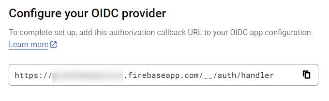

In this walkthrough, you'll add passkey-based sign-on for Google Identity Platform identities to a Javascript web app using the Firebase SDK.  

As shown in the diagram below, the web app sends an OIDC sign-on request to the Google Identity Platform, which sends an OIDC request to Beyond Identity.  

Beyond Identity authenticates the user via passkey and then issues a token to the Google Identity Platform, which verifies the Beyond Identity token (the IDP token) and issues a token for the user to sign in to your web app.  

import GoogleFirebaseDiagram from '../images/goog-firebox-diagram.jpg';


## Prerequisites

These are the things you'll need for this walkthrough.

- Beyond Identity tenant, which was created when you signed up for a free [developer account](https://www.beyondidentity.com/developers/signup).

- A Google Cloud project with Identity Platform enabled, upgraded to [Firebase Authentication with Identity Platform](https://firebase.google.com/docs/auth#identity-platform).  

  :::note
  The upgrade to Firebase Authentication includes OpenId Connect support, which is required for this guide. For more details, see Google's [Identity Platform pricing by authentication type](https://cloud.google.com/identity-platform/pricing).  
  :::

- Development tools 

  - An IDE such as [VS Code](https://code.visualstudio.com/download). The steps below presume VS Code.  

  - Verify that [node.js and npm](https://nodejs.org/en/download) are both installed.  

   ```bash
   node -v
   npm -v
   ```


## Create the Google/Firebase project  

Create the project using one of the following methods: 

- For an existing Google Cloud project created via the [Google Cloud Identity Platform console](https://console.cloud.google.com/customer-identity), open the [Firebase console](https://console.firebase.google.com/), click **Add project**, and select your existing Google Cloud project in the project name drop down. 

- Create a project directly in the [Firebase console](https://console.firebase.google.com/).  

:::tip
Need help with the relationship between Google Cloud projects and Firebase projects? See the support note of Google's [What is a Firebase Project?](https://support.google.com/firebase/answer/6399760).  
:::

## Add a web app to the Google/Firebase project

1. Select your project from the Firebase console [project overview page](https://console.firebase.google.com/u/0/).

2. Click **Add app** and select **Web app**.

3. Give the app a name and click **Register app**.

  The UI presents a web snippet with the rest of the config required. It should look like the example below. You'll need this for your web app's code, but we'll let you know how to retrieve it later. Still, feel free to save this in a text file for now.

  ```javascript
  const firebaseConfig = {
     //your Firebase web app config here:
     apiKey: "{your_api_key}",
     authDomain: "{your_project_name}.firebaseapp.com",
     projectId: "{your_project_id}",
     storageBucket: "{your_project_id}.appspot.com",
     messagingSenderId: "{your_sender_id}",
     appId: "{your_app_id}"
  };
  ```

## Configure your Beyond Identity tenant

In this section, you'll create the app that represents Google within your Beyond Identity tenant. There are two steps: **create a realm** and **create the app**.

### Log in to your tenant

Log into the Admin Console to access the tenant you created when you signed up for a free developer account. Depending on the region you selected when you signed up, you can access the Beyond Identity Admin Console for your tenant at the following:

- US - https://console-us.beyondidentity.com/login

- EU - https://console-eu.beyondidentity.com/login

:::tip
If you have trouble getting in, try using the same computer and browser you used when you signed up.
:::  

### Create a Realm

Next, you'll create a new **realm** in your tenant. A realm is just a logical grouping that helps you apply policy later. 

import CreateRealmAdminConsole from '../includes/_create-realm-console.mdx';

<CreateRealmAdminConsole />

### Create Google Identity Platform as an OIDC app

Now we'll create an app in Beyond Identity to represent the Google Identity Platform. 

import AddAppAdminConsole  from '../includes/_add-application-console.mdx';

<AddAppAdminConsole />

3. On the **External Protocol** tab, use the following values to complete this tab.  

  | Property | Value | 
  | ----------- | ----------- |
  | **Protocol** | OIDC |
  | **Client Type** | Confidential | 
  | **PKCE** | Disabled | 
  | **Redirect URIs** | You'll get this from Google later in this guide, so enter a placeholder URL such as http://someexample.com for now.<br /><br />Your real redirect URI follows the pattern:<br /><br /> `https://{your_google-firebase_project_name}.firebaseapp.com/__/auth/handler`.| 
  | **Token Endpoint Auth Method** | Client Secret Basic | 
  | **Grant Type** | Authorization Code | 
  | **All other options** | Use the default values for the remaining options |  

1. Click the **Authenticator Config** tab and select **Hosted Web** as the Configuration Type. It's the simplest type of authenticator configuration, where Beyond Identity handles the passkey creation and selection experience. For more information on authenticator configuration types, see [authenticator configurations](/docs/next/authentication).

2. Click **Submit** to save the new app.  

## Create an OIDC identity provider for Beyond Identity

1. Navigate to your Google/Firebase project's Providers page in either the Google or the Firebase console:

   - [Google Cloud Identity Platform providers](https://console.cloud.google.com/customer-identity/providers)

   - [Firebase Console](https://console.firebase.google.com/) - Select your project and then select **Authentication > Sign-in method**.  

   :::note
   You can add CORS-authorized domains to the Google console for your test app. The **firebase.app** domains, as well as **localhost** are there by default, so you should not have to add any values 
   :::

2. Click **Add New Provider** and select the **OpenID Connect custom provider**.  

3. Under **Configure OIDC Provider**, add the following configuration:  

  | Property | Value | 
  | ----------- | ----------- |
  | **Grant Type** | Code flow |
  | **Name** | Provide any name. Take note of the resulting Provider ID displayed below the input field. It follows the pattern `oidc.your-provider-name`. You'll need this for your web app code.<br /><br /> |
  | **Client ID** | Copy the Client ID from your BI app's configuration, External Protocol tab |
  | **Issuer (URL)** | Copy the Issuer from your BI app's configuration, External Protocol tab |
  | **Client Secret** | Copy the Client Secret from your BI app's configuration, External Protocol tab |  

3. Beneath the above OIDC configuration, go to the section containing a *callback URL* and take a note of the URL. You'll need it for the next step below.  

    

4. Go to the Beyond Identity Admin Console, and paste the callback URL to your app's Redirect URIs on the **External Protocol** configuration tab.  

    


## Create a BI identity and passkey for testing

Next, you'll create a new identity and then bind a passkey to it so you can test your app.  

### Create an identity

Create the identity in the same realm as the test app. 

import AddAnIdentity from '../includes/_add-an-identity.mdx';

<AddAnIdentity />

### Bind passkey to identity

import BindPasskeyToAnIdentity from '../includes/_bind-passkey-to-an-identity-send-an-email-to-user.mdx';

<BindPasskeyToAnIdentity />


## Create the app in VS Code  

At this point, you have completed the configuration steps in Google/Firebase and Beyond Identity. The next step is to create your web app.  

The following steps walk you through the key steps to integrating Google/Firebase auth using Beyond Identity into your app. Refer to a complete [example app](https://github.com/gobeyondidentity/bi-goog-fb-js-example).  

:::tip
You can find a helpful Firebase [video](https://youtu.be/rQvOAnNvcNQ), which is located in Google's [Add Firebase to your JavaScript project](https://firebase.google.com/docs/web/setup) article.
:::


### Install the Firebase SDK in a VS Code project

You'll create a new VS Code project and install the Firebase SDK.

1. Create a new folder for your project on the development machine. 

2. In VS Code, select **File > Open Folder** and select your folder.

3. Select **View > Terminal** to open a terminal.

4. Initialize your package.json file and install the Firebase node modules:

  ```bash
  npm init
  npm install firebase
  npm install firebase-tools
  ```

### Configure the firebaseConfig file

1. In VS Code, at the top level of your app, create the **src** folder.

2. In the src folder, create an **index.js** and add the following:

  ```javascript
  import { initializeApp } from "firebase/app";
  import { getAuth, signInWithRedirect, OAuthProvider, signOut, onAuthStateChanged, getRedirectResult, signInWithCredential } from "firebase/auth";
  
  const firebaseConfig = {
    //your Firebase web app config here
  };
  ```
3. Within the firebaseConfig object, add the Firebase configuration parameters for your web app.

  :::tip
  You can retrieve the config snippet via the Firebase console [project overview page](https://console.firebase.google.com/u/0/). In your project, click the settings icon (gear) in the left sidebar, select **Project settings**, and scroll down to **Your apps > Web apps**.
  :::

  ```javascript
  import { initializeApp } from "firebase/app";
  import { getAuth, signInWithRedirect, OAuthProvider, signOut, onAuthStateChanged, getRedirectResult, signInWithCredential } from "firebase/auth";
  
  //UPDATE THE CONST BELOW WITH YOUR FIREBASE PROJECT CONFIG:
  //You can retrieve the config snippet via the Firebase console project overview page: https://console.firebase.google.com/u/0/, 
  // In your project, click the settings icon (gear) in the left sidebar, select **Project settings**, and scroll down to **Your apps > Web apps**.

  const firebaseConfig = {
    //your firebase web app config here:
    apiKey: "{your_api_key}",
    authDomain: "{your_project_name}.firebaseapp.com",
    projectId: "{your_project_id}",
    storageBucket: "{your_project_id}.appspot.com",
    messagingSenderId: "{your_sender_id}",
    appId: "{your_app_id}"
  };
  
  ```

## Build out the auth flow
The following code snippets show the key pieces of the auth flow for your web app. To see them in context, refer to the [example app](https://github.com/gobeyondidentity/bi-goog-fb-js-example).  

### Initialize Firebase objects

At the entry point to your web app, you'll need to initialize the Firebase objects that the other functions will use. 

```javascript
// Initialize Firebase
const app = initializeApp(firebaseConfig);

//create provider
const provider = new OAuthProvider("oidc.bi-oidc");

//add scope to request email claim
provider.addScope('email');

//create auth object (used for auth functions)
const auth = getAuth(app);

```
### Add Sign-in and Sign-out functions

Next, you'll need sign-in and sign-out functions. For sign-in, there is sign-in via redirect (signInWithRedirect), popup (signInWithPopup), or directly by providing credentials to the function call (signInWithCredential). The below example shows sign-in with redirect: 

```javascript
  //initiate sign-in flow using redirect (vs. popup)
  async function signInWithBIRedirect() {
    console.log('sign-in via redirect...');
  
    await signInWithRedirect(auth, provider);
  
  }
```

In Firebase, the sign-in functions have explicit functions to retrieve their results. You can use the below function in your page to retrieve the results of a redirect-based sign-in. If no sign-in has taken place, the function will return null:  

```javascript 
//get results of the 'await signInWithRedirect(auth, provider);' call
//returns null if we are refreshing the page
//upon returning from a sign-in via redirect, will return a UserCredential or an error
getRedirectResult(auth).then((result) => {
  if (result) {
    //parse id token
    result.user.getIdTokenResult().then((idTokenResult) => {
      //get id token claims
    }
  }).catch((error) => {
    //handle sign-in error
  })
```

Finally, the sign-out call is straightforward:  

```javascript
  //initiate sign-out
  function signOutUser() {
    signOut(getAuth());
    statusResult.innerHTML = ``;
  }
```

### Add auth state observer

To keep track of auth state, you can register a function to execute every time the auth state changes. For example, you can update the UI accordingly.

```javascript
  //subscribe to auth state changes
  onAuthStateChanged(auth, authStateObserver);
```

```javascript
//auth state change observer function - this will fire each time auth state changes or the page refreshes
async function authStateObserver(user) {
      if (user) {
        //if there is a signed-in user in the context:
        
        //show UI elements for sign-out

        //get information from id token
        let idTokenResult = await user.getIdTokenResult();

        if (idTokenResult) {
          //update UI with id token claims
        }
      } else {
        //show UI elements for sign-in

      }
  }
  ```

## Download the example app

The code snippets above showed you the key JavaScript functions required to add sign-in and sign-out to your app. Refer to our [example app](https://github.com/gobeyondidentity/bi-goog-fb-js-example) for a complete example showing those functions in context.  

## Run the example app

Use the following steps in the VS Code terminal to clone the example app, install dependencies, generate client-side code, and execute the app:  

```bash
git clone https://github.com/sublimezeal/bi-goog-firebase-example.git
cd bi-goog-firebase-example
npm install
.\node_modules\.bin\webpack
serve dist
```

Then, navigate a browser to http://localhost:3000.  

## References
The following are links used for this guide.
- [Firebase Web Codelab](https://firebase.google.com/codelabs/firebase-web)  

- [Google OIDC Documentation](https://cloud.google.com/identity-platform/docs/web/oidc)  

- [Firebase OIDC Documentation](https://firebase.google.com/docs/auth/web/openid-connect)  

- [Add Firebase to your Javascript app](https://firebase.google.com/docs/web/setup)  
