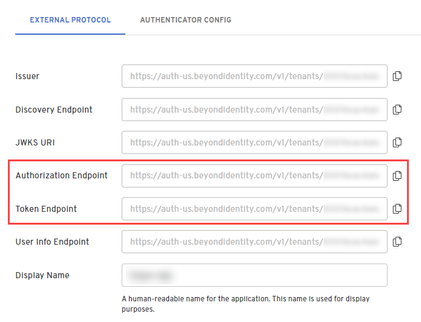
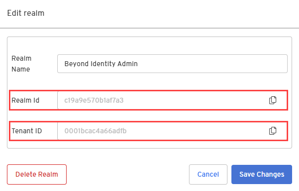
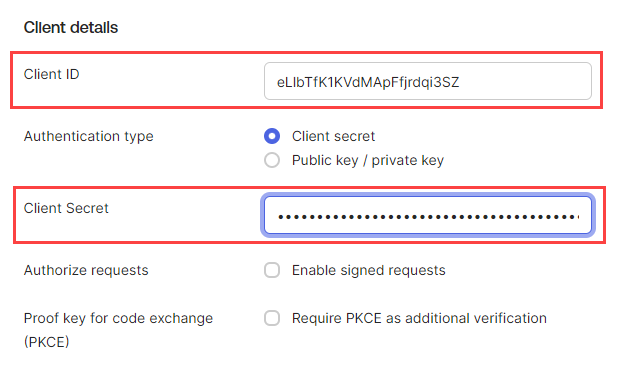

With Beyond Identity, you can configure it to add passwordless authentication to your existing authentication solution. 

This guide provides information on how to configure Beyond Identity as an Identity Provider for Okta using the OpenID Connect (OIDC) identity protocol. 

## Prerequisites

 - Access to a Beyond Identity tenant. If you still need to, [sign up for a tenant](https://www.beyondidentity.com/developers/signup).  

 - If you do not have a Okta developer account, [sign up for one](https://developer.okta.com/signup/).

 - Create a user in Okta that you'll use for testing. Ensure the email and username of the test user in Okta matches an account for which you can receive email. You will provision a Beyond Identity identity and passkey based on this email. 

## Create a new realm

Realms are unique administrative domains within a tenant. All new tenants have a default realm called `Beyond Identity Admin` which should not be used to configure for delegate IDP purposes. 

import CreateRealmAdminConsole from '../includes/_create-realm-console.mdx';

<CreateRealmAdminConsole />

## Create an OIDC application

import AddAppAdminConsole  from '../includes/_add-application-console.mdx';

<AddAppAdminConsole />

3. On the **External Protocol** tab, under **Client Configuration**, set the following values:

  | Field | Value |
  | --- | --- |
  | **Protocol** | OIDC |
  | **Client Type** | Confidential |
  | **Grant Type** | Authorization Code |
  | **Redirect URIs** | https://yourokta-domain.com/oauth2/v1/authorize/callback  **Example:** https://yourokta-domain.okta.com/oauth2/v1/authorize/callback |
  | **Token Endpoint Auth Method** | Client Secret Post |
  | **Resource Server** | None |

4. Scroll down to **Token Configuration** and set the following values and click **Submit**.

  | Field | Value |
  | --- | --- |
  | **Expiration**  |  Set to the desired expiration, for example, `604800`  is one week.  |
  | **Subject**  |  email  |
  | **Token Signing Algorithm**  | RS256   |

5. After the application is created, copy and save the following because you'll need these for the Identity provider configuration in Okta:

   - **Token Endpoint**

   - **Authorization Endpoint**

   

6. Go the the realm's dashboard and select **Edit realm**.

7. Copy and save the **Realm Id** and **Tenant ID**. Then click **Cancel**. You'll need these ID's to send the credential binding email.

  

## Configure the identity provider in Okta

1. In Okta, select **Security > Identity Providers**.

2. Click **Add Identity Providers**, select **OpenID Connect IdP**, and click **Next**.

3. For Scopes, the only scope needed is **openid**, so you can remove the **profile** and **email** scopes.

4. Paste the Client ID and Client Secret values from the Okta OIDC application you created in the Beyond Identity Admin console. 

  

5. In the **Endpoints** section, use the following endpoint values:

  You can find the Authorization and Token endpoints in the Okta OIDC application you created.

  | Name | Value|
  | --- | --- |
  | **Issuer** | https://auth-us.beyondidentity.com/v1/tenants/${tenant_id}/realms/${realm_id}/applications/${application_id} |
  | **Authorization endpoint** | https://auth-us.beyondidentity.com/v1/tenants/${tenant_id}/realms/${realm_id}/applications/${application_id}/authorize |
  | **Token endpoint** | https://auth-us.beyondidentity.com/v1/tenants/${tenant_id}/realms/${realm_id}/applications/${application_id}/token |
  | **JWKS endpoint** | https://auth-us.beyondidentity.com/v1/tenants/${tenant_id}/realms/${realm_id}/applications/${application_id}/.well-known/jwks.json |

6. In the **Authentication settings** section, select **idpuser.externalId** for **IdP Username**.

7. Select **Okta Username** for **Match against**.  

8. Click the **Routing Rules** tab, click **Add Routing Rule**, and give the rule a name.

9. From the **THEN Use this identity provider** drop-down, select the newly created Identity provider. The rule should match the email attribute of the test user.

10. Click **Create Rule** and at the prompt click **Activate**.

11. Click **Finish** and log out of Okta to test authentication with the newly provisioned identity. 

## Configure Okta to delegate authorization requests to Beyond Identity

This section describes how to configure Okta to delegate to Beyond Identity for authentication during an OAuth2 authorization flow.   
Okta will route authorization requests from a sample application you create using one of the platforms below to Beyond Identity.  

import IntegrateWithOktaFlow from '../images/integration-guides/integrate-with-okta-flow.png';

import Tabs from '@theme/Tabs';
import TabItem from '@theme/TabItem';

import JavascriptOkta from '../includes/_sdks/_javascript-okta.mdx';
import KotlinOkta from '../includes/_sdks/_kotlin-okta.mdx';
import FlutterOkta from '../includes/_sdks/_flutter-okta.mdx';
import ReactNativeOkta from '../includes/_sdks/_react-native-okta.mdx';
import SwiftOkta from '../includes/_sdks/_swift-okta.mdx';

<Tabs>
  <TabItem value="javascript" label="JavaScript" default>
    <JavascriptOkta />
  </TabItem>
  <TabItem value="kotlin" label="Kotlin">
    <KotlinOkta />
  </TabItem>
  <TabItem value="flutter" label="Flutter">
    <FlutterOkta />
  </TabItem>
  <TabItem value="react-native" label="React Native">
    <ReactNativeOkta />
  </TabItem>
  <TabItem value="swift" label="Swift">
    <SwiftOkta />
  </TabItem>
</Tabs>