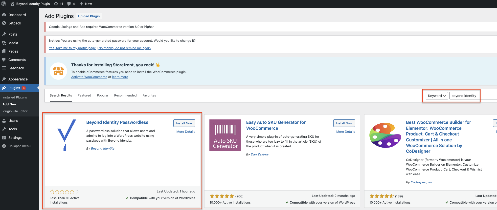
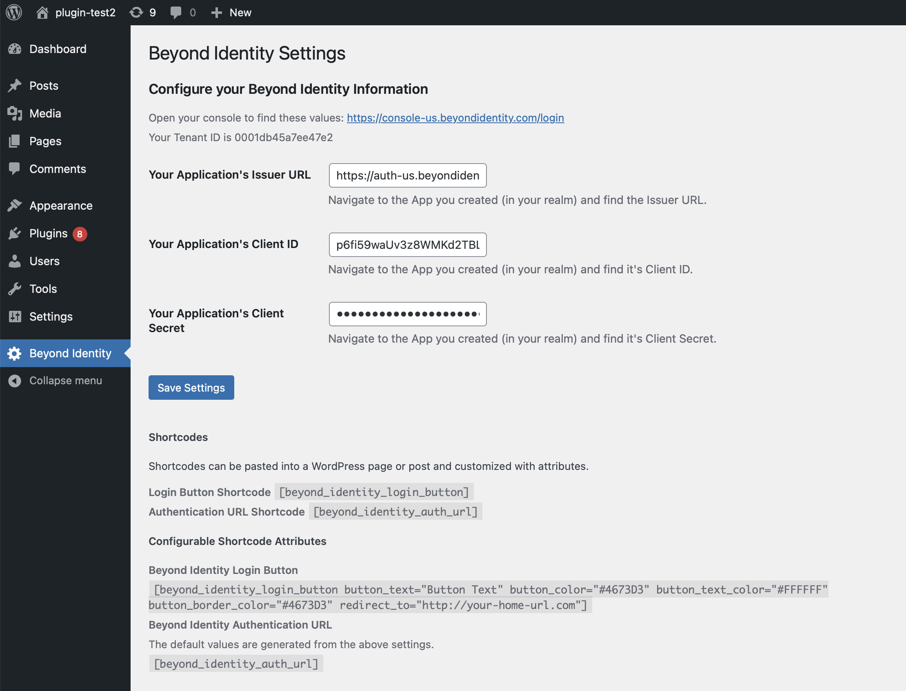
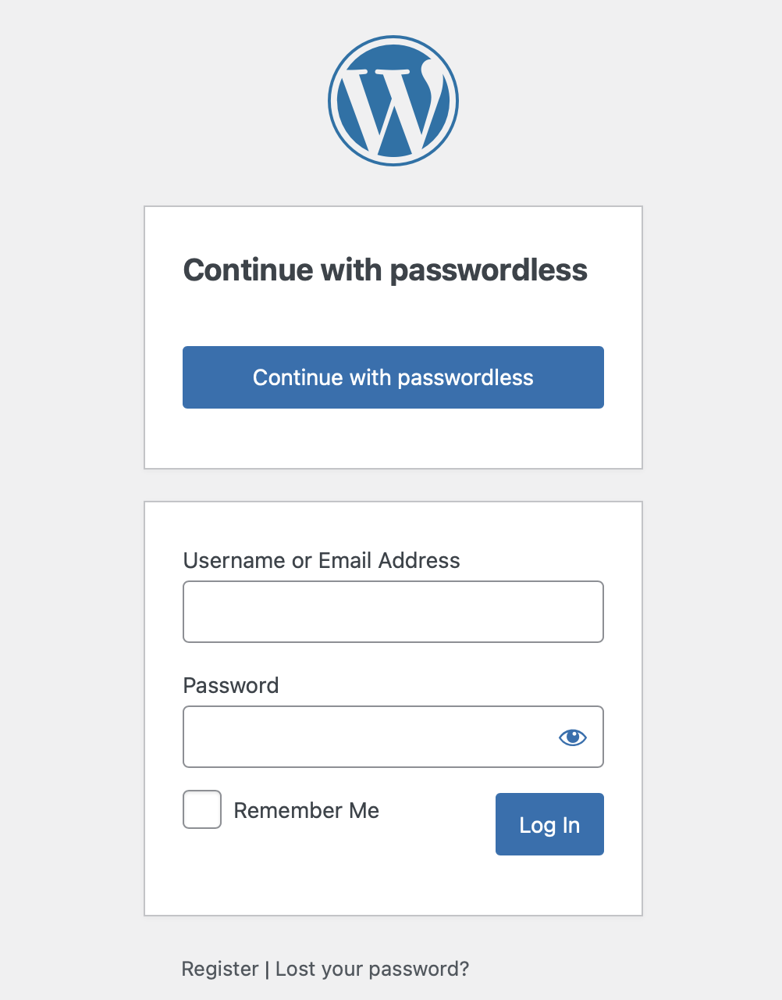
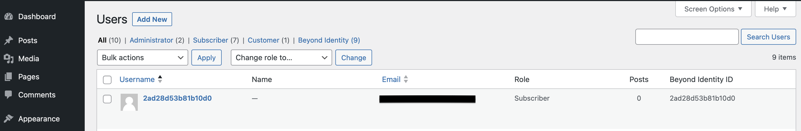

import ProtocolOIDC from '../includes/\_protocol_oidc.mdx';
import HostedWeb from '../includes/\_hosted-web.mdx';
import ClientTypeConfidential from '../includes/\_client-type_confidential.mdx';
import GrantTypeAuthorizationCode from '../includes/\_grant-type_authorization-code.mdx';

This guide provides information on how to set up Beyond Identity as a passwordless authentication provider for a Wordpress site.

In this guide, you'll:

1. Configure Beyond Identity as an Identity Provider
1. Install and configure the [Beyond Identity Passwordless Plugin](https://wordpress.org/plugins/beyond-identity-passwordless/)

## Prerequisites

Before continuing, make sure that the following prerequisites have been met:

- A [Beyond Identity developer account](https://beyondidentity.com/developers).

- A live WordPress site running and administrator privileges.

## Set up Beyond Identity as an Identity Provider

To set up Beyond Identity as an Identity Provider, you need to create a Realm to hold identities and configuration. Inside that realm, you'll need to create an [Application](/docs/add-an-application) that contains the authentication flow configuration. These can be configured in you admin console that was created for you when you signed up for a developer account.

### Create a Realm

import CreateRealmAdminConsole from '../includes/\_create-realm-console.mdx';

<CreateRealmAdminConsole />

### Create an Application

import AddAppAdminConsole from '../includes/\_add-application-console.mdx';

<AddAppAdminConsole />

3. On the **External Protocol** tab, use the following values to complete this tab.

   

  <h4>Client Configuration</h4>

| Property                       | Value                                                                                                                                                                                                                                                        |
| ------------------------------ | ------------------------------------------------------------------------------------------------------------------------------------------------------------------------------------------------------------------------------------------------------------ |
| **Protocol**                   | OIDC <ProtocolOIDC/>                                                                                                                                                                                                                                    |
| **Client Type**                | Confidential <ClientTypeConfidential/>                                                                                                                                                                                                                  |
| **PKCE**                       | Disabled                                                                                                                                                                                                                                                     |
| **Redirect URIs**              | This URL will also be generated for you in the OIDC plugin. You can always come back to change it.  Your redirect URI follows the pattern:  `https://${your-website-domain.com}/wp-admin/admin-ajax.php?action=openid-connect-authorize` |
| **Token Endpoint Auth Method** | Client Secret Post                                                                                                                                                                                                                                           |
| **Grant Type**                 | Authorization Code <GrantTypeAuthorizationCode/>                                                                                                                                                                                                        |
| **All other options**          | Use the default values for the remaining options                                                                                                                                                                                                             |

   

1. Click the **Authenticator Config** tab and use the following values.

| Property                   | Value                                                |
| -------------------------- | ---------------------------------------------------- |
| **Configuration Type**     | Hosted Web  <HostedWeb/>                        |
| **Authentication Profile** | Use the recommended values for the remaining options |

1. Click **Submit** to save the new app.

At this point, your Beyond Identity Admin Console should be configured with a realm and an application set up. The Hosted Web handles passkey registration and authentication for you, including generating new passkeys, presenting users with authenticator choice options as needed, and validating passkey assertions. You are now ready to configure the OpenID Connect WordPress plugin.

## Configure the Beyond Identity Passwordless Plugin

### Install the plugin

:::note
You're required to have administrative privileges in WordPress.
:::

The easiest way to install and activate the plugin is directly from your admin dashboard:

1. Log into you Wordpress admin console.
1. Tap on the dashboard **Plugins** tab
1. Search for _Beyond Identity Passwordless_ in the seach field
1. Tap **Install** and then **Active** on the plugin card

You can also follow the installation steps specified in the [Beyond Identity Passwordless Installation Guide](https://wordpress.org/plugins/beyond-identity-passwordless/#installation).

### Configure the plugin

After you've installed the plugin, you'll need to configure the plugin.

1. Tap on the dashboard **Beyond Identity**

| WordPress Settings Field | Beyond Identity value                                                                         |
| ------------------------ | --------------------------------------------------------------------------------------------- |
| **Issuer URL**           | Copy and paste the **Issuer URL** value from your application's **External Protocol** tab.    |
| **Client ID**            | Copy and paste the **Client ID** value from your application's **External Protocol** tab.     |
| **Client Secret Key**    | Copy and paste the **Client Secret** value from your application's **External Protocol** tab. |

2. Click **Save Changes**.

Congratulations! You have configured the Beyond Identity Passwordless plugin.

### Try it out

In this final step, you'll attempt to log in and verify successful authentication.

1. Go to `http://your_hostname/wp-login.php` to test authentication.

2. Click the **Continue with Passwordless** button. You'll be redirected to the Beyond Identity Hosted Web Authenticator.

3. At the conclusion of a successful authentication, you'll be redirected to your WordPress admin console or to your site depending on your current role.

4. From the Beyond Identity Admin Console, go to **Events** to view several successful authentication events.

:::note
New users are added to your WordPress database with the default user role. Existing user's roles are unchanged. Both types of users will be associated with a Beyond Identity ID (a.k.a "sub" claims from the [ID Token](/docs/terms/id-token.md))
:::

