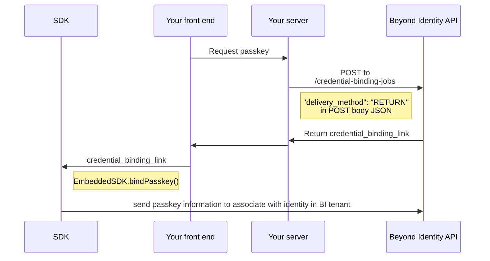

```mermaid
sequenceDiagram
    participant SDK
    participant Your front end
    participant Your server
    participant Beyond Identity API 
    Your front end ->> Your server: Request passkey
    Your server ->> Beyond Identity API: POST to <br/>/credential-binding-jobs
    Note right of Your server: "delivery_method": "RETURN"<br/> in POST body JSON
    Beyond Identity API ->> Your server: Return credential_binding_link
    Your server ->> Your front end: 
    Your front end ->> SDK: credential_binding_link
    Note right of SDK: EmbeddedSDK.bindPasskey()
    SDK ->> Beyond Identity API: send passkey information to associate with identity in BI tenant
```