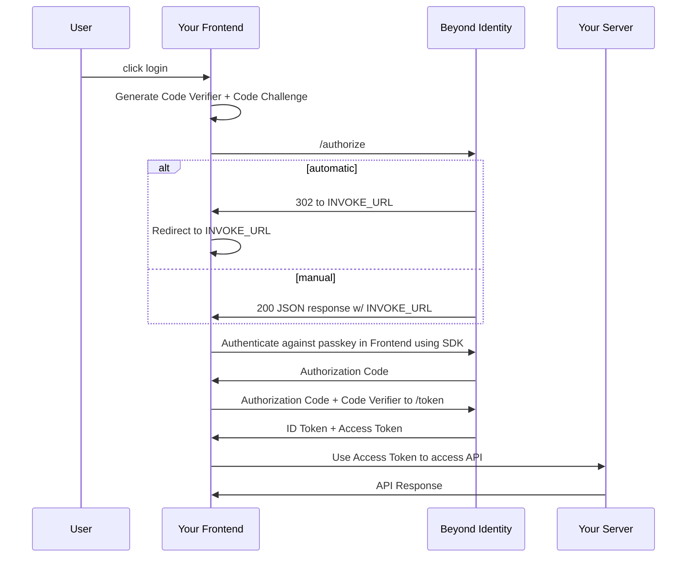

```mermaid
sequenceDiagram
    participant user as User
    participant frontend as Your Frontend
    participant bi as Beyond Identity
    participant server as Your Server
    user ->> frontend: click login
    frontend->>frontend: Generate Code Verifier + Code Challenge
    frontend->>bi: /authorize
    alt automatic
	bi->>frontend: 302 to INVOKE_URL
	frontend->>frontend: Redirect to INVOKE_URL
    else manual
	bi->>frontend: 200 JSON response w/ INVOKE_URL
    end
    frontend->>bi: Authenticate against passkey in Frontend using SDK
    bi->>frontend: Authorization Code
    frontend->>bi: Authorization Code + Code Verifier to /token
    bi->>frontend: ID Token + Access Token
    frontend->>server: Use Access Token to access API
    server->>frontend: API Response
```
