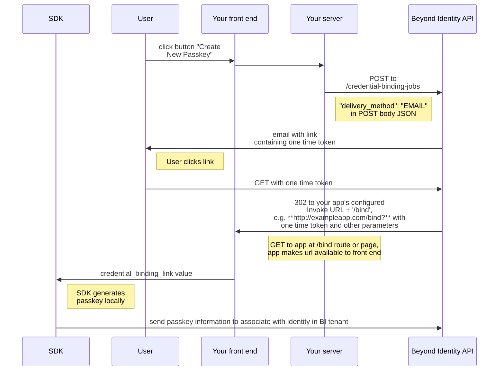
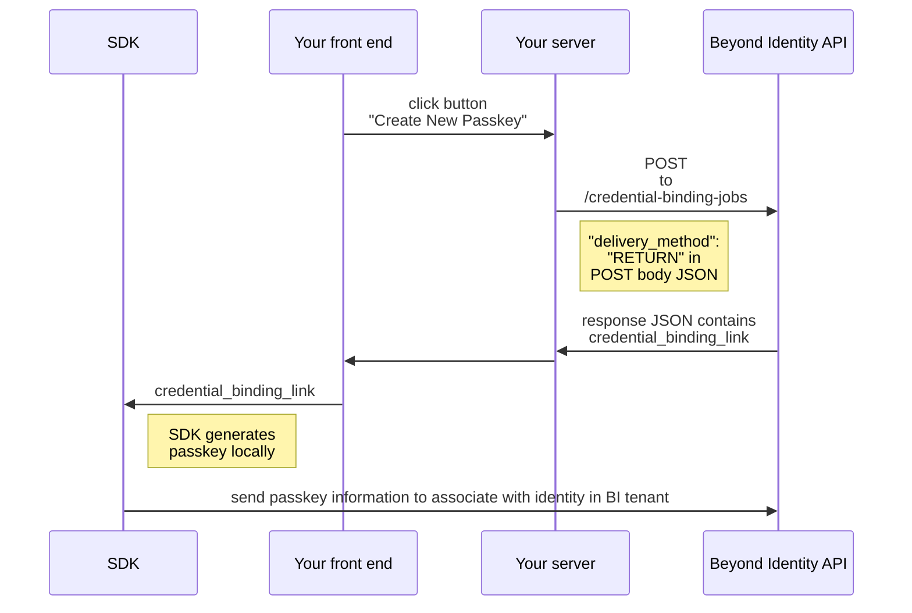

import InvocationDigram from './\_invocation_url_diagram.mdx';

An authenticator config is used to tell us how and where to invoke passkey creation and authentication flows for your native/mobile or web application. Each application is tied to a single authenticator config. This article will help you understand each of the authenticator config options and how they impact Beyond Identity passkey flows.

## Configuration Type

There are two types of authenticator config:

- Hosted Web
- Embedded SDK

On creation, an application defaults to the **Hosted Web** configuration type.

### Hosted Web

The **Hosted Web** configuration type is a constrained version of the **Embedded** configuration type, with the following configuration settings:

- **Invocation Type:** `automatic`
- **Invoke URL:** `https://auth-<REGION>.beyondidentity.com/authenticator/`
- **Trusted Origins:** `[https://auth-<REGION>.beyondidentity.com/authenticator/]`

Use this configuration type if you want to default all bound credentials and authentications to our Hosted Web Authenticator.

Alternatively, if you would like to use your own authenticator with our SDK, and/or to customize the settings, click on "Authenticator Config" under the selected application in the Beyond Identity Admin Console and choose **Embedded SDK** as the configuration type.

### Embedded SDK

The **Embedded SDK** configuration type is used to configure an application using either our native SDKs (iOS, Android, Flutter, React Native) or our web SDK (JS). Choosing this option enables three additional fields to configure: Invocation Type, Invoke URL, and Trusted Origins.

## Invocation Type

The Invocation Type specifies how the Beyond Identity authentication URL is delivered to your application. The authentication url is your app's Invoke URL appended with `/bi-authenticate?` and the query string parameter `request`, containing the authentication challenge your app will need to sign:

```bash
$invoke_url/bi-authenticate?request=<request>
```

> Note: the Invocation Type only impacts the authentication flow. It has no effect on the passkey creation/binding flow

Invocation Type can have one of two values:

- Automatic
- Manual

### Automatic

If **automatic** is selected, a 302 redirect is returned in response to your app's OIDC request, causing the user agent to automatically redirect to the authentication url.

### Manual

If manual is selected, the authentication url will be returned to you as part of a JSON response formatted like the below.

```javascript
{
	"authenticate_url": "$invoke_url/bi-authenticate?request=<request>"
}
```

It will then be up to you to get it to your native/web app any way you see fit. This is useful for flows where you require a lot more control when redirecting to your native/web app. Since the challenge is packaged as part of the url, following the url will result in the same behavior as if an Invocation Type of **Automatic** were selected.

:::tip How do I know which one to use?
`Automatic` does a lot of the heavy lifting for you. If you initiate an OAuth2.0 request and specify the "Invoke URL" correctly, we'll get the Beyond Identity authentication URL to where it needs to be, whether this is inside of a native app or a web application.

`Manual` gives you a lot more control, but you'll have to do a little extra work to wire this flow up. The possibilities include:

- Completley silent OAuth 2.0 authentication using passkeys. No redirects needed in a web app and no web view needed in a native application.
- The flexibility to write your own intelligent routing layer using the Beyond Identity authentication URL. You may want to authenticate against passkeys in your browser on desktop, but use passkeys on your native app on mobile.

:::

## Invoke URL

The invoke URL is a single URL that "points" to where your application is. In the case of a native application (iOS, Android, Flutter, React Native), this is either an App Scheme or an Universal URL / App Link. In the case of a web application, this is just a URL to your web application or a specific page of your web application.

:::caution
While app schemes are generally easier to set up, Universal URLs and App Links are recommended as they provide protection against App Scheme hijacking.
:::

There are two scenarios in which the Invoke URL is used:

### Invoke URL as used for Binding a Credential

When creating a new identity, it's possible to validate that identity using an email. Upon receiving the email, the user will need to click on a link to the Beyond Idantity API, which will then redirect the user to your app, where the credential binding process will take place. The `invoke_url` is used here. The url that is used to redirect into your app will take on the following form:

```bash
$invoke_url/bind?api_base_url=<api_base_url>&tenant_id=<tenant_id>&realm_id=<realm_id>&identity_id=<identity_id>&job_id=<job_id>&token=<token>
```

> Note that the path `/bind` is appended to the `invoke_url` and must be implemented as a route in your application.

:::tip Disambiguating URLs
Need a way to disambiguate our URLs from the rest of the URLs at your routing layer? Our SDKs provide these two functions for your convenience:

- `isAuthenticateUrl(url)`
- `isBindCredentialUrl(url)`

:::

#### Passkey Binding Flow Diagram for EMAIL delivery_method


<br/>

> Note that credential binding flows that use delivery_method "RETURN" do not make use of the Invoke URL.

#### Passkey Binding Flow Diagram for RETURN delivery_method



### Invoke URL as used for Authentication

The authentication flow is shown in the diagram below, and the response differs based on the Invocation Type specified:

> Note that the path `/bi-authenticate` is appended to the `invoke_url` and must be implemented as a route in your application.

#### Invocation Type **Automatic**

```javascript
HTTP/1.1 302 Found
Location: $invoke_url/bi-authenticate?request=<request>
```

#### Invocation Type **Manual**

```javascript
HTTP/1.1 200 OK
Content-Type: application/json

{
	"authenticate_url": "$invoke_url/bi-authenticate?request=<request>"
}
```

### Authentication Flow Diagram by Invocation Type

The diagram below shows how Invocation Type fits into an OAuth 2.0 flow.

<InvocationDigram/>

## Trusted Origins

Trusted Origins are a list of URLs from which the embedded Web SDK is allowed to make requests to our backend. By default, our backend rejects CORS requests except from pre-specified domains. In order to whitelist your domain (and make the embedded Web SDK usable), you'll need to add your web application's URL to the list of Trusted Origins.
