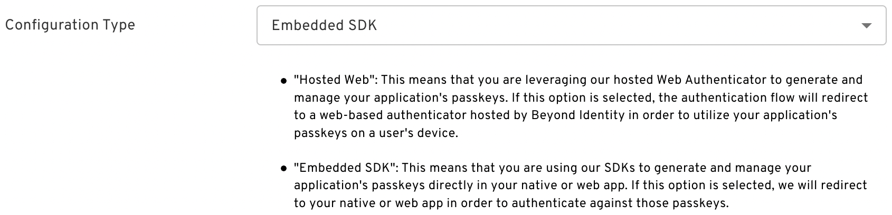
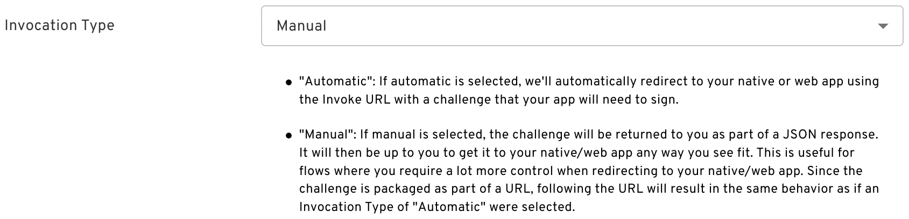
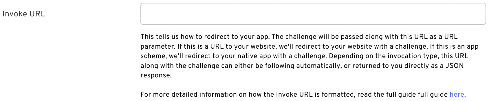
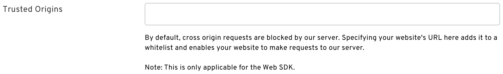

This guide describes how to use Beyond Identity for authentication during an OAuth2 authorization flow.

## Prerequisites

 - [Using Beyond Identity for Authentication](../../using-bi-for-auth)
 - [Kotlin SDK](overview)

Before calling [`EmbeddedSdk.authenticate()`](overview#authentication), we must authorize using Beyond Identity.

## Authorize With Beyond Identity

### Using the Web

The library follows the best practices set out in [RFC 8252 - OAuth 2.0 for Native Apps](https://tools.ietf.org/html/rfc8252), including using [Custom Tabs](https://developer.chrome.com/multidevice/android/customtabs) for authorization requests. For this reason, `WebView` is explicitly _not_ supported due to usability and security reasons.

#### Step 1: Configuring the Authenticator Config

Make sure the [Authenticator Config](/docs/v1/platform-overview/authenticator-config#embedded) in the Beyond Identity Console is set to type `Embedded` and that the Invoke URL points to your application with either an App Scheme or a Universal Link. It is also recommended to set the invocation type to `Manual`.

##### Configuration Type

||
|---------------------------------------------------------------------------------|

##### Invocation Type

||
|---------------------------------------------------------------------|

||
|---------------------------------------------------------------|

##### Invoke URL

||
|--------------------------------------------|

##### Trusted Origins

||
|------------------------------------------------------|

#### Step 2: Beyond Identity Authorize URL

##### Manual Invocation

To start the authorization flow, make a GET request to the OAuth2 Authorization Request URL you built in the pre-requisite step (See [How to craft your Authorize URL](/docs/v1/using-bi-for-auth#how-to-craft-your-authorize-url)).

```javascript
val response = makeAuthorizeRequest()
```

##### Automatic Invocation

To start the authorization flow, build a [`CustomTabsIntent`](https://developer.android.com/reference/androidx/browser/customtabs/CustomTabsIntent), and launch the OAuth2 Authorization Request URL you built in the pre-requisite step.

```javascript
val builder = CustomTabsIntent.Builder()
...
builder.build().launchUrl(context, BI_AUTH_URL)
```

#### Step 3: Invoke URL

##### Manual Invocation

An `authenticate_url` with the Invoke URL scheme should be returned in the authorize response. Using the URL, call [`EmbeddedSdk.authenticate()`](overview#authentication). You can confirm the validity of the URL with [`EmbeddedSdk.isAuthenticateUrl()`](overview#authenticate-url-validation).

```javascript
EmbeddedSdk.isAuthenticateUrl(response.authenticate_url) -> {
    EmbeddedSdk.authenticate(
        url = response.authenticate_url,
        credentialId = selectedCredentialId,
    ) {
        ...
    }
}
```

##### Automatic Invocation

A URL with the Invoke URL scheme should be triggered by the web page. The Android OS will look for an appropraite Activity to handle the Intent. In your [`Activity`](https://developer.android.com/reference/android/app/Activity), which handles your Beyond Identity scheme, override [`onCreate`](<https://developer.android.com/reference/android/app/Activity#onCreate(android.os.Bundle)>) &/ [`onNewIntent`](<https://developer.android.com/reference/android/app/Activity#onNewIntent(android.content.Intent)>), and call [`EmbeddedSdk.authenticate()`](overview#authentication). You can confirm the validity of the URL with [`EmbeddedSdk.isAuthenticateUrl()`](overview#authenticate-url-validation).

```javascript
intent?.data?.let { uri ->
    when {
        EmbeddedSdk.isAuthenticateUrl(uri.toString()) -> {
            EmbeddedSdk.authenticate(
                url = uri.toString(),
                credentialId = selectedCredentialId,
            ) {
                ...
            }
        }
        ...
    }
}
```

#### Step 4: Redirect URL

##### Manual Invocation

A `redirectURL` is returned from a successful `AuthenticateResponse`. The authorization code and the state parameter are attached to this URL. You can exchange the code for an id token using your Beyond Identity Token Endpoint.

```javascript
EmbeddedSdk.isAuthenticateUrl(response.authenticate_url) -> {
    EmbeddedSdk.authenticate(
        url = response.authenticate_url,
        credentialId = selectedCredentialId,
    ) { result ->
        result.onSuccess { authenticateResponse ->
            authenticateResponse.redirectUrl?.let { redirectUrl ->
                // This URL contains authorization code and state parameters
                // Exchange the authorization code for an id_token using Beyond Identity's token endpoint.
                var code = parseCode(redirectUrl)
                var token = exchangeForToken(code)
            }
        }
    }
}
```

##### Automatic Invocation

A `redirectURL` is returned from a successful `AuthenticateResponse`. The authorization code and the state parameter are attached to this URL. You can exchange the code for an id token using your Beyond Identity Token Endpoint.

```javascript
intent?.data?.let { uri ->
    when {
        EmbeddedSdk.isAuthenticateUrl(uri.toString()) -> {
            EmbeddedSdk.authenticate(
                url = uri.toString(),
                credentialId = selectedCredentialId,
            ) { result ->
                result.onSuccess { authenticateResponse ->
                    authenticateResponse.redirectUrl?.let { redirectUrl ->
                        // This URL contains authorization code and state parameters
                        // Exchange the authorization code for an id_token using Beyond Identity's token endpoint.
                        var code = parseCode(redirectUrl)
                        var token = exchangeForToken(code)
                    }
                }
            }
        }
        ...
    }
}
```

#### Full Example

##### Manual Invocation

```javascript
private fun authorizeUsingBeyondIdentity() {
    val response = makeAuthorizeRequest()

    selectCredentialId { selectedCredentialId ->
        EmbeddedSdk.isAuthenticateUrl(response.authenticate_url) -> {
            EmbeddedSdk.authenticate(
                url = response.authenticate_url,
                credentialId = selectedCredentialId,
            ) { result ->
                result.onSuccess { authenticateResponse ->
                    authenticateResponse.redirectUrl?.let { redirectUrl ->
                        // This URL contains authorization code and state parameters
                        // Exchange the authorization code for an id_token using Beyond Identity's token endpoint.
                        var code = parseCode(redirectUrl)
                        var token = exchangeForToken(code)
                    }
                }
            }
        }
    }
}

private fun selectCredentialId(callback: (String) -> Unit) {
    // Where you can perform some logic here to select a credential, or
    // present UI to a user to enable them to select a credential.
}
```

##### Automatic Invocation

```javascript
private fun launchBI(context: Context, url: Uri = BI_AUTH_URL) {
    CustomTabsIntent.Builder().build().launchUrl(context, url)
}

private fun handleIntent(context: Context, intent: Intent?) {
    selectCredentialId { selectedCredentialId ->
        intent?.data?.let { uri ->
            when {
                EmbeddedSdk.isAuthenticateUrl(uri.toString()) -> {
                    EmbeddedSdk.authenticate(
                        url = uri.toString(),
                        credentialId = selectedCredentialId,
                    ) { result ->
                        result.onSuccess { authenticateResponse ->
                            authenticateResponse.redirectUrl?.let { redirectUrl ->
                                // This URL contains authorization code and state parameters
                                // Exchange the authorization code for an id_token using Beyond Identity's token endpoint.
                                var code = parseCode(redirectUrl)
                                var token = exchangeForToken(code)
                            }
                        }
                    }
                }
            }
        }
    }
}

private fun selectCredentialId(callback: (String) -> Unit) {
    // Where you can perform some logic here to select a credential, or
    // present UI to a user to enable them to select a credential.
}
```
