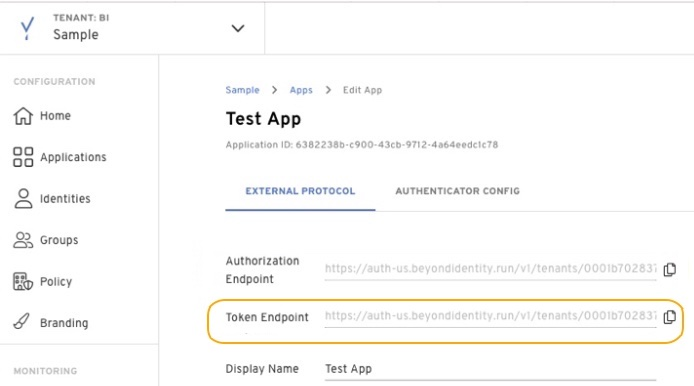
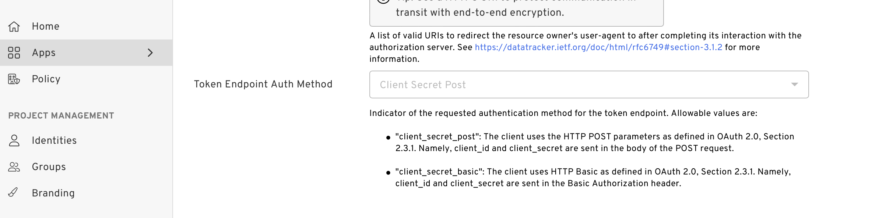

In the [Getting Started](/docs/v1/getting-started) section, we walked you over how to create a tenant, an application, as well as how to configure that application in order to authorize and authenticate a user with Beyond Identity. 

Let's review those steps in a bit more detail in the following section. 

### How to create a new Realm

Realms are unique administrative domains within a tenant. All new tenants have a default realm called Beyond Identity Admin which should not be used to configure for delegate IDP purposes.

Click the drop down on the top left corner and add a new realm. 


### How to create an Application

Applications hold the configuration necessary to integrate your existing software stack with our authentication experience. 
To create a new application you can:

- Click 'Applications' in the left menu
- Click 'Create app'
- Fill out the display name with whatever you want to name this app
- Select the client type:
  - Confidential clients are applications that are able to securely authenticate with the authorization server, for example being able to keep their registered client secret safe.

  - Public clients are unable to use registered client secrets, such as applications running in a browser or on a mobile device. You will not recieve an application "client_secret" if you create this type of application. 

- Set the redirect_uri to be a URL where you want to receive the authorization code and state. This can be either:
  - An app scheme or Universal URL / App Link if you're implementing this in a native application
  - A URL to any page in your web application

- After the protocol configuration is finished, modify your authenticator config
  - [Authenticator Config Reference](/docs/v1/platform-overview/authenticator-config)

- Click on create and your app should be created
  

### How to create a test identity

Before users can start authenticating with Beyond Identity, they must be provisioned in our directory.
To do this via the Admin Console you can: 

- In the Admin Console under the 'Identities' tab, select 'Add Identity'.

- Enter the following values:

   - Email: <email_address>

   - Username: <user_name>

   - Name: <full_name>

### How to craft your Authorize URL

A full authorization request url has additional parameters that we need to account for. You can find the base URL under your application.
 


```bash
https://auth-us.beyondidentity.com/v1/tenants/<tenant_id>/realms/<realm_id>/applications/<application_id>/authorize?
response_type=code
&client_id=<client_id_from_application>
&redirect_uri=<redirect_uri_from_application>
&scope=openid
&state=<state>
&code_challenge_method=<method_from_PKCE_for_public_clients_or_optional_confidential_clients>
&code_challenge=<challenge_from_PKCE_for_public_clients_or_optional_confidential_clients>
```

### Start the request

Use the URL above from a browser, and watch how the authentication process unfolds.

### How to craft your Token URL

Calling the token endpoint is the second step in the authorization flow. You will need to call the authorization endpoint first to retrieve an authorization code. You can find the base token URL under your application. 



You'll also need to make note of your application's Token Endpoint Auth Method.



#### Client Secret Basic:  
The client_id and client_secret are sent in the Basic Authorization header.

```bash
curl -X POST https://your-token-endpoint \
--header 'Authorization: Basic {base64(<client_id>:<client_secret>)}' \
--header "Content-Type: application/x-www-form-urlencoded" \
--data-raw "grant_type=authorization_code
&code=<code_return_from_authorization_response>
&code_verifier=<code_verifier_from_PKCE_code_challenge_if_used_in_authorization_request>
&redirect_uri=<redirect_uri_must_match_value_used_in_authorization_request>"
```

#### Client Secret Post:  
The client_id and client_secret are sent in the body of the POST request as a form parameter.

```bash
curl --request
-F "grant_type=authorization_code"
-F "code=<code_return_from_authorization_response>"
-F "client_id=<client_id_from_application>"
-F "client_secret=<client_secret_from_a_confidential_application>"
-F "code_verifier=<code_verifier_from_PKCE_code_challenge_if_used_in_authorization_request>"
-F "redirect_uri=<redirect_uri_must_match_value_used_in_authorization_request>"
POST \
--url https://your-token-endpoint \
--header 'accept: application/x-www-form-urlencoded'
```
