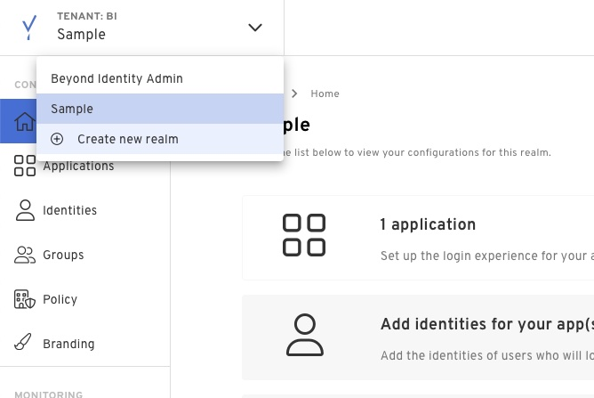
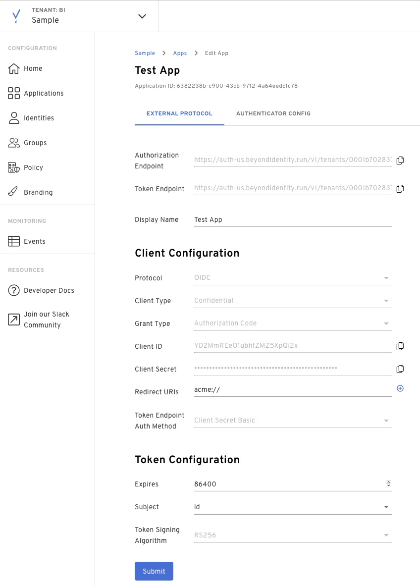
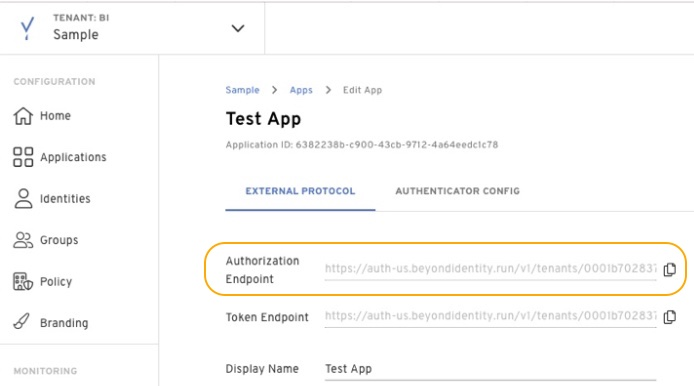

In the [Getting Started](/docs/v1/getting-started) section, we walked you over how to create a tenant, an application, as well as how to configure that application in order to authorize and authenticate a user with Beyond Identity. 

Let's review those steps in a bit more detail in the following section. 

### How to create a new Realm

Realms are unique administrative domains within a tenant. All new tenants have a default realm called Beyond Identity Admin which should not be used to configure for delegate IDP purposes.

Click the drop down on the top left corner and add a new realm. 


### How to create an Application

Applications hold the configuration necessary to integrate your existing software stack with our authentication experience. 
To create a new application you can:

- Click 'Applications' in the left menu
- Click 'Create app'
- Fill out the display name with whatever you want to name this app
- Select the client type:
  - Confidential clients are applications that are able to securely authenticate with the authorization server, for example being able to keep their registered client secret safe.

  - Public clients are unable to use registered client secrets, such as applications running in a browser or on a mobile device.

- Set the redirect_uri to be a URL where you want to receive the authorization code and state. This can be either:
  - An app scheme or Universal URL / App Link if you're implementing this in a native application
  - A URL to any page in your web application

- After the protocol configuration is finished, modify your authenticator config
  - [Authenticator Config Reference](/docs/v1/platform-overview/authenticator-config)

- Click on create and your app should be created
  

### How to create a test identity

Before users can start authenticating with Beyond Identity, they must be provisioned in our directory.
To do this via the Admin Console you can: 

- In the Admin Console under the 'Identities' tab, select 'Add Identity'.

- Enter the following values:

   - Email: <email_address>

   - Username: <user_name>

   - Name: <full_name>

### How to craft your authorize URL

A full authorization request url has additional parameters that we need to account for. You can find the base URL under your application.
 
]

```bash
https://auth-us.beyondidentity.com/v1/tenants/<tenant_id>/realms/<realm_id>/applications/<application_id>/authorize?
response_type=code
&client_id=<client_id_from_application>
&redirect_uri=<redirect_uri from application>
&scope=openid
&state=<state>
```

### Start the request

Use the URL above from a browser, and watch how the authentication process unfolds. 

