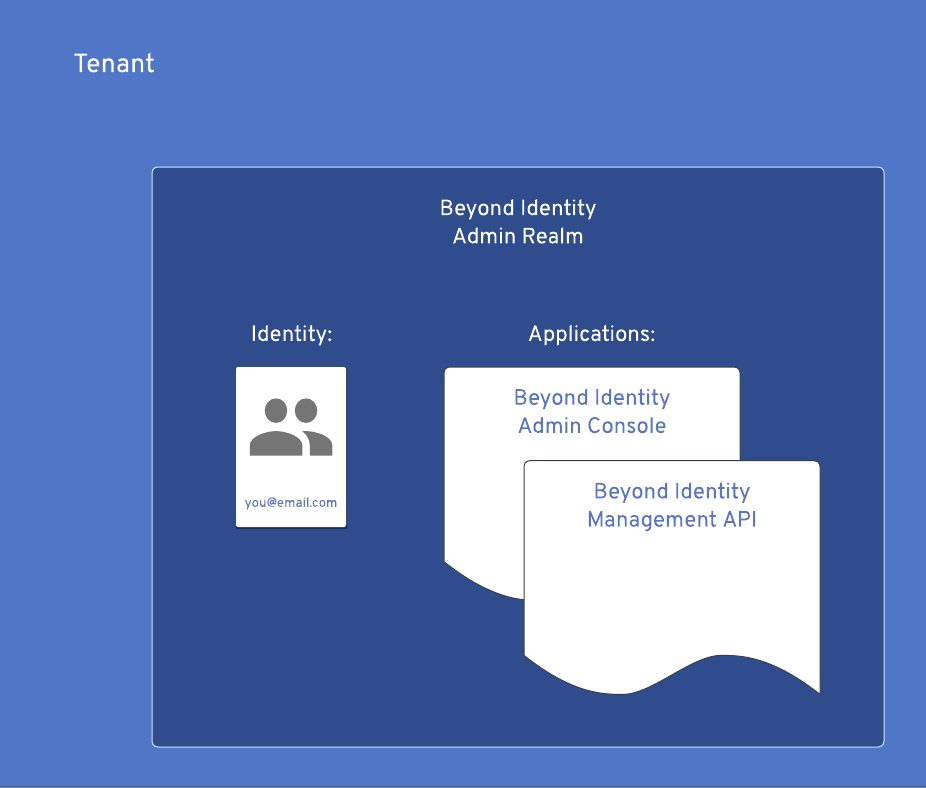
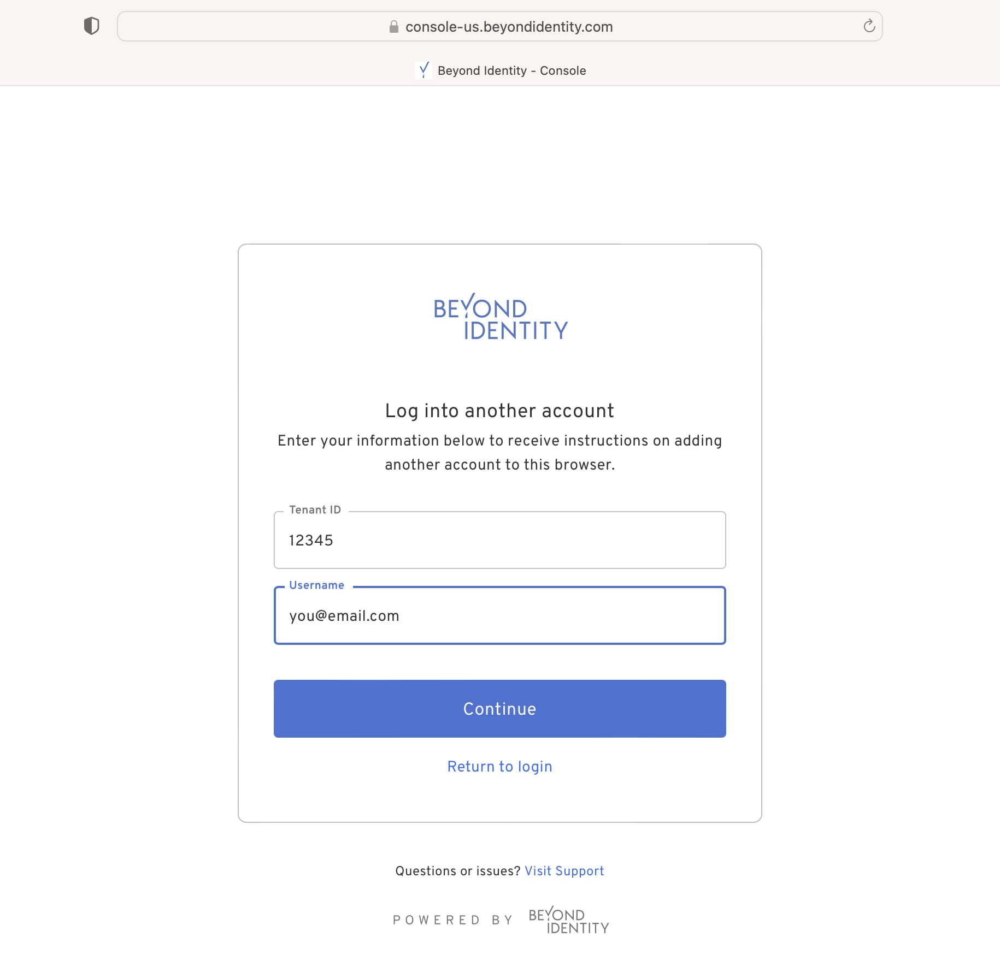

import Arcade, {Clip} from '../../src/components/Arcade.tsx';

# Account Setup

## Sign up for a developer account

To get started, sign up using the following link: https://www.beyondidentity.com/developers/signup. Completing the form will generate several things behind the scenes:

1. You will be given a [tenant](../platform-overview/architecture), which serves as a root container for all your cloud components.
2. Inside this tenant you will find a "Beyond Identity Admin" [realm](../platform-overview/architecture).
3. This realm is populated with an admin identity linked to your email address and two applications: "Beyond Identity Admin Console" and "Beyond Identity Management API".
4. A [Universal Passkey](../platform-overview/passkeys-and-devices/what-are-passkeys.md) will be created and bound to your identity.
5. The passkey will be [stored](../platform-overview/passkeys-and-devices/how-are-keys-stored.md) on your device or browser.
6. With the passkey, you will be immediately logged into your own Beyond Identity Admin Console.

Once inside the Beyond Identity Admin Console you can create and configure everything from realms and applications to monitoring events and defining policies.

Note that when you create an account you will be asked to select a region. Beyond Identity offers multiple regions to host your tenant specific data that meet regional data requirements and privacy laws. For example, selecting `US` will host your data in a data center located in the United States whereas selecting `EU` will host your data in a data center located in the European Union.



## Access Admin Console

After signing up, you can access your Admin Console at anytime using your selected region with the following url:

```
https://console-${REGION}.beyondidentity.com
```

A passkey was created and stored on the original device or browser used when creating the developer account. When logging into the console from that same device or broswer, you will be able to log in passwordlessly!

If you wish to log into your Beyond Identity Admin Console from another device or broswer, you will need your Tenant ID and email address that you used to create your developer account. Enter the Tenant ID and email address as the Username into the console login page on the other device or browser. An email will be sent if the Tenant ID and Username are found in our system. The email will contain a link to bind another passkey to your new device or browser. Follow the email link to log into the Beyond Identity Admin Console. If you need help finding your Tenant ID, look below for [directions](#find-tenant-id).



### Find Tenant ID

Once you've logged into the Beyond Identity Admin Console, make note of your tenant ID for login on other devices and browsers. You can find your `Tenant ID` inside your Beyond Identity Admin Console under "Home". Tap the "Edit realm" button to access and copy your Tenant ID.

<Arcade clip={Clip.FindTenantID} />

### The Beyond Identity Admin Realm

While you only can have one tenant, a tenant can have many realms. The Beyond Identity Admin realm is a special realm created for you in your tenant on [account setup](#sign-up-for-a-developer-account). It is populated with your admin identity so that you can access the Beyond Identity Admin Console. You can add more identities, if you wish, as identities are stored on the realm level. Adding identities to the Beyond Identity Admin realm will allow other users to gain a passkey and access your admin console.

A realm is a unique administrative domain that contains a unique set of directory, policy, event, applications, and branding objects. While the Beyond Identity Admin realm contains all of these objects, the most interesting might be "Beyond Identity Management API" application. The Beyond Identity Management API application can be utilize to [create API tokens](./api-token.md) that authorize access to the [Beyond Identity APIs](../../../../api/v1/).

Feel free to create your own realm to host your application! Check out the next guide [Realms](realms.md).
