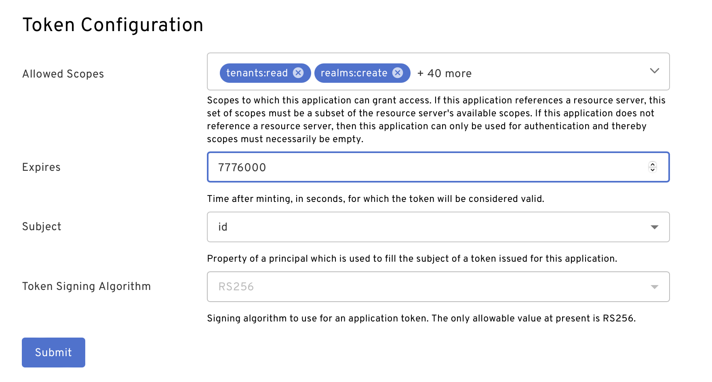

import Tabs from '@theme/Tabs';
import TabItem from '@theme/TabItem';
import MultiLanguageCodeBlock from '../../src/components/MultiLanguageCodeBlock';
import Arcade, {Clip} from '../../src/components/Arcade.tsx';

# API Tokens

## Prerequisites

- Set up a [developer account](./account-setup.md)

## API Token Overview

All [Beyond Identity API](https://developer.beyondidentity.com/api/v1) endpoints require authentication using an access token. The access token is generated through OAuth 2.0 or OIDC, using the authorization code flow or the client credentials flow. Alternatively, you can generate an API token using the admin console. The admin console uses the Beyond Identity management API application already preconfigured to the client credentials flow to generate API tokens for you. All access tokens are JWT. Two token formats are supported: self-contained tokens as JWS and referential tokens as JWE. The default token on creation is self-contained.

You can obtain an access token either through:

1. [Beyond Identity Admin Console](api-token#create-token-with-the-beyond-identity-admin-console)
2. [Beyond Identity APIs](api-token#create-token-with-the-beyond-identity-api)

The access token should be generated with your Beyond Identity Management API application in order to access any of the Beyond Identity APIs. The "Beyond Identity Management API" application is provided by default as part of the tenant onboarding process.

The access token must be provided in the Authorization header of an API request like the following:

```bash
curl https://api-us.beyondidentity.com/v1/... \
-X $HTTP_METHOD -H "Authorization: Bearer $TOKEN"
```

API access tokens are valid for 3 months (TTL 7776000 seconds). You can restrict the token's access with [scopes](../apis/scopes) by selecting a list in the Beyond Identity Admin Console or specifying a space-separated string of scopes in your API request, in accordance with [RFC6749#3.3](https://datatracker.ietf.org/doc/html/rfc6749#section-3.3). Token expiration can be configured from your "Beyond Identity Management API" application.

## Create Token with the Beyond Identity Admin Console

The simplest way to acquire an access token is through the Beyond Identity Admin Console. Under the "Apps" tab, select the "Beyond Identity Management API" application, navigate to the "API TOKENS" tab, and then click on "Create token". From there you can configure the token with a Name and specified list of Scopes.

<Arcade clip={Clip.CreateAPIToken} />

## Create Token with the Beyond Identity API

Alternatively, an access token may also be generated directly via API by requesting a token for the `Beyond Identity Management API` application. You will need the "Beyond Identity Management API" application's `CLIENT_ID`, `CLIENT_SECRET` and `APPLICATION_ID`. These values can be found either through the Beyond Identity Admin Console under the "Beyond Identity Admin" realm and selecting the "Beyond Identity Management API" application, or by [API](https://developer.beyondidentity.com/api/v1) after retrieving the management application. In accordance with [RFC6749#3.3](https://datatracker.ietf.org/doc/html/rfc6749#section-3.3), the scopes are expressed as a space-delimited string. If you do not specify a list of scopes, all of the available scopes will be assigned to your token on creation. For more information on available scopes, check out [Scopes](../apis/scopes).

### Client Credentials Flow

The `Beyond Identity Management API` application created during [developer setup](./account-setup.md) only supports the client credentials flow. Use the below example to create an access token.

<MultiLanguageCodeBlock
curl='curl "https://auth-$(REGION).beyondidentity.com/v1/tenants/$(TENANT_ID)/realms/$(REALM_ID)/applications/$(MANAGEMENT_APPLICATION_ID)/token" \
-X POST \
-u "$(MANAGEMENT_API_CLIENT_ID):$(MANAGEMENT_API_CLIENT_SECRET)" --basic \
-H "Content-Type: application/x-www-form-urlencoded" \
-d "grant_type=client_credentials&scope=$(SCOPES)"'
title="/token"
/>

### Authorization Code Flow

If you would like to use the authorization flow, [create another application](./applications.md) in the "Beyond Identity Admin" realm referencing the management API [resource server](./applications.md#create-a-resource-server). Set the application's grant type to "Authorization Code".

Using the authorization code flow is a two part process. First an authorization grant code must be obtained. This code is received through your callback specified in the `redirect_uri`. When extracting the code, your `state` and PKCE should be validated. Second you must use the grant code to create an access token.

Use the following curl examples below to obtain an authorization code and then create a token with that code. Note the following example uses `S256`, but using the `plain` `code_challenge_method` might be easier to get started as using PKCE requires storing the hash of the value passed as `code_challenge` so it can be passed to the token endpoint later.

1. Authenticate to obtain an authorization code:

<MultiLanguageCodeBlock
curl='curl -G "https://auth-$(REGION).beyondidentity.com/v1/tenants/$(TENANT_ID)/realms/$(REALM_ID)/applications/$(APPLICATION_ID)/authorize" \
--data-urlencode "response_type=code" \
--data-urlencode "client_id=$(APPLICATION_CLIENT_ID)" \
--data-urlencode "redirect_uri=$(REDIRECT_URI)" \
--data-urlencode "scope=$(SCOPES)" \
--data-urlencode "state=$(STATE)" \
--data-urlencode "code_challenge=$(OPTIONAL_CODE_CHALLENGE)" \
--data-urlencode "code_challenge_method=S256"'
title="/authorize"
/>

2. Create an access token the with authorization code:

<MultiLanguageCodeBlock
curl='curl "https://auth-$(REGION).beyondidentity.com/v1/tenants/$(TENANT_ID)/realms/$(REALM_ID)/applications/$(APPLICATION_ID)/token" \
-X POST \
-H "Content-Type: application/x-www-form-urlencoded" \
-d "grant_type=authorization_code&code=$(CODE)&client_id=$(API_CLIENT_ID)&code_verifier=$(OPTIONAL_CODE_VERIFIER)"'
title="/token"
/>

#### Refreshing a Token

If you enable Refresh Tokens in your application, the token response json object will contain an additional field called `refresh_token` similarly to [RFC6749#4.1.4](https://datatracker.ietf.org/doc/html/rfc6749#section-4.1.4).
That refresh token can be used to obtain a new access token for the same identity with the same settings.

<MultiLanguageCodeBlock
curl='curl "https://auth-$(REGION).beyondidentity.com/v1/tenants/$(TENANT_ID)/realms/$(REALM_ID)/applications/$(APPLICATION_ID)/token" \
-X POST \
-H "Content-Type: application/x-www-form-urlencoded" \
-d "grant_type=refresh_token&refresh_token=$(REFRESH_TOKEN)'
title="/token"
/>

You can read more about refresh flow in [RFC-6749#6](https://datatracker.ietf.org/doc/html/rfc6749#section-6)

## Token Configuration

Token configuration, such as expiration and default allowed scopes, can be modified either through the Beyond Identity Admin Console or through API on [application update](https://developer.beyondidentity.com/api/v1#tag/Applications/operation/UpdateApplication).

In the Beyond Identity Admin Console under the "Apps" tab, select the "Beyond Identity Management API" application. Then tap on "EXTERNAL PROTOCOL" and scroll down to the bottom to see "Token Configuration".



## Revoking Access Tokens

Beyond Identity exposes two different endpoints to revoke a token. Both endpoints achieve the same goal.

1. The Revoke Endpoint is [RFC-7009](https://www.rfc-editor.org/rfc/rfc7009) compliant, needs the whole token and accepts bearer or basic auth.
2. Revoke Token by ID is not RFC-7009 compliant, only needs the token_id and only accepts bearer.

You need to choose which endpoint to use based on the information available to you. What information is available depends on the use case.

Here are two examples:

- Imagine an administrator configures an application to use referential tokens. Then, a user logs into the application and their token leaks somewhere. Now, the administrator wants to revoke the token. For this use case, it's only possible to use the [RFC-7009](https://www.rfc-editor.org/rfc/rfc7009) endpoint as the administrator has no way of knowing the token_id of the referential token.
- Imagine a developer uses the Beyond Identity Management API to implement session management. They display a screen with a list of active tokens. For each token, they want to display a button that revokes the token. The token listing endpoint as specified provides only token_id. It doesn't provide the cryptographic string representing the token, which makes it impossible to use the [RFC-7009](https://www.rfc-editor.org/rfc/rfc7009) endpoint.

### Revoke Endpoint ([RFC-7009](https://www.rfc-editor.org/rfc/rfc7009))

In order to revoke an access token, you must be passed authentication in the form of either Bearer or Basic.

In the case of Basic authentication, the passed authentication must come from the confidential application that the token has been minted for. The passed access token must be signed by the same client id as the application.

In the case of Bearer authentication, the passed authentication must contain the scope "tokens:delete".

Note that passing an invalid token, or a token which has already been revoked or expired, will produce a success response, pursuant to [RFC7009§2.2](https://www.rfc-editor.org/rfc/rfc7009).

<MultiLanguageCodeBlock
curl='curl "https://auth-$(REGION).beyondidentity.com/v1/tenants/$(TENANT_ID)/realms/$(REALM_ID)/applications/$(MANAGEMENT_APPLICATION_ID)/revoke" \
-X POST \
-H "Authorization: Bearer $(MANAGEMENT_API_TOKEN)" \
-H "Content-Type: application/json" \
-d "token=$(TOKEN_TO_REVOKE)"'
title="/revoke"
/>

### Revoke Token by ID

In order to revoke a token by token_id, you must pass a Bearer
authentication containing a management API token with the `tokens:delete`
scope.

You must know the `APPLICATION_ID` of the application that is the issuer of the token.

You must also know the `TOKEN_ID` of the token you want to revoke. This can be
returned for example from the token listing.

<MultiLanguageCodeBlock
curl='curl "https://api-$(REGION).beyondidentity.com/v1/tenants/$(TENANT_ID)/realms/$(REALM_ID)/applications/$(APPLICATION_ID)/tokens/$(TOKEN_ID)" \
-X DELETE \
-H "Authorization: Bearer $(MANAGEMENT_API_TOKEN)" \
-H "Content-Type: application/json"'
title="DELETE /tokens/{TOKEN_ID}"
/>

## Validating Access Tokens

There are two token formats that can be validated: `self-contained` or `referential`. When validating self-contained tokens, consider if you want to revoke your tokens. If revoked tokens are accepted (as in a MVP case), then the token can be validated [offline](api-token#offline-validation) by validating the signature and parsing the claims of the JWT token. In all other cases the token should be [introspected](api-token#introspection-online-validation).

### Introspection (Online Validation)

The introspect endpoint is compliant with [RFC-7662](https://datatracker.ietf.org/doc/html/rfc7662).
After receiving information about the token, validate that token has the expected scopes and audience.

<MultiLanguageCodeBlock
curl='curl "https://auth-$(REGION).beyondidentity.com/v1/tenants/$(TENANT_ID)/realms/$(REALM_ID)/introspect" \
-X POST \
-u "$(MANAGEMENT_API_CLIENT_ID):$(MANAGEMENT_API_CLIENT_SECRET)" --basic \
-H "Content-Type: application/x-www-form-urlencoded" \
-d "token=$(TOKEN_TO_INTROSPECT)"'
title="/introspect"
/>

#### Successful Response

A successful introspect query will return a JSON object containing the key
`"active"` set to the boolean value `true`, plus information about the token.

```
{
  "active": true,
  "iss": "https://auth-us.beyondidentity.com/v1/tenants/0001b18ee979ce2c/realms/eb381961f60ce222/applications/4d3b2c7f-69c9-4edf-8c21-4b098af8d40a",
  "sub": "2eDWKMf4sr5gwPjgu_1MTCgD",
  "aud": [
    "beyondidentity"
  ],
  "exp": 1685353182,
  "nbf": 1677577182,
  "iat": 1677577182,
  "jti": "1waXvcIcr4PHW3Q2HDI1Im4nUXh32dZ5",
  "scope": "tenants:read realms:create realms:read realms:update realms:delete identities:create identities:read identities:update identities:delete groups:create groups:read groups:update groups:delete applications:create applications:read applications:update applications:delete authenticator-configs:create authenticator-configs:read authenticator-configs:update authenticator-configs:delete policy-v1:create policy-v1:read resource-servers:create resource-servers:read resource-servers:update resource-servers:delete tokens:create tokens:read tokens:update tokens:delete tokens:introspect credentials:read credentials:revoke credential-binding-jobs:create credential-binding-jobs:read themes:create themes:read themes:update events:read console-configs:read console-configs:update tenants:update",
  "azp": "tenants/0001b18ee979ce2c/realms/eb381961f60ce222/applications/4d3b2c7f-69c9-4edf-8c21-4b098af8d40a",
  "bi_p": "tenants/0001b18ee979ce2c/realms/eb381961f60ce222/applications/4d3b2c7f-69c9-4edf-8c21-4b098af8d40a",
  "bi_t": "0001b18ee979ce2c",
  "bi_r": "*"
}
```

#### Unsuccessful Response

Pursuant to RFC-7662, the introspect endpoint returns HTTP 200 status code even
if the token is revoked. If the token is revoked, expired or its signature is
invalid the introspect endpoint returns a JSON object with a single key
`"active"` set to the boolean value `false`.

```json
{
  "active": false
}
```

Apart from this, the introspect endpoint might return other error codes in case
the request is malformed or unauthorized.

### Offline Validation

In order to validate a token offline, the JWT header and claims must be decoded. Decode both and follow the steps below:

1. Parse the [host](https://datatracker.ietf.org/doc/html/rfc3986#section-3.2.2) of the URI in the `jku` header field. If it equals `auth-$REGION.beyondidentity.com`, then proceed. Otherwise, reject the token.
2. Download the public key for token validation from the `jku` in the JWT header. The key can be cached for the number of seconds specified by the [Cache-Control](https://developer.mozilla.org/en-US/docs/Web/HTTP/Headers/Cache-Control#response_directives) max-age directive. Check the token signature against the key with matching `kid` downloaded from `jku`.
3. Check that either the application id or resource server identifier is listed in the `aud` of the JWT claims. It is sufficient if at least one of the allowed audiences is in the token `aud` claim.
4. Check timestamps in JWT claims where `nbf` <= current time as unix timestamp in seconds <= `exp`
5. Check that JWT claims target tenant `bi_t` and target realm `bi_r` match the tenant and realm for the given application.
6. Check that JWT claims has the expected scopes.

## Listing Access Tokens

Our API also provides the functionality to list active tokens that are held by a given identity or an application.
In order to list tokens, you need to know the ID of the application that was used to issue the token.

You need to use a Management API Bearer token with the `tokens:read` scope in order to call this API.

### Request: Listing Access Tokens for an Identity

In this case, the application is the issuer of the token and the identity is the subject of the token.

<MultiLanguageCodeBlock
curl='curl -G "https://api-$(REGION).beyondidentity.com/v1/tenants/$(TENANT_ID)/realms/$(REALM_ID)/applications/$(APPLICATION_ID)/tokens" \
--data-urlencode "principal_type=identity" \
--data-urlencode "principal_id=$(IDENTITY_ID)" \
-H "Authorization Bearer $(MANAGEMENT_API_TOKEN)"'
title="/tokens"
/>

### Example Response

```json
{
  "tokens": [
    {
      "id": "uZcs8hF4_vR69eonor3U_lottYxtSfrX",
      "scopes": ["tenants:create"],
      "expires": 1675177245,
      "issued_at": 1675090845,
      "token_type": "access",
      "token_format": "self_contained"
      "token_suffix": "Jv_1828r9",
    }
  ],
  "total_size": 1
}
```

### Request: Listing Access Tokens for an Application

In this case, the application is both the issuer and the subject of the token,
which is why it needs to be in the request twice.

<MultiLanguageCodeBlock
curl='curl -G "https://api-$(REGION).beyondidentity.com/v1/tenants/$(TENANT_ID)/realms/$(REALM_ID)/applications/$(APPLICATION_ID)/tokens" \
--data-urlencode "principal_type=application" \
--data-urlencode "principal_id=$(APPLICATION_ID)" \
-H "Authorization Bearer $(MANAGEMENT_API_TOKEN)"'
title="/tokens"
/>

### Example Response

```json
{
  "tokens": [
    {
      "id": "uZcs8hF4_vR69eonor3U_lottYxtSfrX",
      "scopes": ["tenants:create"],
      "expires": 1675177245,
      "issued_at": 1675090845,
      "token_type": "access",
      "token_format": "self_contained"
      "token_suffix": "Jv_1828r9",
    }
  ],
  "total_size": 1
}
```

## Custom Claims

The `custom_claims` parameter allows for additional information to be stored
within a token. Any data may be associated with a token by using the
custom_claims URL parameter. The provided data must be a valid JSON object. All
fields are accessible, when parsed from a token within the `bi_custom` field of
the JWT payload. `

<MultiLanguageCodeBlock
curl='curl "https://auth-$(REGION).beyondidentity.com/v1/tenants/$(TENANT_ID)/realms/$(REALM_ID)/applications/$(APPLICATION_ID)/token?principal_type=application&principal_id=$(APPLICATION_ID)&
-u "$(MANAGEMENT_API_CLIENT_ID):$(MANAGEMENT_API_CLIENT_SECRET)" --basic \
-H "Content-Type: application/x-www-form-urlencoded" \
-d "grant_type=client_credentials&scope=$(SCOPES)&custom_claims=$(CLAIMS_JSON_OBJECT)'
title="/tokens"
/>

After a token is created, when introspected, the token will contain the
`bi_custom` field with all of the claims.

```json
{
  "active": true,
  "iss": "https://auth-us.beyondidentity.com/v1/tenants/0001b18ee979ce2c/realms/eb381961f60ce222/applications/4d3b2c7f-69c9-4edf-8c21-4b098af8d40a",
  "sub": "2eDWKMf4sr5gwPjgu_1MTCgD",
  "aud": [
    "beyondidentity"
  ],
  "exp": 1685353182,
  "nbf": 1677577182,
  "iat": 1677577182,
  "jti": "1waXvcIcr4PHW3Q2HDI1Im4nUXh32dZ5",
  "scope": "tenants:read realms:create realms:read realms:update realms:delete identities:create identities:read identities:update identities:delete groups:create groups:read groups:update groups:delete applications:create applications:read applications:update applications:delete authenticator-configs:create authenticator-configs:read authenticator-configs:update authenticator-configs:delete policy-v1:create policy-v1:read resource-servers:create resource-servers:read resource-servers:update resource-servers:delete tokens:create tokens:read tokens:update tokens:delete tokens:introspect credentials:read credentials:revoke credential-binding-jobs:create credential-binding-jobs:read themes:create themes:read themes:update events:read console-configs:read console-configs:update tenants:update",
  "azp": "tenants/0001b18ee979ce2c/realms/eb381961f60ce222/applications/4d3b2c7f-69c9-4edf-8c21-4b098af8d40a",
  "bi_p": "tenants/0001b18ee979ce2c/realms/eb381961f60ce222/applications/4d3b2c7f-69c9-4edf-8c21-4b098af8d40a",
  "bi_t": "0001b18ee979ce2c",
  "bi_r": "*",
  "bi_custom": {
    "a":"b",
    "c":"d"
  }
}
```

In this case, we set the `CLAIMS_JSON_OBJECT` to `{"a": "b", "c": "d"}`.

## Expiration time

This parameter is used to set a custom expiration time on individual tokens, to
a value that is less than what was originally configured. This is done by
passing an `expiration_time` parameter to the  `/token` endpoint.

<MultiLanguageCodeBlock
curl='curl "https://auth-$(REGION).beyondidentity.com/v1/tenants/$(TENANT_ID)/realms/$(REALM_ID)/applications/$(APPLICATION_ID)/token" \
-X POST \
-H "Content-Type: application/x-www-form-urlencoded" \
-d "grant_type=authorization_code&code=$(CODE)&scope=$(SCOPES)&client_id=$(API_CLIENT_ID)&code_verifier=$(OPTIONAL_CODE_VERIFIER)&expiration_time=$(EXPIRES_IN_SECONDS)"'
title="/token"
/>

When calling inspect on the newly created token you will see the following
fields.

```json
{
  "active": true,
  "iss": "https://auth-us.beyondidentity.com/v1/tenants/0001b18ee979ce2c/realms/eb381961f60ce222/applications/4d3b2c7f-69c9-4edf-8c21-4b098af8d40a",
  "sub": "2eDWKMf4sr5gwPjgu_1MTCgD",
  "aud": [
    "beyondidentity"
  ],
  "exp": 1685353182,
  "nbf": 1677577182,
  "iat": 1677577182,
  "jti": "1waXvcIcr4PHW3Q2HDI1Im4nUXh32dZ5",
  "scope": "tenants:read realms:create realms:read realms:update realms:delete identities:create identities:read identities:update identities:delete groups:create groups:read groups:update groups:delete applications:create applications:read applications:update applications:delete authenticator-configs:create authenticator-configs:read authenticator-configs:update authenticator-configs:delete policy-v1:create policy-v1:read resource-servers:create resource-servers:read resource-servers:update resource-servers:delete tokens:create tokens:read tokens:update tokens:delete tokens:introspect credentials:read credentials:revoke credential-binding-jobs:create credential-binding-jobs:read themes:create themes:read themes:update events:read console-configs:read console-configs:update tenants:update",
  "azp": "tenants/0001b18ee979ce2c/realms/eb381961f60ce222/applications/4d3b2c7f-69c9-4edf-8c21-4b098af8d40a",
  "bi_p": "tenants/0001b18ee979ce2c/realms/eb381961f60ce222/applications/4d3b2c7f-69c9-4edf-8c21-4b098af8d40a",
  "bi_t": "0001b18ee979ce2c",
  "bi_r": "*",
}
```

We can now verify that the difference of expiration time and issued at time
`(exp- iat)` is equal to what we send in expiration_time request parameter.
