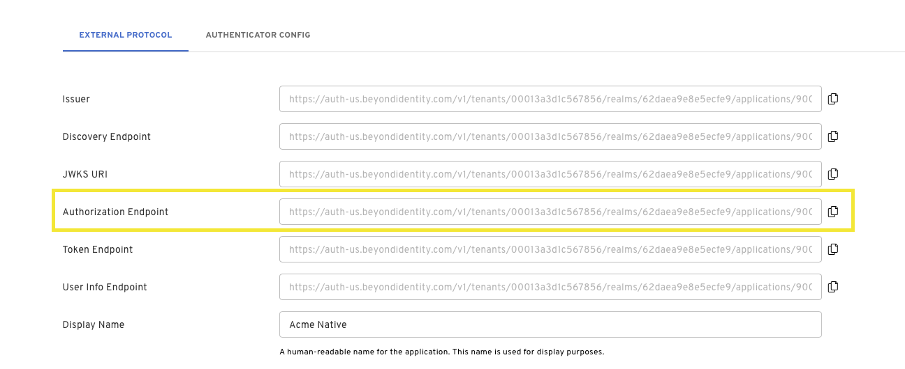
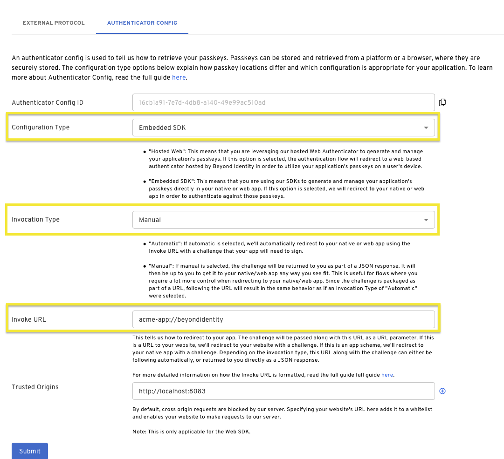
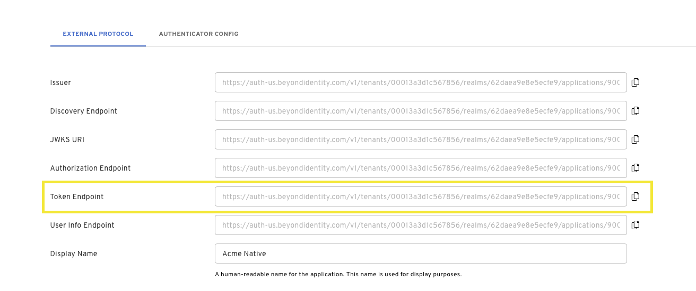
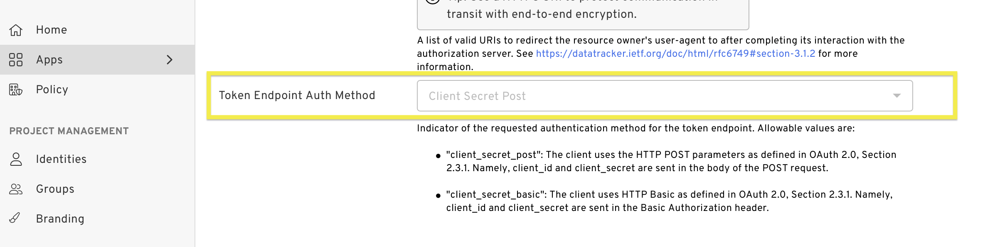

import Tabs from '@theme/Tabs';
import TabItem from '@theme/TabItem';
import TokenExchange from './\_authentication-token-exchange.mdx'
import WebAuth from './\_authentication-via-automatic.mdx'
import SilentAuth from './\_authentication-via-return.mdx'

# Authentication Overview

This guide describes how to authenticate an application with a passkey using an OAuth2 authorization flow. This guide assumes you have already [set up an application](../using-bi-for-auth.md), have access to the Beyond Identity Admin Console, and your application has at least one passkey [bound to an identity](./TODO link ./bind-passkey). Before authenticating, some logic should be performed to select a passkey. This might be UI presented to the user to select a passkey. Once a passkey is selected, you can authenticate with that passkey. There are two steps to authentication: [authorization](authentication#authorization) and then [token exchange](authentication#token-exchange). First you will need to authorize the application to recieve authorization code. That code can be then used in the token exchange.

## Authorization

### 1. Craft Authorization Url

In order to authenticate you should first craft your authorization url. The base url can be found in the Beyond Identity Admin Console
under your application, select "EXTERNAL PROTOCOL". Copy the `Authorization Endpoint` and add the following additional query parameters:



:::info PKCE
Note that the following query parameters includes [PKCE](https://www.rfc-editor.org/rfc/rfc7636) as it is recommeded, but optional. If you send an authorization request with PKCE, you will need to store the hash of the `code_challenge` so that it can be passed to the token exchange endpoint later as a `code_verifier`.
:::

```bash title="/authorize"
https://auth-$REGION.beyondidentity.com/v1/tenants/$TENANT_ID/realms/$REALM_ID/applications/$APPLICATION_ID/authorize?
response_type=code
&client_id=$APPLICATION_CLIENT_ID
&redirect_uri=$REDIRECT_URI
&scope=openid
&state=$STATE
&code_challenge_method=256
&code_challenge=$PKCE_CODE_CHALLENGE
```

### 2. Configure Authenticator Config

There are three pieces we need to check in the [Authenticator Config](../platform-overview/authenticator-config) before authentication. To check your config, navigate the Beyond Identity Admin Console and find your application. Select "AUTHENTICATOR CONFIG".

1. In order to use the Embedded SDKs, the `Configuration Type` should be set to [Embedded SDK](../platform-overview/authenticator-config#embedded-sdk).
2. Set the [Invoke URL](../platform-overview/authenticator-config#invoke-url) to a URL that "points" to where your application is. In the case of a native application (iOS, Android, Flutter, React Native), this is either an App Scheme or an Universal URL / App Link. In the case of a web application, this is just a URL to your web application or a specific page of your web application.

:::caution
While app schemes are generally easier to set up, Universal URLs and App Links are recommended as they provide protection against App Scheme hijacking.
:::

3. Set the the [Invocation Type](../platform-overview/authenticator-config#invocation-type). This specifies how our authentication URL is delivered to your application. Invocation Type can be one of two values:

- **Automatic**: If automatic is selected, we'll automatically redirect to your native or web app using the Invoke URL with a challenge that your app will need to sign.

- **Manual**: If manual is selected, the challenge will be returned to you as part of a JSON response. It will then be up to you to get it to your native/web app any way you see fit. This is useful for flows where you require a lot more control when redirecting to your native/web app. Since the challenge is packaged as part of a URL, following the URL will result in the same behavior as if an Invocation Type of "Automatic" were selected. The JSON payload returned has the following format.



### 3. Start Authorization

You have two options to begin authorization depending on the `Invocation Type` set in your Authenticator Config.

:::tip How do I know which one to use?
`Automatic` does a lot of the heavy lifting for you. If you initiate an OAuth2.0 request and specify the "Invoke URL" correctly, we'll get the Beyond Identity authentication URL to where it needs to be, whether this is inside of a native app or a web application.

`Manual` gives you a lot more control, but you'll have to do a little extra work to wire this flow up. The possibilities include:

- Completley silent OAuth 2.0 authentication using Passkeys. No redirects needed in a web app and no web view needed in a native application.
- The flexibility to write your own intelligent routing layer using the Beyond Identity authentication URL. You may want to authenticate against passkeys in your browser on desktop, but use passkeys on your native app on mobile.

:::

import ImageSwitcher from '../../src/components/ImageSwitcher.js';

<ImageSwitcher lightSrc="/assets/invocation-url-diagram-light.png" darkSrc="/assets/invocation-url-diagram-dark.png" />

### Select Invocation Type for Code Samples

<Tabs groupId="authenticate-invocation-type" queryString>
<TabItem value="manual" label="Manual">
<SilentAuth/>
</TabItem>
<TabItem value="automatic" label="Automatic">
<WebAuth/>
</TabItem>
</Tabs>

## Token Exchange

Unless your application is using the [NextAuth](https://next-auth.js.org) provider (see the Javascript Authorization example using Automatic Invocation Type), you will need complete authentication with a token exchange.

Calling the token endpoint is the second step in the authorization flow and usually happens in your backend. Make sure to a call the [authorization endpoint](authentication#craft-authorization-url) first to retrieve an authorization code.

### 1. Craft Token Url

The token endpoint base url can also be found in the Beyond Identity Admin Console under your application, select "EXTERNAL PROTOCOL". Copy the `Token Endpoint`.



### 2. Token Endpoint Auth Method

Next, scroll down to "Client Configuration" and make note of your "Token Endpoint Auth Method". The "Token Endpoint Auth Method" will determin how to make the token exchange call. The token auth method can either be set to `Client Secret Post` or `Client Secret Basic`.



### 3. Start Token Exchange

<TokenExchange/>
