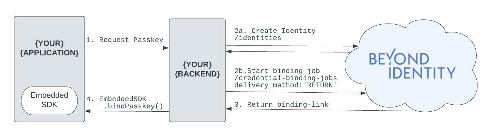
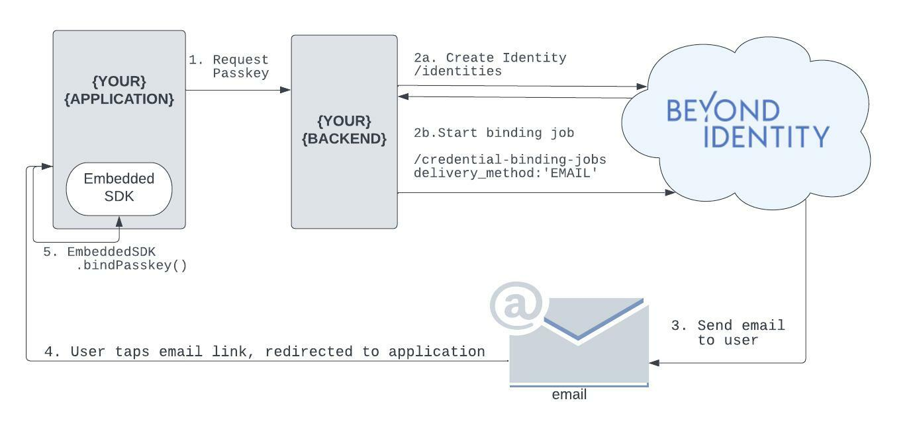

import Tabs from '@theme/Tabs';
import TabItem from '@theme/TabItem';
import BackendGeneral from './\_bind-passkey-backend-general.mdx';
import BackendReturn from './\_bind-passkey-backend-return.mdx';
import BackendEmail from './\_bind-passkey-backend-email.mdx';
import FrontEndReturn from './\_bind-passkey-frontend-return.mdx';
import FrontEndEmail from './\_bind-passkey-frontend-email.mdx';

# Bind Passkey To User Overview

In order to authenticate with Beyond Identity, you need a [Universal Passkey](../platform-overview/passkeys-and-devices/what-are-passkeys). This guide will walk you through setting up your backend to create an identity, bind a passkey to that identity and finally store that passkey in your application.

Passkeys are generated through a binding job. On creation of a binding job, a binding link will be generated. That binding link can be used to bind a passkey to a specific device or browser. This passkey will be stored in the user’s devices’ hardware root of trust (i.e. secure enclave).

A binding job must be generated through the [Beyond Identity API](https://developer.beyondidentity.com/api/v1). There are currently two `delivery_method` options for your binding link: `RETURN` and `EMAIL`. The value `RETURN` indicates that a binding link will be returned to the caller upon creation of the binding job whereas the value `EMAIL` indicates that a binding link will be sent to the email address associated with the identity. The user of that identity will click on the link in their email and that link will redirect the user to your applicaiton for you as the developer to further handle the binding link in the SDK.

Toggle delivery methods below for code samples:

<Tabs groupId="bind-delivery-method" queryString>

<TabItem value="return" label="RETURN">

<Tabs groupId="bind-platform" queryString>
<TabItem value="backend" label="Backend">
<BackendGeneral/>
<BackendReturn/>
</TabItem>
<TabItem value="frontend" label="Front End">
<FrontEndReturn/>
</TabItem>
</Tabs>

</TabItem>

<TabItem value="email" label="EMAIL">

<Tabs groupId="bind-platform" queryString>
<TabItem value="backend" label="Backend">
<BackendGeneral/>
<BackendEmail/>
</TabItem>
<TabItem value="frontend" label="Front End">
<FrontEndEmail/>
</TabItem>
</Tabs>

</TabItem>

</Tabs>
