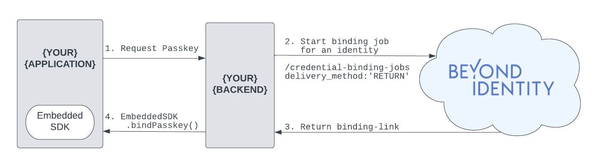
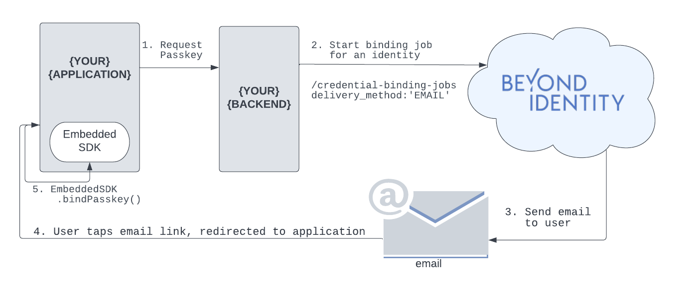

import Tabs from '@theme/Tabs';
import TabItem from '@theme/TabItem';
import BackendGeneral from './\_bind-passkey-backend-general.mdx';
import BackendReturn from './\_bind-passkey-backend-return.mdx';
import BackendEmail from './\_bind-passkey-backend-email.mdx';
import FrontEndReturn from './\_bind-passkey-frontend-return.mdx';
import FrontEndEmail from './\_bind-passkey-frontend-email.mdx';

# Bind Passkey To User Overview

In order to authenticate with Beyond Identity, you need a [Universal Passkey](../platform-overview/passkeys-and-devices/what-are-passkeys). This guide will walk you through setting up your backend to create an identity, bind a passkey to that identity, and finally store that passkey in your application.

Passkeys are generated through a binding job. On creation of a binding job, a binding link will be generated. That binding link can be used to bind a passkey to a specific device or browser. This passkey will be [stored](../platform-overview/passkeys-and-devices/how-are-keys-stored) in the user’s devices’ hardware root of trust (i.e. secure enclave).

A binding job must be generated through the [Beyond Identity API](https://developer.beyondidentity.com/api/v1). There are currently two `delivery_method` options for your binding link: `RETURN` and `EMAIL`.

1. The value `RETURN` indicates that a binding link will be returned to the caller upon creation of the binding job. The developer can then deliver that link to the end user however they want (in-line, sms, email, etc). This is the suggested method if you want the end user to create a passkey without having to leave your application.
2. The value `EMAIL` indicates that a passkey creation email will be sent to the end user. The end user will receive the email and click the passkey creation link. Clicking the link will redirect the end user to Beyond Identity Cloud. Beyond Identity Cloud will look up the authenticator_config that is associated with that passkey creation link and redirect the end user to the authenticator_config.invoke_url. The invoke_url should be a http request handler in your application. Once the user has been redirected to your applicaiton, you as the developer can handle the binding link in the SDK.

Toggle delivery methods below for code samples:

<Tabs groupId="bind-delivery-method" queryString>

<TabItem value="return" label="RETURN">

<BackendGeneral/>
<BackendReturn/>
<FrontEndReturn/>
</TabItem>

<TabItem value="email" label="EMAIL">

<BackendGeneral/>
<BackendEmail/>
<FrontEndEmail/>
</TabItem>

</Tabs>
