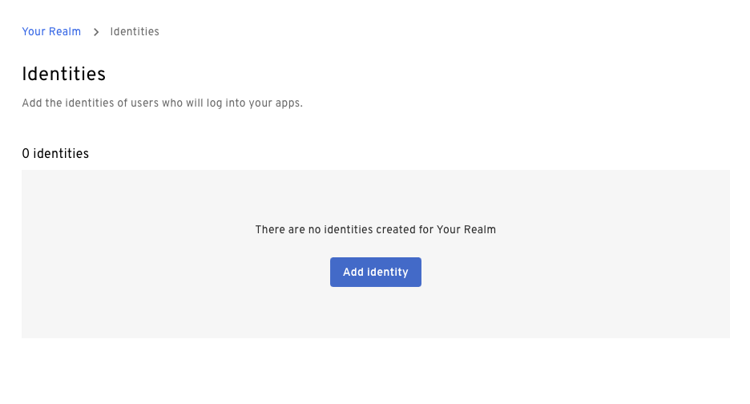
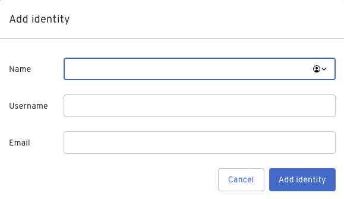
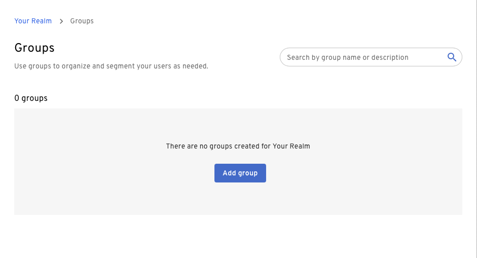

import Tabs from '@theme/Tabs';
import TabItem from '@theme/TabItem';

# User Provisioning Overview

Before creating a Passkey, a user must be provisioned as an identity under a realm. An identity is a unique identifier that may be used by an end-user to gain access governed by Beyond Identity. An end-user may have multiple identities. A realm can have many identities.

Identities can be part of a group. A realm can have many groups. An identity can belong to many groups. Groups are commonly used as a predicate in a policy rule (e.g. Allow group "Beyond Identity Administrators" to access the "Beyond Identity Admin Console" application).

You can provision a user with:

1. [Beyond Identity Admin Console](user-provisioning#provision-user-with-the-beyond-identity-admin-console)
2. [Beyond Identity APIs](user-provisioning#provision-user-with-the-beyond-identity-api)
3. [SCIM](../scim/v1/scimv1)

## Provision User with the Beyond Identity Admin Console

From the Beyond Identity Admin Console you can add identities and manage groups.

### Identities

The simplest way to create an identity is through the Beyond Identity Admin Console. First select a realm. Under the "PROJECT MANAGEMENT" tab, select "Identities", and then click on "Add identity". From there you can enter the user's name, username, and email.





### Groups

You can also create groups and add or remove identities from groups in the Beyond Identity Admin Console. Under the "PROJECT MANAGEMENT" tab, select "Groups".



## Provision User with the Beyond Identity API

From the [Beyond Identity API](https://developer.beyondidentity.com/api/v1) you can add identities and manage groups.

Before making any API calls you'll want to generate an API access token. Check out [API Tokens](./api-token) for help creating an access token.

### Identities

The following examples show how to create an identity via API.

<Tabs groupId="user-provisioning-api-platform" queryString>
  <TabItem value="curl" label="Curl">

```bash title="/identities"
curl https://api-$REGION.beyondidentity.com/v1/tenants/$TENANT_ID/realms/$REALM_ID/identities \
-X POST \
   -H "Authorization: Bearer $API_TOKEN" \
   -H 'Content-Type: application/json' \
   -d '{"identity":{"display_name":"NAME","traits": {"type": "traits_v0","username": "USERNAME",
"primary_email_address":"EMAIL"}}}'
```

  </TabItem>
  <TabItem value="node" label="Node">

```jsx title="/identities"
const identityResponse = await fetch(
  `https://api-${REGION}.beyondidentity.com/v1/tenants/${TENANT_ID}/realms/${REALM_ID}/identities`,
  {
    body: JSON.stringify({
      identity: {
        display_name: human_readable_name_for_an_identity,
        traits: {
          type: 'traits_v0',
          username: unique_username_for_an_identity,
          primary_email_address: primary_email_address_for_an_identity,
        },
      },
    }),
    headers: {
      Authorization: 'Bearer ' + accessToken,
    },
    method: 'POST',
  }
);

const identityResponseJson = await identityResponse.json();
```

</TabItem>
<TabItem value="python" label="Python">

```python title="/identities"
import requests

headers = {
    'Authorization': 'Bearer API_TOKEN',
    'Content-Type': 'application/json',
}

json_data = {
    'identity': {
        'display_name': 'NAME',
        'traits': {
            'type': 'traits_v0',
            'username': 'USERNAME',
            'primary_email_address': 'EMAIL',
        },
    },
}

response = requests.post(
    'https://api-REGION.beyondidentity.com/v1/tenants/TENANT_ID/realms/REALM_ID/identities',
    headers=headers,
    json=json_data,
)
```

</TabItem>
<TabItem value="go" label="Go">

```go title="/identities"
package main

import (
	"fmt"
	"io/ioutil"
	"log"
	"net/http"
	"strings"
)

func main() {
	client := &http.Client{}
	var data = strings.NewReader(`{"identity":{"display_name":"NAME","traits": {"type": "traits_v0","username": "USERNAME",
"primary_email_address":"EMAIL"}}}`)
	req, err := http.NewRequest(http.MethodPost, "https://api-REGION.beyondidentity.com/v1/tenants/TENANT_ID/realms/REALM_ID/identities", data)
	if err != nil {
		log.Fatal(err)
	}
	req.Header.Set("Authorization", "Bearer API_TOKEN")
	req.Header.Set("Content-Type", "application/json")
	resp, err := client.Do(req)
	if err != nil {
		log.Fatal(err)
	}
	defer resp.Body.Close()
	bodyText, err := ioutil.ReadAll(resp.Body)
	if err != nil {
		log.Fatal(err)
	}
	fmt.Printf("%s\n", bodyText)
}
```

</TabItem>
</Tabs>

### Groups

You can also create groups and add or remove identities from groups in the Beyond Identity API.

For deleting, updating, and managing groups via API, see the [API documentation](https://developer.beyondidentity.com/api/v1#tag/Groups).
