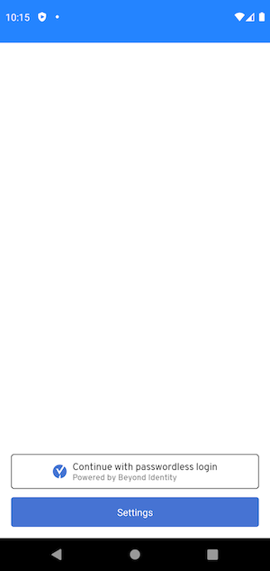
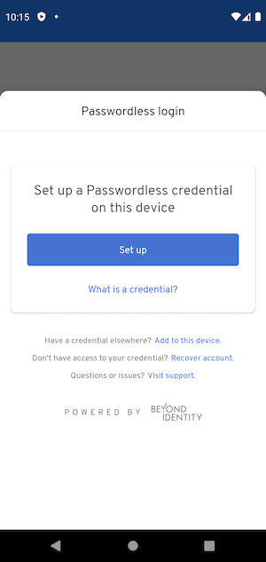
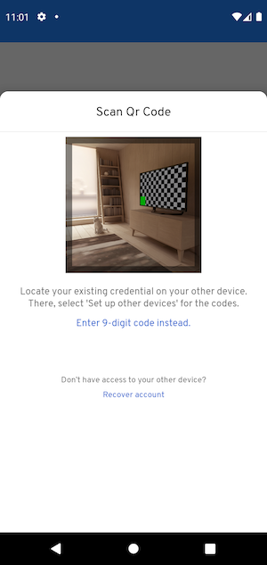

#### Embed Passwordless Authentication into your Android app with out of the box view wrappers

### Overview

The EmbeddedUI SDK provides view wrappers around the Embedded SDK functions.

A single `BeyondIdentityButton` handles login, recovery, and credential creation or migration. A `BeyondIdentitySettings` supplements your app settings screen handling credential creation, recovery, or migration as well as the ability to view existing credential information, delete an existing credential, or display a QR code to add the credential to another device. 



```mdx-code-block
import LiteYouTubeEmbed from 'react-lite-youtube-embed';

<div className="video-container">
  <LiteYouTubeEmbed
    // cSpell:ignore TsNU5 240Y
    id="TsNU5ll240Y"
    params="autoplay=1&autohide=1&showinfo=0&rel=0"
    title="Beyond Identity Android Embedded SDK With UI"
    poster="maxresdefault"
    webp
  />
</div>
```

### Sample App

:::tip Sample App
Sample apps are available to explore. Check out [Example](https://github.com/gobeyondidentity/bi-sdk-android) for the EmbeddedUI SDK.
:::

### Installation

#### Gradle
To enable the retrieval of Cloudsmith hosted packages via Gradle, we need to add the Cloudsmith repository to the  `root/build.gradle` file.

```Groovy
repositories {
    maven {
        url "https://packages.beyondidentity.com/public/bi-sdk-android/maven/"
    }
}
```

After the repository is added, we can specify the Beyond Identity dependencies.

```Groovy
dependencies {
    implementation 'com.beyondidentity.android.sdk:embedded-ui:<<android-sdk-embedded-version>>'
}

```

### Configuration

```Kotlin
// Use when OIDC client is configured as public client
private val myClientConfig = PublicClientData(
  clientId = "client-id",
  redirectUri = "https://mydomain.com/redirect",
)

// Use when OIDC client is configured as confidential client
private val myClientConfig = ConfidentialClientData(
  clientId = "client-id",
  redirectUri = "https://mydomain.com/redirect",
  scope = "openid",
)

EmbeddedUiConfig.config = Config(
  appDisplayName = "Acme Inc.",
  supportUrlOrEmail = "https://www.acme.com/support", // url or email
  authenticationData = myClientConfig,
)
```

### BeyondIdentityButton

The `BeyondIdentityButton` first determines if a credential exists on the device. If a credential exists and the user wishes to log in, then the button will start the login process by either calling `EmbeddedSdk.authorize` or `EmbeddedSdk.authenticate` depending on the configured `authenticationData`. On success, either an `BiEvent.Authentication` containing `TokenReponse` or `BiEevent.Authorization` containing `AuthorizationCode` will be posted. If an `AuthorizationCode` is returned then it will need to be used to make a token exchange. A `TokenResponse` contains both an [IdToken](https://www.oauth.com/oauth2-servers/openid-connect/id-tokens/) with user information and an [AccessToken](https://www.oauth.com/oauth2-servers/access-tokens/).  

If a credential does not exist then the user has three options: 

#### 1. Create a new credential
If the user wishes to create a new credential or replace the current credential with a new one, UI is provided up until registration. Instead, `BiEvent.CredentialSetup` is posted. This action should navigate the user to a registration screen provided by the developer where the Beyond Identity [create `user` API ](https://developer.beyondidentity.com/api/v0#tag/Users/operation/CreateUser) is called. An email will be sent to the user to register a new credential.

```Kotlin
//...
class MyClass : AppCompatActivity(), BiObserver {
      override fun onEvent(event: BiEvent) {
        when (event) {
          CredentialSetup -> {
                startActivity(Intent(this, MyRegistrationActivity::class))
            }
        }
      }
}
//...
```


#### 2. Recover an existing credential
If the user wishes to recover an existing credential, UI is provided up until recovery. Instead, `BiEvent.CredentialRecovery` will be posted. This action should navigate the user to a recovery screen where the Beyond Identity [`recover-user` API](https://developer.beyondidentity.com/api/v0#tag/Users/operation/RecoverUser) is called. An email will be sent to the user to recover an existing credential.

```Kotlin

//...
class MyClass : AppCompatActivity(), BiObserver {
      override fun onEvent(event: BiEvent) {
        when (event) {
          CredentialRecovery -> {
                startActivity(Intent(this, MyRecovryActivity::class))
            }
        }
      }
}
//...
```

##### Complete Registration or Recovery
To intercept the registration link an `IntentFilter` needs to be set up.

```xml
<activity
    android:name=".MyActivity"
    android:exported="true">
  <intent-filter>
    <action android:name="android.intent.action.VIEW" />

    <category android:name="android.intent.category.DEFAULT" />
    <category android:name="android.intent.category.BROWSABLE" />
    <!-- !WARNING! Use verified app links (https://yourdomain.com) vs deep links. -->
    <!-- Accepting URIs with custom schemes "my-app://home” can be intercepted by other apps -->

    <!-- Needs to match the register redirect uri configred for your client -->
    <data 
    android:host="myhost"
    android:path="/register"
    android:scheme="myscheme" />
  </intent-filter>
</activity>

```

When the data is intercepted, pass it to the `BeyondIdentityActionHandlerFragment` and display it to the user.

```Kotlin
intent.data?.let { registerUri ->
    val actionHandlerFragment = BeyondIdentityActionHandlerFragment
    .newInstance(actionType = Registration(registerUri = registerUri.toString()))
    // Don't forget the TAG
    actionHandlerFragment.show(supportFragmentManager, BeyondIdentityActionHandlerFragment.TAG)
}
```

After the `Credential` is set up, a `BiEvent.CredentialRegistered` will be posted. `EmbeddedSdk.authorize` or `EmbeddedSdk.authenticate` depending on the configured `authenticationData` will be invoked. On success, either an `BiEvent.Authentication` containing `TokenReponse` or `BiEevent.Authorization` containing `AuthorizationCode` will be posted. If an `AuthorizationCode` is returned then it will need to be used to make a token exchange. A `TokenResponse` contains both an [IdToken](https://www.oauth.com/oauth2-servers/openid-connect/id-tokens/) with user information and an [AccessToken](https://www.oauth.com/oauth2-servers/access-tokens/).

#### 3. Add a credential from another device
UI is provided around scanning a QR code or entering a code to `import` a credential from another device.

On error screens and throughout the UI, the user will have the option to visit your support page or contact your support email with the provided `supportUrl`.

### BeyondIdentitySettingsFragment

To display the `BeyondIdentitySettingsFragment` to the user.


```Kotlin
settingsButton.setOnClickListener {
    val settingsFragment = BeyondIdentitySettingsFragment.newInstance()
    // Don't forget the TAG
    settingsFragment.show(supportFragmentManager, BeyondIdentitySettingsFragment.TAG)
}
```

If a credential already exists on the device, the Settings screen will display options to the user to view credential details, delete a credential or display a QR code to add this credential to another device. 

If a credential does not exist then the user will see the add credential option that additionally has three options: 

#### 1. Create a new credential
If the user wishes to create a new credential or replace the current credential with a new one, UI is provided up until registration. Instead, `BiEvent.CredentialSetup` is posted. This action should navigate the user to a registration screen provided by the developer where the Beyond Identity create `users` API is called. An email will be sent to the user to register a new credential.

#### 2. Recover an existing credential
If the user wishes to recover an existing credential, UI is provided up until recovery. Instead,`BiEvent.CredentialRecovery` will be posted. This action should navigate the user to a recovery screen where the Beyond Identity `recover-user` API is called. An email will be sent to the user to recover an existing credential.

#### 3. Add a credential from another device
UI is provided around scanning a QR code or entering a code to `import` a credential from another device.




### Observing Events

To observe events happening around the EmbeddedUI SDK, you can register a `BiObserver` with `BiEventBus`

```Kotlin
class EmbeddedLoginActivity : AppCompatActivity(), BiObserver {
    override fun onCreate(savedInstanceState: Bundle?) {
        BiEventBus.registerObserver(this)
    }
  
    override fun onDestroy() {
        super.onDestroy()
        BiEventBus.unRegisterObserver(this)
    }
  
    override fun onEvent(event: BiEvent) {
        when (event) {
            CredentialSetup -> ...
            CredentialRecovery -> ... 
            is Authentication -> ...
            is Authorization -> ...
            is CredentialRegistered -> ... 
            CredentialDeleted -> ...
            is BiEventError -> ... 
          }
    }
}
```

### Custom Beyond Identity UI Button

Call this function from your own button to present custom Beyond Identity UI and begin the passwordless experience.

- @param fm Instance of the [FragmentManager] to control the BottomSheetDialog

```Kotlin
EmbeddedSdk.getCredentials { result ->
   result.onSuccess { credentials ->
          if (credentials.isNotEmpty()) {
                BeyondIdentityBeforeAuthFragment
                    .newInstance()
                    .show(fm, BeyondIdentityBeforeAuthFragment.TAG)
            } else {
                val registrationFragment = BeyondIdentityRegistrationFragment.newInstance(false)
                registrationFragment.show(fm, BeyondIdentityRegistrationFragment.TAG)
            }
        }
        result.onFailure { }
    }
```


