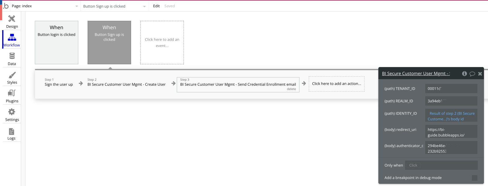
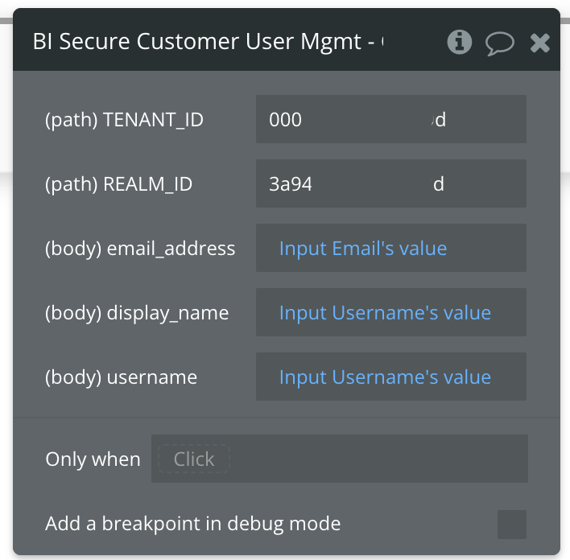
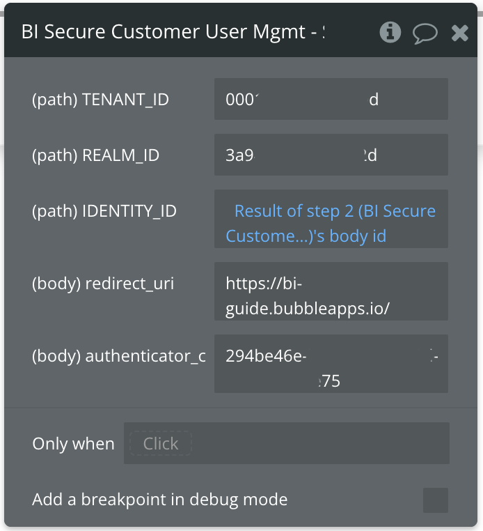

bubble.io is a no-code solution for creating and deploying applications. It is very useful as a prototyping platform, and can actually be used to host real production apps. This tutorial will show how to integrate Beyond Identity's Secure Customer passwordless authentication into your bubble.io app.

# Demo Application

You can visit a [Demo Application](https://beyondid-secure-customer.bubbleapps.io/) to see one in action.

The user flow to set up a passwordless account is:

1. User enters a username and email address and hits "Sign up and Bind a Credential"
1. Application creates an identity, and then sends the user a Credential Binding email
1. When the user clicks the Credential Binding email, BI uses WebAuthN to create and bind a credential to the user's current browser.
1. The user can login now and in the future with their email, which will trigger a step-up (on most devices) and retrieve the credential.
1. That credential is presented to Beyond Identity to authenticate the user.

More details are [available here on how BI Secure Customer](https://www.beyondidentity.com/developers/signup) works. You can sign up for a **free account** there.

# bubble.io

[Bubble.io](https://bubble.io/) is a no code platform that non-developers and developers alike can use to build apps. We found it to be quite easy to use and extremely powerful. It has a plugins and apps ecosystem to make sharing code easy. It also has numerous useful foundational components like an OIDC client that made it easy for us to build a foundation for others to use in their apps.

# Beyond Identity Plugins

We have created two plugins for bubble app creators to use. They should be customized with the tenant, realm, and client id/secret of your own BI application before use. 

1. [Beyond Identity Customer AuthN](https://bubble.io/plugin_editor?id=1663167119592x240371050688282620&tab=tabs-1): Performs the authentication flow after initial signup. 

1. [Beyond Identity Customer Mgmt](https://bubble.io/plugin_editor?id=1663167558199x986364837141938200&tab=tabs-1): Helps perform user management. In our demo application, it is used to create a new identity and send a Credential Binding request to the email address on record. This plugin can also be used to retrieve a list of identities for the current tenant.

You can see these in action in the Demo App that is linked above.

# Getting started

## Prerequisites

Before you get started, please set up the following.

- A free account on [bubble.io](https://bubble.io) and some basic familiarity with their UI

- A free account on [Beyond Identity Secure Customer](https://www.beyondidentity.com/developers/signup)

- A tenant, realm, and application set up in Beyond Identity. On our [Getting Started](https://developer.beyondidentity.com/docs/v1/getting-started#3-create-a-tenant) guide, go through steps 3, 6, 7, and 8. 

    **NOTE**: In Step 8, during App creating, select "Token Endpoint Auth Method" = "Client Secret Post" instead of the instructions in the other readme. 

- Create your [bubble app here](https://bubble.io/home?tab=apps)

## Add the Beyond Identity plugins

Once you have created an application, you will be presented with the "New Application Assistant". 

1. Click through the assistant's steps until you arrive at the "Install Plugin" page and click "Install Plugin".

1. In the upper left, click "Sort by" -> "Name"

1. Search for "Beyond Identity". You will see "Beyond Identity Customer AuthN" and click "install" on it.

1. Next, you should also see "Beyond Identity Customer Mgmt", install that too.

Here are the direct URLs to the plugins as well:

[Beyond Identity Customer Mgmt](https://bubble.io/plugin/beyond-identity-customer-mgmt-1663167558199x986364837141938200)

[Beyond Identity Customer AuthN](https://bubble.io/plugin/beyond-identity-customer-authn-1663167119592x240371050688282620)

You do not need the API connector for BI services, but you may wish to use it to integrate with your other services.

## Configure the plugins with values from Beyond Identity

This step involves copying OIDC and client/secret values from the BI console into bubble's plugin configuration page.

### Configure the Beyond Identity Customer Mgmt plugin

This plugin is a management plugin, used to manage identities and credentials, and more.

To use it, you will need to create and copy an API key from the Beyond Identity admin console.

1. In your bubble.io app, click Plugins -> Beyond Identity Customer Mgmt

1. For the Authorization token, we will need an API token from the BI console

    1. Login to the [BI Admin console](https://console-us.beyondidentity.com/)

    1. Use the realm selector in the top left corner and ensure that you're logged into the "Beyond Identity admin" realm

    1. Click Applications -> Beyond Identity Management API -> API TOKENS

    1. Create a new token and name it "bubble io plugin" or a name of your choosing

    1. Copy and save that API token in a text editor. You will not get access to it again.

1. Back in the bubble.io plugin configuration page, in the field for Authorization (shared headers), type "Bearer " and then paste your API token from the step above

  

1. In the BI Admin console, use the realm selector in the top left corner to make sure you're in the new realm that you created in the prerequisites.

1. Click "Edit realm" and copy the TENANT_ID and REALM_ID into the bubble.io plugin's configuration page

  

### Configure the Beyond Identity Customer AuthN plugin

This plugin uses OIDC to follow the Authentication (AuthN) flow.

1. In your bubble.io app, click Plugins -> Beyond Identity Customer AuthN

1. In another tab or window, open up the [BI Admin console](https://console-us.beyondidentity.com/). Navigate to the new realm you created in the prerequisites.

1. Navigate to the new application you created "Applications -> your_new_app"

1. Copy "Client ID" into bubble.io plugin's "App ID/API Key" field

1. Copy "Client Secret" into bubble.io plugin's "App secret" field and also into the API_KEY field

  

## Create User Signup flow

This flow will enable a new user to input their username and email address and create a new identity. It will also send a credential binding email to the new user's specified email address.

1. Once you're in your new app, and on the page you wish to add the login flow to, add two "Input" fields:
  1. Username (content format: Text)
  
  1. Email address (content format: Email)

1. Label each box with a Visual Element -> Text for Username and Email address

1. Add a Button for "Sign up" and click "Start/Edit workflow"

  

1.  For the first Action, click "Account -> Sign the user up". This will just create an entry in the local database for the user.

1. Add a second action. Click "Plugins -> BI Secure Customer User Mgmt - Create User"

1. Enter the TENANT_ID and REALM_ID copied from the Beyond Identity console "Home -> Edit Realm"

1. In the "email_address" field, remove the existing text and click "Insert dynamic data" -> Input Email's value"

1. In the "display_name" field, remove the existing text and click "Insert dynamic data -> Input Username's value"

1. In the "username" field, remove the existing text and click "Insert dynamic data -> Input Username's value"

    

1. Next, we will call the BI API to send a credential binding email to the user.

1. Add another action with "Click here to add another action -> Plugins -> BI Secure Customer User Mgmt -> Send Credential Enrollment email"

1. In the IDENTITY_ID, delete the existing text, and click "Insert dynamic text" -> "Result of Step 2's body id"

1. Replace redirect_uri with the expected URL of your hosted app. You can come back and edit this field later if you don't yet know the final URL. If you leave it as localhost, the Credential Enrollment portion will attempt to redirect you to localhost.

1. Replace the "authenticator_config_id" with the value from your BI admin console at "Applications -> your_new_app -> Authenticator config -> Authenticator config id"

1. At this point, you can tell bubble to redirect to a page that confirms authentication with a text field, or redirect back to index, or do nothing.

1. (Optional) Create another page that tells the user to check their email and hit the credential enrollment link to complete signup.

## Set up the login button

For users who have already signed up and enrolled a credential, let's create a Login button. They will need to input their email address.

1. Create a text field and title it "Existing user email address"

1. Create a button "Login" and click "Start/edit workflow"

    

1. For the first action, select "Account -> Log the user in". For Email, use "Input Existing user email's value", and the same value for password. This will set up the browser session and update a row in the app's local database upon user login.

1. Create a second action to perform the OAuth login. Click to create a second action and select "Account -> Signup/login with a social network"

1. In the resulting popup, select "Provider -> BI Secure Customer AuthN"

1. Click "Add API Key"

1. Copy and paste the App ID and App Secret from the BI console.

    "Applications -> your_new_app -> Client ID" should be copied into "App ID/API Key"

    "Applications -> your_new_app -> Client Secret" should be copied into "App Secret"

## Preview the site

In this step, we'll preview the site, correct any visual design problems, and also copy the bubble.io URL back into the workflow to enable the BI web authenticator to redirect back to your application after it has bound a credential to your devices.

1. In the bubble.io editor, click "preview" in the top right corner of the screen.

1. Copy the URL of your preview app

1. Paste that URL into the bubble.io editor -> "Workflow -> When Button Sign Up is clicked -> Step 3 - Send Credential Enrollment email -> redirect uri

  
  

1. Add that URI to the permitted list of redirects in the BI console.

   1. On the BI Admin console, go to your new realm -> applications -> your new application. 

   1. Paste the URL of your preview app into the field "Redirect URIs", add the suffix "/api/1.1/oauth_redirect" and hit Submit. For example, https://bi-guide.bubbleapps.io/api/1.1/oauth_redirect. You can have multiple URLs here.
 

1. Click the Design editor and fix any UI issues and close the browser tab for the older preview.

1. Hit Preview again

# Sign up a user

1. Input a username and email address (they can be the same) and hit signup

1. It will create a new identity in the bubble.io app as well as the beyondidentity tenant and realm

1. It will send you a credential binding email at the address you specified.

1. Click that link to bind a credential to your device. Do not use an Incognito/private browser for this, as your credential will be created and then discarded.

# Log in the user

1. Visit the main page of your app. Again, don't use an Incognito/private browsing window or the credentials will be discarded.

1. Input the email address you used in the signup process and hit "Log in"

1. Observe the browser step up and verify it with biometrics if prompted

1. You should be redirected back to the bubble.io app home, and see that you've been logged in.