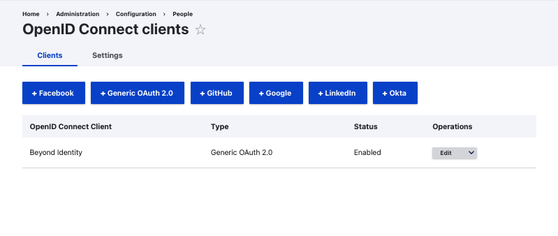
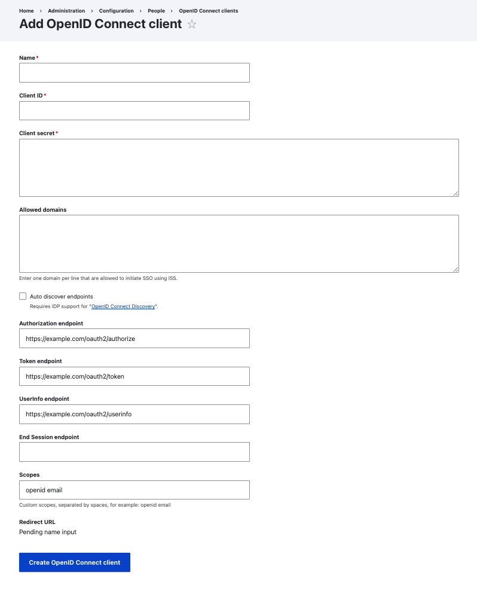

import Arcade, {Clip} from '@site/src/components/Arcade.tsx';

# Integrate Beyond Identity Passwordless Authentication into Drupal

Make your Drupal admin login more secure!

This guide provides information on how to set up Beyond Identity as a passwordless authentication provider for a Drupal admin panel login.

This guide will cover:

- How to configure Beyond Identity as an Identity Provider
- How to install the required module to support an OpenID Connect (OIDC) integration
- How to configure the OIDC module

## Prerequisites

Before continuing, make sure that the following prerequisites have been met:

- Ensure that you have a live Druapl site running and administrator privileges to install and configure modules.
- Access to a Beyond Identity tenant and its admin console. If necessary, sign up for a tenant at https://www.beyondidentity.com/developers/signup

## Set up Beyond Identity as an Identity Provider

### Create a Realm

We need to create a new [Realm](https://developer.beyondidentity.com/docs/v1/workflows/realms) to hold identities and configuration:

From the Admin Console:

1. Click the Realm selector on the top-left.
2. Click **Create New Realm**.
3. Type the name of your new realm. Click **Create Realm**.
4. Click **Switch to Realm**.
5. From the Realm's Home page, click Edit.

<Arcade clip={Clip.CreateRealm} />

### Create an Application

Next, we'll create a new [Application](https://developer.beyondidentity.com/docs/v1/workflows/applications) that contains the configuration for your end users:

From the Admin Console:

1. From the navigation bar, click **Applications**, then click **Add app**.
1. Type a name for your new Application.
1. Set your application's **Protocol** to "OIDC"
1. Set your application's **Client Type** to "Confidential"
1. Set your application's **PKCE** to "Disabled"
1. Set your application's **Redirect URIs** to include `https://${your-website-domain.com}/openid-connect/${client_machine_name}`. This URL will also be generated for you in the OIDC module. You can always come back to change this.
1. Set your application's **Token Endpoint Auth Method** to "Client Secret Post"
1. Set your application's Token Configuration **Subject** to "id".
1. Navigate to your application's Authenticator Config
1. Set your Authenticator Config's **Configuration Type** to "Hosted Web"
1. Tap the **Submit** button to save your changes.

At this point, your Beyond Identity Admin Console should be configured with a realm and an application set up.

<Arcade clip={Clip.CreateApplication} />

## Create an Identity and generate a Universal Passkey

Once you have an application in the admin console you are ready to provision users in your realm's directory, generate passkeys, and handle those passkeys in your application.

### Create an Identity

Creating a user can be done either in the admin console or through an API. This guide will use the admin console. Navigate to your realm in the console and click **Identities**, then click **Add identity**.

Note that it's best if the user is already in the Drupal system. A good place to start is for yourself as the administrator. Also, make sure that the Username matches the Drupal Username.

For more information visit [Workflows: User and Group Provisioning](/docs/v1/workflows/user-provisioning).

<Arcade clip={Clip.CreateIdentity} />

### Generate a passkey

Once you have an identity, you are ready to generate a passkey for this user. This step can also be done either in the admin console or through an API. This guide will use the admin console. Navigate back to **Identities** and select the identity you would like to bind to a passkey. Click **Add a passkey**, select your app and the click **Proceed & send email**. The user will receive an enrollment email which they can tap on to bind a passkey to their device.

Note that whichever browser or device that the user taps on the enrollment email will be the device/browser where the user can log into your Drupal site. If the user wishes to login from a different browser or device you will need to send the user another email to bind that new browser/device. Also note that private/incognito browsers act as a different browser in this case. Users can bind multiple devices and browsers.

For more information visit [Workflows: Bind Passkey To User](/docs/v1/workflows/bind-passkey).

<Arcade clip={Clip.CreatePasskey} />

## Configure the OpenID Connect Drupal Module

### Install the OIDC module

This guide is based on the popular [OpenID Connect / OAuth client](https://www.drupal.org/project/openid_connect) and will require administrative privileges to install to your Drupal site.

Install as you would normally install a contributed Drupal module.
Visit: https://www.drupal.org/project/openid_connect for further information.

### Configure the module using Generic OAuth 2.0

1. Log into you Drupal admin console
1. Keep the Beyond Identity Admin Console open in another tab or window to copy and paste values in.
1. Go to Home -> Administration -> Configuration -> People -> OpenID Connect clients.
1. Under the **Clients** tab, select and enable "+ Generic OAuth 2.0".

### Configure OIDC

The following will use values from your Beyond Identity Admin Console and the application you created above.

1. Navigate to **Add OpenID Connect client**
1. For **Name** enter "Beyond Identity"
1. For **"Client ID"**, copy and paste the value from Applications -> Your New Application -> External Protocol -> Client ID
1. For **"Client Secret Key"**, copy and paste the value from Applications -> Your New Application -> External Protocol -> Client Secret
1. You can ignore **Allowed domains** for now.
1. For **"Authorization endpoint"**, copy and paste the value from Applications -> Your New Application -> External Protocol -> Authorization Endpoint
1. For **"Token endpoint"**, copy and paste the value from Applications -> Your New Application -> External Protocol -> Token Endpoint
1. For **"Userinfo endpoint"**, copy and paste the value from Applications -> Your New Application -> External Protocol -> User Info Endpoint
1. Leave **"End Session endpoint"** blank
1. For **"Scopes"**, paste in "email profile openid"
1. A **Redirect URL** will be generated for you after filling out this form. If you need to, go back to the Beyond Identity Console and add this URL to the **Redirect URIs** in your application you created.
1. Click **"Create OpenID Connect client"**

### Allow exisiting users to login

In order for a user already in your Drupal system to login, you will need to check the
box in the Advances Settings for "Automatically connect exisiting users".

1. Select the **Settings** tab and configure the plugin to the settings you prefer.
2. Make sure that in the advanced tab you check the box "Automatically connect exisiting users".

### Enable new user creation on successful login

If you send a passkey to a user that is not already in your Drupal system, the login will fail unless you enable the "Override registration settings" box. You can allow new users to be added to your Drupal users by checking the box in Settings.

This will assign a new user as an `authenticated user` with no other defined role. You can change the user's role in your Drupal admin settings.

### Display login button on user login form

There are two ways to do this. You can either add a block provided by the module, or configure the **openID button display in user login form** in Settings. The easiest option is to configure the Settings.

Choose the option that works best for your site:

- Hidden: hides the login button and best to use when displaying a block
- Above: displays the login button above the login form
- Below: displays the login button below the login form
- Replace: will hide the core login form and only show the OIDC login option.

### Try logging in

We will now attempt to log in and verify successful authentication.

1. Using the same browser where you [generated a passkey](#generate-a-passkey), Visit your `/user/login` admin page to login.
1. You will see a "Login with Beyond Identity" button. Click it.
1. You will be redirected to the Beyond Identity Web Authenticator.
1. You may see a step-up authentication prompt, depending on how Policy is set up for your tenant.
1. At the conclusion of a successful authentication, you will be redirected to your drupal site!
1. You will see successful authentication events in BI Admin Console -> Events
