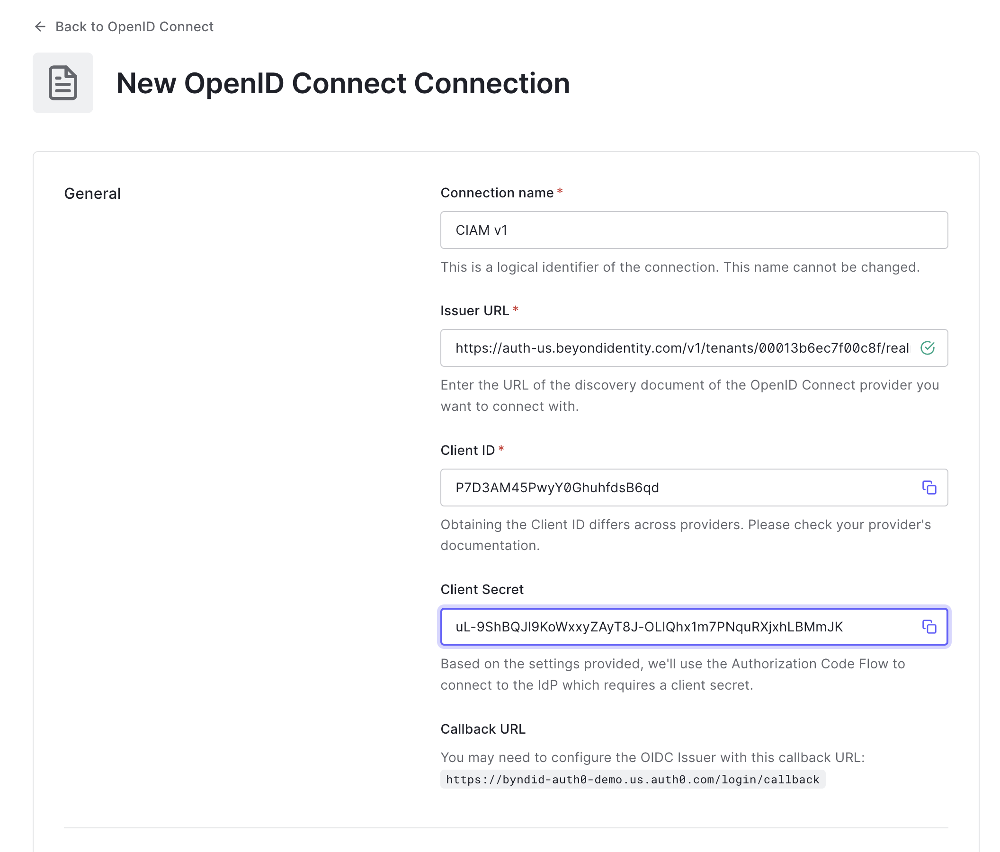
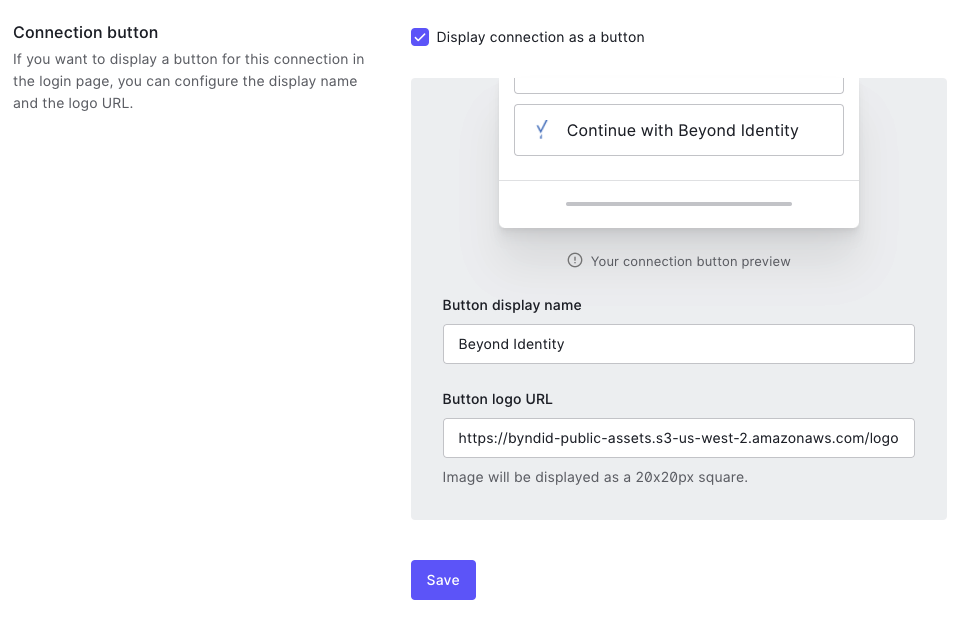
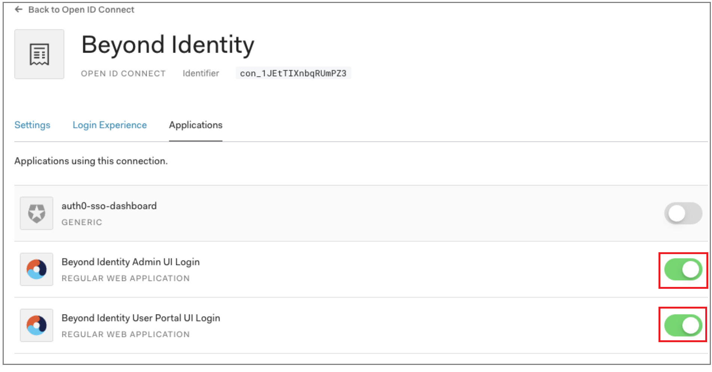

This guide provides information on how to set up Beyond Identity as a passwordless authentication provider in an Auth0 environment.

This guide will cover:
* How to configure Beyond Identity as an Identity provider
* How to Provision and Deprovision users when Auth0 is the master directory

:::info
You can find us in the [Auth0 Marketplace](https://marketplace.auth0.com/integrations/beyond-identity).
:::

## Prerequisites

Before continuing, make sure the following prerequisites have been met:

  * Ensure that you have an Auth0 account with admin privileges
  * Access to a Beyond Identity tenant. If necessary, sign up for a tenant at https://www.beyondidentity.com/developers/signup

## Add Beyond Identity as an Identity Provider

Depending on your Auth0 subscription (license) you can add Beyond Identity as an identity provider using the [Enterprise OIDC connection](#enterprise-oidc-connection) or as a [custom social OAuth2.0 connection](#custom-social-oauth20-connection).

### Create an Inbound OIDC client in Beyond Identity

1. Log into the Beyond Identity Admin portal, select the **Applications** tab, and select **Create app**.

2. Fill in the following fields:

   * **Display Name** = Auth0 SSO

   * **Redirect URIs** = `https://DOMAIN.auth0.com/login/callback`

   * Replace `DOMAIN` with your Auth0 domain URL

  example: `https://byndid-auth0-demo.us.auth0.com/login/callback`

Leave all other fields with their default  values.

3. Click **Submit**.


4. Select the newly created OIDC client configuration and make a note of the **Authorization Endpoint**
, **Token Endpoint**, **Client ID** and **Client Secret** as these will be used in the next steps.


### Enterprise OIDC Connection

1. On the left side menu, click **Authentication**,  and click **Enterprise** from the expanded menu.
2. On the **Enterprise Connections** page,  click **Open ID Connect**.


3.  Then within the Open ID Connect menu click ‘Create Connection’
4. Enter the following values:
   * **Connection Name**: “Beyond-Identity”
   * **Issuer URL**: Issuer corresponding to Beyond Identity app.
   * **Client ID**: From OIDC client created in Beyond Identity
   * **Client Secret**: From OIDC client created in Beyond Identity




5. Click **Create**.

6. Scroll up and click the **Login Experience** tab.


10. Under this tab, find the section called **Connection button** and check (enable) the checkbox field labelled **Display connection as a button**.
11. Enter the ‘Button display name’ as “Beyond Identity”.
12. Add the following URL for the :point-down:

**Button Logo URL** - https://byndid-public-assets.s3-us-west-2.amazonaws.com/logos/beyondidentity.png



13. Scroll down and click **Save**.

### Custom Social (OAuth2.0) Connection

1. On the left side menu, click **Authentication**, and from the expanded menu, click **Social**.
2. On the **Social Connections** page,  click the **+ Create Connection** button in the top right corner:


3. On the **New Social Connection** page, scroll down to the last option called **Create Custom**.



4. On the new connection form, enter the following values:
* **Connection Name**: “Beyond-Identity”
* **Authorization URL**: From Authorization URL created in Beyond Identity
* **Token URL**: From Token URL created in Beyond Identity
* **Scope**: `openid email`
* **Client ID**: From OIDC client created in Beyond Identity
* **Client Secret**: From OIDC client created in Beyond Identity
* Enter the following code snippet under ‘Fetch User profile Script’

```javascript
function(accessToken, ctx, cb) {

  request.get('<BEYOND_IDENTITY_BASE_URL>/userinfo',    {
      headers: {
        'Authorization': 'Bearer ' + accessToken
      }
   },
    function(err, r, body) {
      if (err) {
        return cb(err);
      }
      try {
        var profile = JSON.parse(body);
        profile.provider = 'beyond';
        profile.id = profile.sub;
        profile.displayName = profile.display_name;
        profile.email = profile.email;
        cb(null, profile);
      } catch (e) {
        cb(e);
      }
    });
}
```

5. Leave the other values as default and click **Create**.

6. The connection is then saved and the ‘Applications’ tab will be displayed. You can now configure which applications should use this connection. Use the toggle switches to enable the connection for the applications you wish to use Beyond identity with.

7. If you are using Auth0 hosted pages, the button text and button logo must be be updated. Auth0 only supports this via the API at the point rather than through the UI. You can follow the Auth0 docs here to configure this last part:
   * https://auth0.com/docs/connections/social/oauth2#modify-the-icon-and-display-name
   * The Beyond Identity logo URL is: https://byndid-public-assets.s3-us-west-2.amazonaws.com/logos/beyondidentity.png

**Note:** We recommend labelling the button ‘Beyond Identity’ or ‘Passwordless’.

8. If you are using your own login form, you can add the button manually and call the authorize endpoint specifying the connection parameter where the connection is the name of the connection you just created as documented here:
   * https://auth0.com/docs/connections/social/oauth2#log-in-using-the-custom-connection
   * Auth0’s API reference: https://auth0.com/docs/api/authentication#social

### Enable the Beyond Identity connection in Auth0

1. From the left side menu, select **Connections → Enterprise → Beyond-Identity → Applications**.

2. Enable the OIDC connection or Custom OAuth2.0 connection for the Beyond Identity Admin portal and any applications you wish to user Beyond Identity for.


### Confirm Callback URL

**Important** Check the Auth0 callback URL is correct the in Beyond Identity OIDC integration

1. In Auth0, under the **Settings** tab of the **Beyond Identity OIDC connection** created in Step 8, make a note of the Callback URL as shown below:


2. Navigate to the Beyond Identity Admin portal, select the **Integrations tab**, and click **OIDC Clients**. Select the OIDC client that was created in Step 4 and click **Edit**.

3. Ensure that the **Redirect URI** value matches the value in the Auth0 connection. If the values do not match, update the value with the **Callback URL** from Auth0.

## User Provisioning

**Setting up test users**

Before users can start authenticating with Beyond Identity, they must be provisioned in the Beyond Identity Directory. As Auth0 does not support SCIM, users must be manually provisioned using the Beyond Identity Admin Portal or using the [Create User API](https://developer.beyondidentity.com/api/v0#tag/Users/operation/CreateUser). See the Admin Portal video tutorial that shows how to navigate to the directory area of the admin portal.

https://www.beyondidentity.com/resources/beyond-identity-admin-console-overview

- In the 'Beyond Identity Console' under the 'Identities' tab, select 'Add Identity'.

- Enter the following values:

   - **Email**: `email_address`

   - **Username**: `user_name`

   - **Name**: `full_name`

## User Deprovisioning

To deprovision users from the Beyond Identity experience, access the Beyond Identity Admin Portal and manually delete the appropriate user(s).
