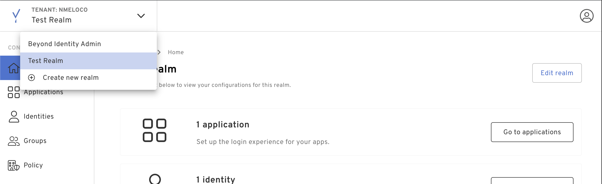
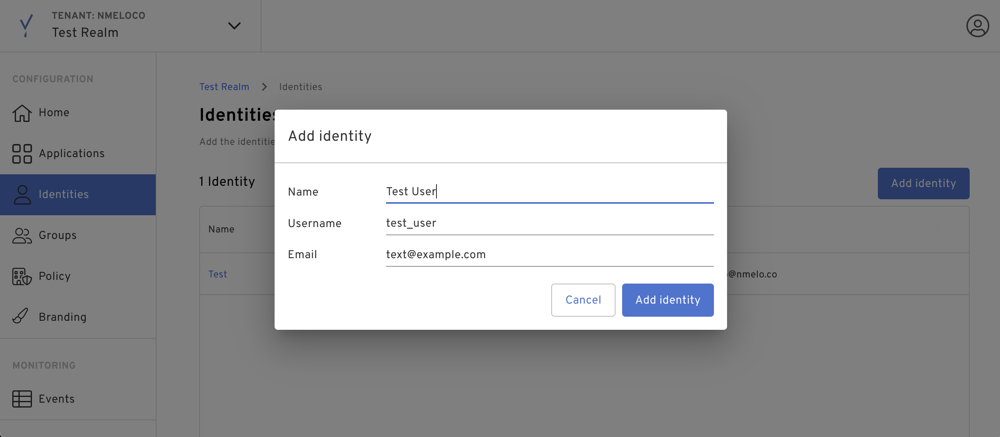

This guide describes how to configure Beyond Identity as an Identity Provider for Okta using the OpenID Connect identity protocol. 


## Setup a Beyond Identity tenant

[Create a tenant](https://www.beyondidentity.com/developers/signup) via the sign up form.

After a tenant and a local passkey is created, you will be automatically redirected to the [Admin Console](http://console-us.beyondidentity.run/).

### Create a new realm

Realms are unique administrative domains within a tenant. All new tenants have a default realm called `Beyond Identity Admin` which should not be used to configure for delegate IDP purposes. 

To configure an Okta integration, please create a new realm as shown below. 

1. Click the drop down on the top left corner and add a new realm. 



2. Create a new identity with an email that you want to use for testing.



3. Create an OIDC application with the following Client Configuration:

|Name | Value |
|-----|------|
|Protocol| OIDC|
|Client Type| Confidential|
|Grant Type| Authorization Code|
|Redirect URIs| https://yourokta-domain.com/oauth2/v1/authorize/callback|
|Example| https://yourokta-domain.okta.com/oauth2/v1/authorize/callback |
|Token Endpoint Auth Method| Client Secret Post|
|Resource Server| None|

### Token Configuration:

- **Expiration**: set to desired expiration (e.g `604800` which is one week). 
- **Subject**: `Email`
- **Token Signing Algorithm**: `RS256`


After the application is created, take note of the token, and  authorization endpoint URLs, these will be used in the Identity provider configuration in Okta. The `tenant_id` and `realm_id` from these URLs will also be needed to send the credential binding email 

Now we’ll need to send a credential binding email to the newly created identity in the new realm. To do this, we’ll need to mint a management API token in the Admin realm

To continue, complete the following steps: 

- Navigate back to the Admin realm, and select Applications. 
- Click the Beyond Identity Management API.
- Within the Beyond Identity Management API application, select API Tokens.
- Create a new token and once created copy the token to your clipboard.
- Navigate back to the second realm that contains the Okta application.

Now we need to send a credential binding email to the new identity in the second realm. To send a credential binding email, we’ll need to find out what the authenticator config id is of the Okta application. This can be done with the following API call and newly minted bearer token:

```bash
curl --location --request GET 'https://api-us.beyondidentity.com/v1/tenants/${tenant_id}/realms/${realm_id}/authenticator-configs' \
	--header 'Authorization: Bearer ${api_token}'
```

Now using the `authenticator_config_id` from the previous API call, send a credential binding email. The `identity_id` is visible after selecting the identity in the admin console

```bash
curl --location -g --request POST '\''https://api-us.beyondidentity.com/v1/tenants/${tenant_id}/realms/${realm_id}/identities/${identity_id}/credential-binding-jobs'\'' \
	--header 'Authorization: Bearer ${api_token}' \
	--header 'Content-Type: application/json' \
	--data-raw '{
	 "job": {
	   "delivery_method": "EMAIL",
	   "authenticator_config_id": "${authenticator_config_id}"
	 }
	}'
```

An email should be received to bind a credential.

For more details about the responses to the requests above, see our guide to [Sending Enrollment Emails](docs/v1/workflows/send-enrollment).

### Configure the Identity provider in Okta

If you do not have a Okta developer account, sign up here: https://developer.okta.com/signup/

After creating the Okta account, create an additional user in Okta that you would like to use for testing. You’ll want to ensure the email or username of the test user in Okta matches the identity provisioned in the second realm. 

- In Okta, select `Security` -> `Identity Providers`
- Click `Add Identity Providers`, select `OpenID Connect` and click next.
- For Scopes, the only scope needed is `openid`, remove `profile` and `email`

The Client ID/Secret will be the values from the Okta application created in the Beyond Identity Admin console. 
The Authorization and Token endpoints are provided in the Admin console of that application.

The endpoints are as follows:

|Name|Value|
|---|---|
|Issuer| https://auth-us.beyondidentity.com/v1/tenants/${tenant_id}/realms/${realm_id}/applications/${application_id}|
|Authorization endpoint| https://auth-us.beyondidentity.com/v1/tenants/${tenant_id}/realms/${realm_id}/applications/${application_id}/authorize|
|Token endpoint| https://auth-us.beyondidentity.com/v1/tenants/${tenant_id}/realms/${realm_id}/applications/${application_id}/token|
|JWKS endpoint| https://auth-us.beyondidentity.com/v1/tenants/${tenant_id}/realms/${realm_id}/applications/${application_id}/.well-known/jwks.json|

For Authentication settings set the following for IdP Username: `idpuser.externalId`

Match against: `Okta Username`

### Setup the Routing Rule

Now we need to configure a routing rule in Okta for the newly created Identity provider. In the same tab as Identity providers there is a routing rule tab just to the right.

Give the rule a name and set the rule to match on the email attribute of the newly created identity. Set the rule to use the newly created Identity provider.

Once the routing rule is set, log out of Okta and you can authenticate with the newly provisioned identity.
