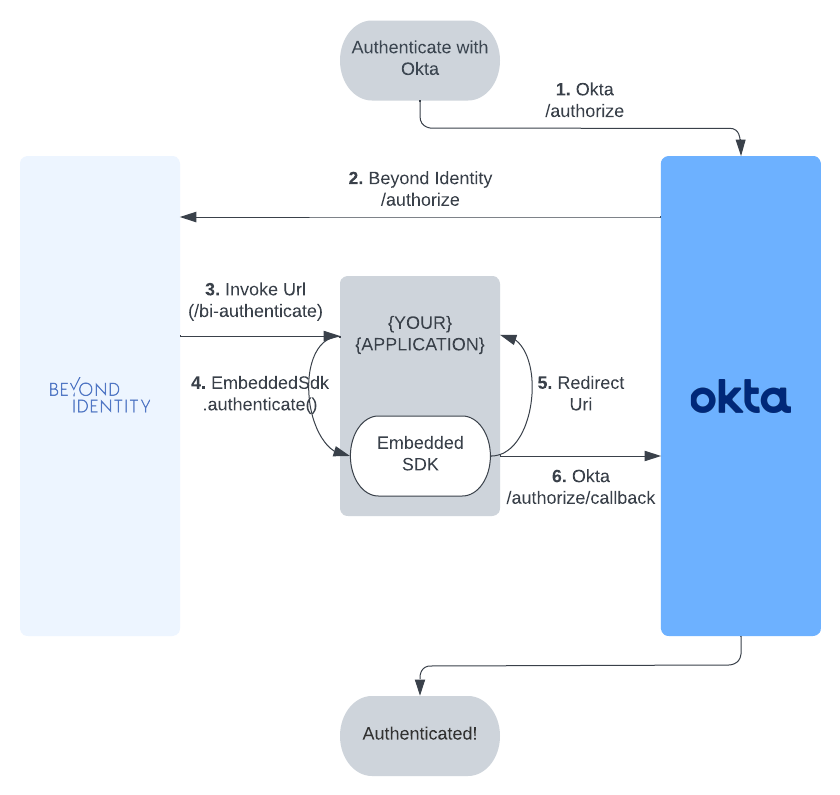

This guide describes how to configure Auth0 to delegate to Beyond Identity for authentication during an OAuth2 authorization flow.

## Prerequisites

 - [Integrate With Auth0](../../guides/integrate-with-auth0.md)
 - [Flutter SDK Setup](../../workflows/sdk-setup.mdx?sdks=flutter)

Before calling [`EmbeddedSdk.authenticate()`](../../workflows/sdk-setup.mdx?sdks=flutter#authentication), we must [Authorize With Auth0](#authorize-with-auth0).

## Authorize With Auth0



### Using an SDK

See Auth0's [Developer Site](https://auth0.com/docs/quickstart/native) for the latest Flutter SDKs or Widgets.

Note: At this time, there is no Auth0 SDK for Flutter, so we recommend [using the Web](#using-the-web).

### Using the Web

The library follows the best practices set out in [RFC 8252 - OAuth 2.0 for Native Apps](https://tools.ietf.org/html/rfc8252).

This guide uses the [Web Auth for Flutter](https://github.com/LinusU/flutter_web_auth) SDK.

 - Step 1: Configuring the Authenticator Config

Make sure the [Authenticator Config](../../platform-overview/authenticator-config#embedded-sdk) in the Beyond Identity Console is set to type `Embedded` and that the Invoke URL points to your application with either an App Scheme or a Universal Link. Note: You may want to use a separate scheme for Beyond Identity and Auth0.

 - Step 2: Auth0 Authorize URL

To start the authorization flow, make a call to `FlutterWebAuth.authenticate()` with the Oauth2 Authorization Request URL provided by [Auth0](https://auth0.com/docs/api/authentication#authorization-code-flow-with-pkce) and a callback url scheme.

```javascript
var result = await FlutterWebAuth.authenticate(
    url: AUTH0_URL,
    callbackUrlScheme: CALLBACK_URL_SCHEME,
);
```

 - Step 3: Invoke URL

The result will be a URL with the Invoke URL scheme. You can call [`EmbeddedSdk.authenticate()`](../../workflows/sdk-setup.mdx?sdks=flutter#authentication), using the result. You can confirm the validity of the URL with [`EmbeddedSdk.isAuthenticateUrl()`](../../workflows/sdk-setup.mdx?sdks=flutter#authenticate-url-validation).


```javascript
var authenticateResponse = await Embeddedsdk.authenticate(result, selectedPasskeyId);
```

 - Step 4: Redirect URL

To complete the authorization flow, make another call to `FlutterWebAuth.authenticate()` with the `redirectUrl` returned from a successful `AuthenticateResponse` to complete the initial OAuth flow. Another url will be returned that contains an authorization code that can be used to exhange for an ID token using Auth0's [token endpoint](https://auth0.com/docs/api/authentication#authorization-code-flow-with-pkce45).

```javascript
var result = await FlutterWebAuth.authenticate(
    url: authenticateResponse.redirectUrl,
    callbackUrlScheme: CALLBACK_URL_SCHEME,
);

// This URL contains authorization code and state parameters
// Exchange the authorization code for an id_token using Auth0's token endpoint.
```

#### Full Example

```javascript
selectPasskeyId((selectedPasskeyId) async {
    var result = await FlutterWebAuth.authenticate(
        url: AUTH0_URL,
        callbackUrlScheme: CALLBACK_URL_SCHEME,
    );

    var authenticateResponse = await Embeddedsdk.authenticate(result, selectedPasskeyId);

    var redirectUrlResult = await FlutterWebAuth.authenticate(
        url: authenticateResponse.redirectUrl,
        callbackUrlScheme: CALLBACK_URL_SCHEME,
    );

    // This URL contains authorization code and state parameters
    // Exchange the authorization code for an id_token using Auth0's token endpoint.
});

Future<void> selectPasskeyId(Function(String) callback) async {
  // Where you can perform some logic here to select a passkey, or
  // present UI to a user to enable them to select a passkey.
}
```
