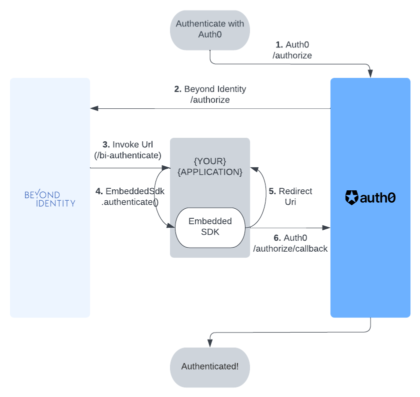

This guide describes how to configure Auth0 to delegate to Beyond Identity for authentication during an OAuth2 authorization flow.

## Prerequisites

 - [Integrate With Auth0](/guides/sso-integrations/integrate-with-auth0)
 - [Kotlin SDK Setup](../../workflows/sdk-setup?sdks=kotlin)

Before calling [`EmbeddedSdk.authenticate()`](../../workflows/sdk-setup?sdks=kotlin#authentication), we must [Authorize With Auth0](#authorize-with-auth0).

## Authorize With Auth0



### Using an SDK

See Auth0's [Developer Site](https://auth0.com/docs/quickstart/native/android) for the latest Android SDKs or Widgets. This guide uses the [Auth0 Android](https://github.com/auth0/Auth0.Android) SDK.

Note: At this time, the authorization flow cannot be completed using the SDK, so we recommend [using the Web](#using-the-web); The SDK is not designed to work with a secondary IdP. The token exchange, however, can be completed using the SDK.

### Using the Web

The library follows the best practices set out in [RFC 8252 - OAuth 2.0 for Native Apps](https://tools.ietf.org/html/rfc8252), including using [Custom Tabs](https://developer.chrome.com/multidevice/android/customtabs) for authorization requests. For this reason, `WebView` is explicitly *not* supported due to usability and security reasons.

 - Step 1: Configuring the Authenticator Config

Make sure the [Authenticator Config](../../platform-overview/authenticator-config#embedded-sdk) in the Beyond Identity Console is set to type `Embedded` and that the Invoke URL points to your application with either an App Scheme or a Universal Link. Note: You may want to use a separate scheme for Beyond Identity and Auth0.

 - Step 2: Auth0 Authorize URL

To start the authorization flow, build a [`CustomTabsIntent`](https://developer.android.com/reference/androidx/browser/customtabs/CustomTabsIntent), and launch the OAuth2 Authorization Request URL provided by [Auth0](https://auth0.com/docs/api/authentication#authorization-code-flow-with-pkce).

```javascript
val builder = CustomTabsIntent.Builder()
...
builder.build().launchUrl(context, AUTH0_URL)
```

 - Step 3: Invoke URL

A URL with the Invoke URL scheme should be triggered by the web page. The Android OS will look for an appropraite Activity to handle the Intent. In your [`Activity`](https://developer.android.com/reference/android/app/Activity), which handles your Beyond Identity scheme, override [`onCreate`](https://developer.android.com/reference/android/app/Activity#onCreate(android.os.Bundle)) &/ [`onNewIntent`](https://developer.android.com/reference/android/app/Activity#onNewIntent(android.content.Intent)), and call [`EmbeddedSdk.authenticate()`](../../workflows/sdk-setup?sdks=kotlin#authentication). You can confirm the validity of the URL with [`EmbeddedSdk.isAuthenticateUrl()`](../../workflows/sdk-setup?sdks=kotlin#authenticate-url-validation).

```javascript
intent?.data?.let { uri ->
    when {
        EmbeddedSdk.isAuthenticateUrl(uri.toString()) -> {
            EmbeddedSdk.authenticate(
                url = uri.toString(),
                passkeyId = selectedPasskeyId,
            ) {
                ...
            }
        }
        ...
    }
}
```

 - Step 4: Redirect URL

To complete the authorization flow, build another [`CustomTabsIntent`](https://developer.android.com/reference/androidx/browser/customtabs/CustomTabsIntent), and launch the `redirectUrl` returned from a successful `AuthenticateResponse` to complete the initial OAuth flow. Another url will be returned that contains an authorization code that can be used to exhange for an ID token using Auth0's [token endpoint](https://auth0.com/docs/api/authentication#authorization-code-flow-with-pkce45).

```javascript
intent?.data?.let { uri ->
    when {
        EmbeddedSdk.isAuthenticateUrl(uri.toString()) -> {
            EmbeddedSdk.authenticate(
                url = uri.toString(),
                passkeyId = selectedPasskeyId,
            ) { result ->
                result.onSuccess { authenticateResponse ->
                    authenticateResponse.redirectUrl?.let { redirectUrl ->
                        CustomTabsIntent.Builder().build().launchUrl(context, Uri.parse(redirectUrl))
                    }
                }
            }
        }
        uri.scheme == CALLBACK_URL_SCHEME -> {
            // This URL contains authorization code and state parameters
            // Exchange the authorization code for an id_token using Auth0's token endpoint.
        }
        ...
    }
}
```

#### Full Example

```javascript
private fun launchAuth0(context: Context, url: Uri = AUTH0_URL) {
    CustomTabsIntent.Builder().build().launchUrl(context, url)
}

private fun handleIntent(context: Context, intent: Intent?) {
    selectPasskeyId { selectedPasskeyId ->
        intent?.data?.let { uri ->
            when {
                EmbeddedSdk.isAuthenticateUrl(uri.toString()) -> {
                    EmbeddedSdk.authenticate(
                        url = uri.toString(),
                        passkeyId = selectedPasskeyId,
                    ) { result ->
                        result.onSuccess { authenticateResponse ->
                            authenticateResponse.redirectUrl?.let { redirectUrl ->
                                CustomTabsIntent.Builder().build().launchUrl(context, Uri.parse(redirectUrl))
                            }
                        }
                    }
                }
                uri.scheme == CALLBACK_URL_SCHEME -> {
                    // This URL contains authorization code and state parameters
                    // Exchange the authorization code for an id_token using Auth0's token endpoint.
                }
            }
        }
    }
}

private fun selectPasskeyId(callback: (String) -> Unit) {
    // Where you can perform some logic here to select a passkey, or
    // present UI to a user to enable them to select a passkey.
}
```
