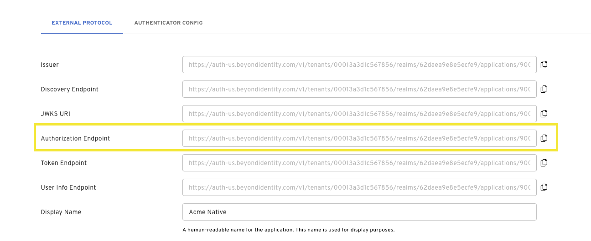
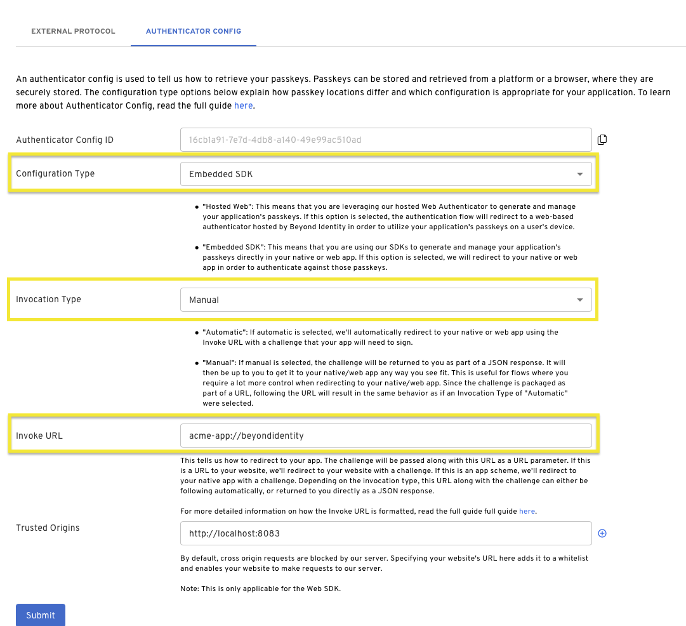
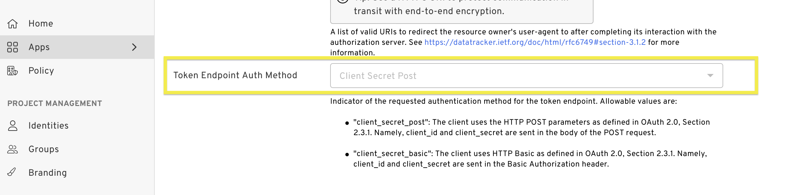

import Tabs from '@theme/Tabs';
import TabItem from '@theme/TabItem';
import WebAuth from '../includes/_authentication-via-automatic.mdx'
import SilentAuth from '../includes/_authentication-via-return.mdx'
import MultiLanguageCodeBlock from '@site/src/components/MultiLanguageCodeBlock';
import InvocationDiagram from '../includes/_invocation-url-diagram.mdx';
import AppSchemeCaution from '../includes/_app-scheme-caution.mdx';
import InvocationTip from '../includes/_invocation-type-tip.mdx';

# Authentication with Passkey

## Prerequisites

- Set up a [developer account](./account-setup)
- Create an [application](./applications)
- Create at least one [identity](./user-provisioning)
- Have at least one passkey [bound](./bind-passkey) to an identity

## Overview

This guide describes how to authenticate an application with a passkey using Beyond Identity within a standard OAuth2/OIDC authorization flow.

In response to an OIDC request to the Beyond Identity /authorize endpoint, Beyond Identity initiates passwordless authentication by returning an authentication challenge and other information to your app. Before authenticating, your app can use the Beyond Identity SDK to enumerate available passkeys and should perform some logic to select one, such as presenting selection UI to the user. Once a passkey is selected, you can then use the SDK to complete authentication and finally perform the OAuth code for token exchange.

## Authorization

### 1. Craft Authorization Url

First you will need to craft an authorization URL. The base url can be found in the Beyond Identity Admin Console
under your application, select "EXTERNAL PROTOCOL". Copy the `Authorization Endpoint` and add the following additional query parameters:



```bash title="/authorize"
https://auth-$REGION.beyondidentity.com/v1/tenants/$TENANT_ID/realms/$REALM_ID/applications/$APPLICATION_ID/authorize?
response_type=code
&client_id=$APPLICATION_CLIENT_ID
&redirect_uri=$REDIRECT_URI
&scope=openid
&state=$STATE
&code_challenge_method=256
&code_challenge=$PKCE_CODE_CHALLENGE
```

Check your appliction config in the admin console for your `APPLICATION_CLIENT_ID`.

The `REDIRECT_URI` is your application's App Scheme or Universal URL.

:::info PKCE
Note that the following query parameters includes [PKCE](https://www.rfc-editor.org/rfc/rfc7636) as it is recommeded, but optional. If you send an authorization request with PKCE, you will need to store the hash of the `code_challenge` so that it can be passed to the token exchange endpoint later as a `code_verifier`.

You will need to set PKCE as a Client Configuration in your Application Config.
:::

:::info state
The `STATE` parameter is used to mitigiate [CSRF attacks](https://en.wikipedia.org/wiki/Cross-site_request_forgery). Have your application generate a random string for the `STATE` value on each authentication request. You should check that this string is returned back to you to in the response.
:::

### 2. Configure Authenticator Config

There are three pieces we need to check in the [Authenticator Config](../platform-overview/authenticator-config) before authentication. To check your config, navigate the Beyond Identity Admin Console and find your application. Select "AUTHENTICATOR CONFIG".

1. In order to use the Embedded SDKs, the `Configuration Type` should be set to [Embedded SDK](../platform-overview/authenticator-config#embedded-sdk).
2. Set the [Invoke URL](../platform-overview/authenticator-config#invoke-url) to a URL that "points" to where your application is. In the case of a native application (iOS, Android, Flutter, React Native), this is either an App Scheme or an Universal URL / App Link. In the case of a web application, this is just a URL to your web application or a specific page of your web application.

<AppSchemeCaution/>

3. Set the the [Invocation Type](../platform-overview/authenticator-config#invocation-type). This specifies how our authentication URL is delivered to your application. Invocation Type can be one of two values:

- **Automatic**: redirect to your application using the Invoke URL with a challenge that your app will need to sign.

- **Manual**: the challenge will be returned to you as part of a JSON response.

<InvocationTip/>

<InvocationDiagram />



### 3. Start Authorization for Invocation Type

<Tabs groupId="authenticate-invocation-type" queryString>
<TabItem value="manual" label="Manual">
<SilentAuth/>
</TabItem>
<TabItem value="automatic" label="Automatic">
<WebAuth/>
</TabItem>
</Tabs>

## Token Exchange

Calling the token endpoint is the second step in the authorization flow and usually happens in your backend if your application's Client Type is `Confidential`. Make sure to a call the [authorization endpoint](#1-craft-authorization-url) first to retrieve an authorization code.

If your application is using the [NextAuth](https://next-auth.js.org) provider (see the Javascript Authorization example using Automatic Invocation Type), you will not need to complete authentication with a token exchange.

### 1. Craft Token Url

The token endpoint base url can also be found in the Beyond Identity Admin Console under your application, select "EXTERNAL PROTOCOL". Copy the `Token Endpoint`.


### 2. Token Endpoint Auth Method

Next, scroll down to "Client Configuration" and make note of your "Token Endpoint Auth Method". The "Token Endpoint Auth Method" will determin how to make the token exchange call. The token auth method can either be set to `Client Secret Post` or `Client Secret Basic`.



### 3. Start Token Exchange

<Tabs groupId="token-auth-method" queryString>
<TabItem value="client_secret_basic" label="Client Secret Basic">

The `$CLIENT_ID` and `$CLIENT_SECRET` are sent in the Basic Authorization header.

<MultiLanguageCodeBlock
  curl='curl "https://auth-$(REGION).beyondidentity.com/v1/tenants/$(TENANT_ID)/realms/$(REALM_ID)/applications/$(APPLICATION_ID)/token" \
-X POST \
-u "$(CLIENT_ID):$(CLIENT_SECRET)" --basic \
-H "Content-Type: application/x-www-form-urlencoded" \
-d "grant_type=authorization_code&code=$(CODE_FROM_AUTHORIZATION_RESPONSE)&code_verifier=$(CODE_VERIFIER_IF_USED_PKCE_IN_AUTHORIZATION_REQUEST)&redirect_uri=$(REDIRECT_URI_MUST_MATCH_VALUE_USED_IN_AUTHORIZATION_REQUEST)"'
  title="/token"
/>
</TabItem>

<TabItem value="client_secret_post" label="Client Secret Post">

The `$CLIENT_ID` and `$CLIENT_SECRET` are sent in the body of the POST request as a form parameter.

<MultiLanguageCodeBlock
  curl='curl "https://auth-$(REGION).beyondidentity.com/v1/tenants/$(TENANT_ID)/realms/$(REALM_ID)/applications/$(APPLICATION_ID)/token" \
-X POST \
-H "Content-Type: application/x-www-form-urlencoded" \
-F "grant_type=authorization_code" \
-F "code=$(CODE_FROM_AUTHORIZATION_RESPONSE)" \
-F "client_id=$(CLIENT_ID)" \
-F "client_secret=$(CLIENT_SECRET_FROM_CONFIDENTIAL_APPLICATION)" \
-F "code_verifier=$(CODE_VERIFIER_IF_USED_PKCE_IN_AUTHORIZATION_REQUEST)" \
-F "redirect_uri=$(REDIRECT_URI_MUST_MATCH_VALUE_USED_IN_AUTHORIZATION_REQUEST)"'
  title="/token"
/>

</TabItem>
</Tabs>
